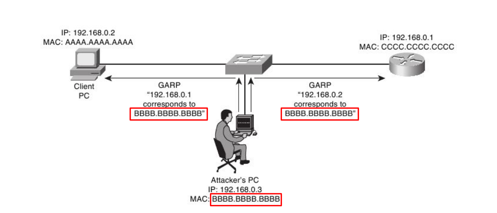

---

## **Introduction to hacking**

Hacking is a term often associated with malicious activities, but it encompasses various practices, some of which are legal and aimed at improving security. Understanding hacking involves knowing its definition, the different types of individuals who engage in it, and the systematic process they follow.

Here's an introduction to hacking based on the provided sources:

**1. Definition of Hacking** Hacking, or penetration testing, is a logical process that can be broken down into tasks and goals. It involves gaining unauthorized access to a system, typically with the intent of stealing identities, personal information, or other data. From a cybersecurity perspective, hacking refers to the act of breaking into computers. The term "hacking" is often associated with something negative, leading to fear about how the process works. However, the same techniques used by malicious hackers can also be employed for protective purposes.

**2. Types of Hackers** The sources categorize hackers into three main types based on their motivations and permissions:

- **Black Hat Hackers:** These are often the ones reported in the news. They search for and exploit vulnerabilities in security systems for financial gain or other malicious reasons, without concern for the harm they cause. Their activities can range from spreading viruses to disabling websites and stealing sensitive financial information, potentially causing major damage to individuals and organizations. They may use computer-based methods like adding keystroke monitoring programs or non-computer methods like impersonating users over the phone to gain access.
- **Gray Hat Hackers:** These hackers operate in a "middle ground" between black hat and white hat hackers. While they break ethical principles and standards by accessing systems without permission, they typically do so without malicious intent, often to expose vulnerabilities to the public or to the company itself. Although their actions are technically illegal due to lack of permission, they may face less punishment than black hat hackers if their intent was for the "common good". Sometimes, after alerting a company to vulnerabilities, gray hat hackers may even be offered prominent positions.
- **White Hat Hackers:** Also known as ethical hackers, these professionals are computer security experts who intentionally break into protected systems and networks with permission to test and assess security. Their goal is to identify and expose vulnerabilities before malicious hackers can exploit them, thereby improving security and protecting information. White hat hackers often work for the companies they are testing, using methods similar or identical to black hat hackers, but with the intent of benefiting society and ensuring data protection. Many white hat hackers have formal schooling in computer systems and technology, which helps them handle large networks and systems safely.

**3. The Hacking Process** Hacking, or any penetration testing, follows a logical process, which can be broken down into several phases:

- **Reconnaissance (Footprinting/Information Gathering):** This is the initial and often most important phase, involving the collection of as much data as possible about the target. This can be passive (e.g., Google searches, public records, social media, dumpster diving, job postings) or active (direct interaction like pinging a system). The goal is to understand the system, its network, services, and security aspects.
- **Scanning:** After gathering initial information, this phase uses various tools (e.g., vulnerability scanners, network mappers, port scanners) to collect more detailed information about the target. This includes identifying open/closed ports, operating systems, and connected devices. Scanning can be active (sending network traffic to observe responses) or passive (sniffing network traffic with tools like Wireshark). The aim is to create a "blueprint" of the network and identify vulnerabilities.
- **Gaining Access:** This is where the actual "hacking" takes place, exploiting vulnerabilities discovered during the scanning phase to penetrate the target system. Access can be gained through vulnerabilities in the network, applications, or operating systems. Methods like Denial of Service (DoS) attacks or session hijacking might be used to expose hidden vulnerabilities. Human error is often cited as the easiest vulnerability to exploit.
- **Maintaining Access:** Once access is gained, the next challenge is to stay on the system without detection. Hackers might install backdoors, Trojans, or rootkits to ensure future access. This phase allows for intercepting emails, monitoring user activity, and gathering sensitive information like passwords through keyloggers. The longer access is maintained, the more opportunities for data manipulation and further attacks.
- **Clearing the Tracks (Covering Tracks):** This final phase involves hiding all activities to prevent detection by IT professionals. This includes overwriting, destroying, or deleting logs that document the hacker's presence and actions. Maintaining anonymity is crucial, as detection can lead to loss of access and being traced.

**4. Hacking and Cybersecurity** Hacking is intrinsically linked to cybersecurity. Cybersecurity is the process of protecting and recovering programs, devices, and networks from cyberattacks. Cyberattacks are becoming increasingly common and are designed to access, destroy, or extort money for sensitive data. A strong cybersecurity system relies on multiple layers of protection—people, processes, and technology—and ethical hacking plays a vital role in identifying weaknesses in these layers before malicious actors can exploit them.

---

## **what penetration testing standards is**

Penetration testing, often synonymous with ethical hacking, follows a logical and structured process, which can be considered a standard methodology for assessing and improving system security. This structured approach is crucial for both offensive (malicious) and defensive (ethical) hacking activities.

The standard process for penetration testing generally involves several distinct phases:

1. **Reconnaissance (Footprinting/Information Gathering)**: This initial phase focuses on collecting as much data as possible about the target system or network. It is considered the most important phase because the collected information is vital for later stages.
    
    - **Passive Reconnaissance**: This involves gathering information without direct interaction with the target, such as through Google searches, public records (like WHOIS), social media, job postings, or even "dumpster diving". The goal is to understand the system, its network, services, and security aspects.
    - **Active Reconnaissance**: This involves direct engagement with the target, such as making telephone calls or using "ping" services to determine if a system will respond. This method carries a higher risk of detection.
2. **Scanning**: After initial information gathering, the scanning phase uses various tools to collect more detailed information about the target.
    
    - Tools used include vulnerability scanners, network mappers, and port scanners.
    - The aim is to identify open/closed ports, operating systems, and connected devices to create a "blueprint" of the network and uncover vulnerabilities.
    - Scanning can also be active (e.g., sending network traffic to observe OS responses) or passive (e.g., sniffing network traffic using tools like Wireshark).
3. **Gaining Access**: This is the phase where the actual "hacking" takes place, by exploiting vulnerabilities identified during the scanning phase to penetrate the target system.
    
    - Access can be achieved through vulnerabilities in the network, applications, or operating systems.
    - Methods like Denial of Service (DoS) attacks or session hijacking might be employed to expose hidden vulnerabilities.
    - Human error is frequently cited as one of the easiest vulnerabilities to exploit, through actions such as sharing information, not logging out, opening suspicious emails, or being careless on websites.
4. **Maintaining Access**: Once access is gained, the objective is to remain on the system without detection and ensure future access.
    
    - Hackers may install backdoors, Trojans, or rootkits to facilitate future entry.
    - Maintaining prolonged, undetected access allows for continuous monitoring, intercepting communications, and gathering sensitive data like passwords through keyloggers.
5. **Clearing the Tracks (Covering Tracks)**: This final phase involves hiding all activities to prevent detection by IT professionals.
    
    - This includes overwriting, destroying, or deleting logs that document the hacker's presence and actions.
    - Maintaining anonymity is crucial, as detection can lead to loss of access and traceability.

For ethical hacking, specifically, planning and strategy are determined and agreed upon in advance, highlighting that penetration testing is a deliberate and methodical process. The same techniques used by malicious black hat hackers are employed, but with the explicit permission of the system owner and with the goal of benefiting society and ensuring data protection.

---

## **Introduction to kali Linux and it’s installation methods**

Kali Linux is an operating system frequently used for hacking purposes, particularly ethical hacking. It is recognized as one of the best operating systems for those beginning to learn hacking due to its ease of use and comprehensive suite of pre-installed software designed for hacking projects. Kali Linux is free and open-source, allowing for modifications and flexible use.


**Installation Methods for Kali Linux**

The sources detail a method for installing Kali Linux as a dual boot alongside a Windows operating system, specifically mentioning Windows 7, 8, 8.1, or 10.

**Prerequisites for Dual Boot Installation:**

- An existing Windows 10 (or other Windows version) installation on your computer.
- A laptop or PC capable of handling hacking processes.
- A Pendrive with a minimum capacity of 4 GB.
- A Dual Core processor (AMD or Intel) and at least 1 GB of RAM.
- The latest version of Kali Linux.
- Rufus utility.
- Patience.

**Steps for Dual Boot Installation with Windows:**

1. **Download Kali Linux ISO:** Obtain the latest Kali Linux ISO file (either 32-bit or 64-bit) from kali.org.
2. **Create a Bootable USB:**
    - Download and install the Rufus utility from Rufus.ie.
    - Connect your USB drive (4GB minimum) to the computer.
    - Run Rufus, ensure the correct USB drive is selected, click on the small CD drive icon, locate the downloaded Kali Linux ISO file, and click "Start".
    - Allow the process to complete, then close the Rufus window. This USB can also be used for a "Kali live boot," running Kali without installation, though with limited functions.
3. **Create a Separate Partition:**
    - Open Disk Management in Windows (or run `diskmgmt.msc`) to create a new partition for Kali Linux. A minimum size of 15 to 20 GB is recommended, which may involve shrinking an existing volume.
4. **BIOS Settings (Optional but Recommended):** Before restarting, consider checking BIOS options to enable "Fast Boot" and "Disable Secure Boot" if available.
5. **Start Kali Linux Installation:**
    - Restart your laptop or PC and access the boot manager.
    - Choose the USB boot option.
    - Select "Graphical Install" from the Kali Linux installation choices for an easier setup.
    - Configure basic settings such as language and country.
6. **User and Partitioning Setup:**
    - Set a hostname (which acts as a username) and then enter a password for the root user (administrative account), then click "continue".
    - For the partitioning method, select "Manual".
    - Carefully choose the partition you created earlier for Kali Linux installation. Delete it, then select the "FREE SPACE" that appears.
    - Choose "Automatically partition the free space" followed by "All files in one partition" (recommended for new users).
    - Confirm by selecting "Finish partitioning and write changes to disk" and then "Yes" to grant permission for changes.
7. **Complete Installation:**
    - The installation process will begin and may take approximately 15 minutes.
    - During the process, you will be prompted to select a network mirror for updates; it's advisable to choose "no" for now and adjust settings later.
    - Install the GRUB boot loader by clicking "Yes" and select the second hard disk option for installation. This ensures that the option to select operating systems will be displayed upon startup.
8. **Final Steps:**
    - Once the installation is complete, click "Continue" and eject the USB drive.
    - Restart your system. The GRUB Loader will appear, allowing you to choose between "Kali GNU/Linux" and "Windows Recovery Environment," enabling you to easily switch between the two operating systems.

This dual-boot setup allows users to leverage Kali Linux for their hacking endeavors while retaining access to their Windows environment.

---

##  **Introduction to vulnerability analysis by info gathering using tools**

Vulnerability analysis, particularly in the context of ethical hacking and cybersecurity, often begins with a logical and structured process of information gathering, also known as reconnaissance and scanning. This systematic approach helps ethical hackers understand a target system's weaknesses before any protective measures can be implemented.

### The Hacking Process and Vulnerability Analysis

The hacking process, whether for malicious intent or ethical testing, typically involves five main steps: reconnaissance, scanning, gaining access, maintaining access, and clearing the tracks. Vulnerability analysis by information gathering primarily falls into the first two phases: reconnaissance and scanning.

### Phase 1: Reconnaissance (Information Gathering)

Reconnaissance is the initial and often most crucial phase, where the goal is to collect as much data as possible about the target system or network. This information is vital for later stages of the hacking process. It involves two types:

1. **Passive Reconnaissance:** This involves gathering information without directly interacting with the target system, allowing the analyst to remain hidden. Methods include:
    
    - **Online Searches:** Using search engines like Google or Yahoo to find information about employees, the organization's website, or public records.
    - **Social Media and Online Community Groups:** Surfing platforms like Facebook or other online community groups to gain information about individuals or organizations.
    - **Public Records:** Checking public databases like WHOIS to gather data about a company's website and domain registration. Other sources include USSearch, ZabaSearch, ChoicePoint.
    - **Company Information:** Reviewing press releases, acquisition or merger announcements, SEC documents, patents, trademarks, and incorporation filings.
    - **Network Sniffing:** Passively monitoring network traffic to understand the overall network infrastructure.
2. **Active Reconnaissance:** This involves direct engagement with the target, which carries a higher risk of detection. An example includes:
    
    - **Ping Services:** Using a ping service to determine if a system will respond, indicating its active status.

The ultimate goal of reconnaissance is to create a "blueprint" of the target network, identifying potential weak points.

### Phase 2: Scanning

After gathering initial information, the scanning phase uses various tools to collect more detailed insights about the target. This phase is more active than passive reconnaissance but provides specific data on vulnerabilities. Key aspects and tools include:

1. **Purpose of Scanning:**
    
    - Determine open and closed ports on the network.
    - Identify the type of operating systems (OS) being used.
    - Discover various devices connected to the network.
    - Scrutinize or "enumerate" information, which involves identifying valid user accounts or groups, network resources, shared resources, and running applications.
2. **Types of Tools and Techniques:**
    
    - **Port Scanners:** Used to systematically scan computer ports to identify open "doors" to a computer. Examples include:
        - **Vanilla Scan:** Attempts to connect to all 65,535 ports.
        - **Probe Scan:** Focuses on non-services to exploit.
        - **Fragmented Packets:** Sends packet fragments that can bypass simple firewalls.
        - **UDP Scan:** Looks for open UDP ports.
        - **Sweep Scan:** Connects to the same port on multiple machines.
        - **FTP Bounce:** Disguises the source of the scan through an FTP server.
        - **Stealth Scanner:** Blocks the scanned computer from recording port activities.
    - **Vulnerability Scanners:** Tools specifically designed to find vulnerabilities within systems.
    - **Sweepers and Ping Tools:** Used to identify live hosts on a network. SuperScan is mentioned as a ping utility.
    - **Network Mappers:** Help visualize the network infrastructure.
    - **Traffic Sniffers:** Tools like Wireshark can be used to sniff network traffic passively, providing a comprehensive understanding of the network infrastructure.
    - **Various Hacking Tools (open-source):** The sources list numerous tools, often described as "open-source software," used for active attacks and information gathering:
        - **Arpfound, Arping, Bing, Bugtraq, Dig, DNStracer:** Network and reconnaissance tools.
        - **Dnsniff, Filesnarf, FindSMB, Fping, Fragroute, Fragtest:** Tools for network auditing, file transfer, and packet manipulation.
        - **Hackbot:** Exploitation and scanner.
        - **Hmap, Hping:** IP/TCP packet assembler and analyzer.
        - **Httpping, Hunt, Libwhisker, Mailsnarf, Magnasnarft, NBTScan:** Tools for HTTP requests, network auditing, and mail sniffing.
        - **Nessus, Netcat, Nikto, Nmap:** Vulnerability scanners and network utility tools.
        - **Pathchar, Ping, SsnSH, SMBclient, SMTPSniff, TCPDump, TCPreplay, THC-Amap, Traceroute, URLSnarf, Xprobe2:** Diverse tools for network characteristics, SSH auditing, SMB/CIFS file sharing, SMTP mail analysis, TCP/IP packet capture/replay, and footprinting.
    - **Websites for Vulnerability Information:** Several websites are listed as resources for finding common vulnerabilities:
        - US-CERT (us-cert.gov)
        - CVE (cve.mitre.org)
        - Secunia (secunia.com)
        - Hackstorm (hackerstorm.com)
        - Hackerwatch (hackerwatch.org)
        - Zone-H (zone-h.org)
        - Milworm (milworm.com)
        - OSVDB (osvdb.org)
        - Metasploit (metasploit.com)

### Importance and Goal of Information Gathering

The primary purpose of conducting these reconnaissance and scanning activities, especially for ethical hackers, is to identify existing vulnerabilities in a system or network before malicious hackers can exploit them. By thinking like a hacker and continuously performing these scans, organizations and individuals can proactively secure their systems, close off access points, and protect sensitive data from cyberattacks.

---


## **Man-in-the-Middle (MITM) Attack using Ettercap** (10 Marks)

### **Definition:**

A **Man-in-the-Middle (MITM)** attack is a cyberattack where an attacker secretly intercepts and possibly alters the communication between two devices on a network without their knowledge.

### **Tool Used: Ettercap**

- **Ettercap** is an open-source tool for network sniffing, MITM attacks, and protocol analysis.
    
- It supports ARP poisoning, DNS spoofing, and packet capturing.
    

### **Working Principle:**

#### Steps to Perform MITM Attack:

1. **Network Setup:**
    
    - All devices (attacker, victim, router) must be on the same **Local Area Network (LAN)**.
        
2. **Enable IP Forwarding (Linux):**
    
    ```bash
    echo 1 | sudo tee /proc/sys/net/ipv4/ip_forward
    ```
    
3. **Start Ettercap (GUI or CLI):**
    
    ```bash
    sudo ettercap -G        # GUI mode
    sudo ettercap -T -M arp:remote /victimIP/ /gatewayIP/  # CLI
    ```
    
4. **Select Targets:**
    
    - Scan hosts, set **victim** as **Target 1** and **router** as **Target 2**.
        
5. **Start ARP Poisoning:**
    
    - Go to: `Mitm > ARP Poisoning > Sniff Remote Connections`
        
    - Click "Start Sniffing"
        
6. **Intercepted Data:**
    
    - Ettercap starts capturing and logging the victim's data, which may include usernames, passwords, or browsing activity.
        

### **Diagram: MITM Attack Using Ettercap**

   

> **ARP Poisoning** allows the attacker to impersonate the router to the victim and vice versa, capturing all traffic.

### **Security Implications:**

- Can lead to **credential theft**, **session hijacking**, or **data manipulation**.
    
- Works especially well if traffic is **unencrypted** (e.g., HTTP).
    
### **Prevention Techniques:**

- Use **HTTPS**, **VPNs**, or **SSH**.
    
- Apply **static ARP entries**.
    
- Monitor networks using **IDS/IPS** tools like **Snort**, **Wireshark**.
    
- Enable **port security** and **dynamic ARP inspection** in switches.
    
---


