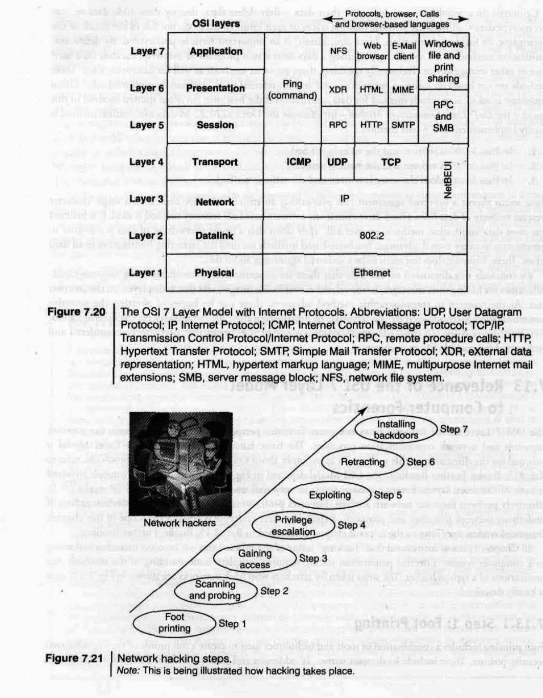
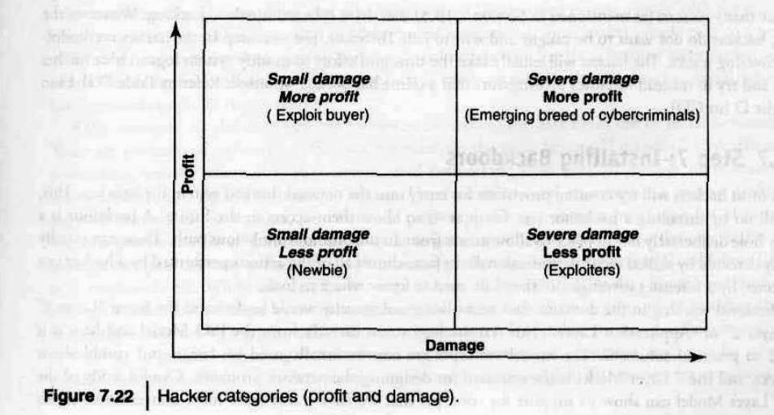
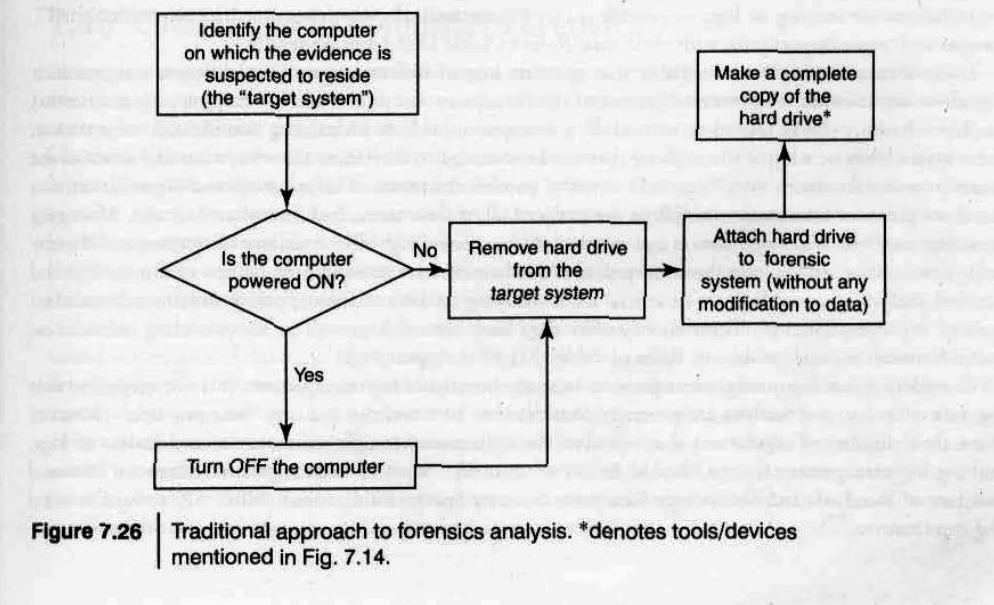

---

## **Computer Forensics and Steganography**

Computer forensics is a specialized field focused on the systematic identification, acquisition, preservation, and analysis of digital evidence, typically conducted after unauthorized access or misuse of a computer system has occurred. It involves applying analytical and investigative techniques to identify, collect, examine, and preserve magnetically stored or encoded information. The primary goal of cyber forensics is to find digital evidence to establish whether a fraud or crime has been committed. This field is critical because digital evidence is often present at crime scenes, necessitating that law enforcement and experts are able to recognize, seize, transport, and properly store it for forensic examination.

Key aspects and processes within computer forensics include:

- **Objectives**: Digital forensics aims to uncover and document evidence and leads, corroborate other discovered evidence, help in identifying patterns of events (often using data mining), connect attacker and victim computers (in line with Locard's Exchange Principle), reveal the end-to-end sequence of events leading to a compromise, and extract data that may be hidden, deleted, or not directly accessible.
- **Challenges**: Investigators face challenges due to miniaturized storage devices and the massive volume of digital data, making it difficult to find relevant forensic information, much like searching for a "needle in a haystack". Specialized forensic software is used to help filter relevant data from the larger, irrelevant mass.
- **Phases**: The digital forensic life cycle comprises several distinct phases: preparation and identification, collection and recording, storing and transporting, examination/investigation, analysis, interpretation and attribution, reporting, and testifying.
- **Evidence Rules**: For digital evidence to be admissible in court, it must adhere to cardinal rules, meaning it must be admissible, authentic, complete, reliable, understandable, and believable. During the collection phase, strict precautions, such as ensuring data is not altered, maintaining a detailed audit trail, and adhering to a clear chain of custody, are essential.

Steganography is a technique referred to as "sheltered writing" where the primary goal is to conceal the very existence of a message or communication. This differs from cryptography, which hides the content of a message but not its presence. The term "steganography" derives from Greek words meaning "hidden" (kryptos) and "to write" (graphein), thus "concealed writing". Methods used in steganography include embedding messages in microdots, merging text with images, or other techniques to hide information during storage or transmission, ensuring only the intended recipient is aware of and can access the hidden data. A common example involves manipulating the least significant bit of words within an image to embed a secret message. It can also be employed to create digital watermarks for copyright protection.

The relationship between computer forensics and steganography is direct and crucial. Since steganography is employed to hide data, often by malicious actors, detecting and extracting such hidden information becomes a vital task for computer forensic investigators. Digital forensics explicitly includes the objective of extracting data that might be hidden or not readily available. For instance, within the scope of digital forensics, image analysis specifically involves examining images for any evidence of steganography. This is particularly relevant in cases where individuals, such as terrorists, use steganographic techniques to conceal their communications within seemingly innocuous images shared online, making forensic analysis indispensable for uncovering such hidden messages. Forensic experts require specialized tools and methodologies to effectively detect and recover information hidden through steganography.

---
### Rootkits

The term **rootkit** is used to describe the mechanisms and techniques whereby malware—including viruses, spyware, and Trojans—attempt to hide their presence from spyware blockers, antivirus programs, and system management utilities. Rootkits can be classified as:

- **Persistent rootkits**
- **Memory-based rootkits**
- **User-mode rootkits**
- **Kernel-mode rootkits**

These classifications are based on whether the malware survives a reboot and whether it executes in **user mode** or **kernel mode**.

Basically, a rootkit is a **set of tools** used after compromising a computer operating system. These tools hide logins, processes, passwords, etc., in a way that carefully avoids detection by normal system monitoring commands. Rootkits are installed **after** an attacker has exploited a system vulnerability and gained **root access**. Rootkits themselves **do not** provide root access; they are used **after** a successful compromise.

Rootkits generally serve **three primary functions**:

1. **Maintain root access to the system**  
   The first and primary function of a rootkit is to maintain access to the compromised system. This access can be maintained through various communication channels—from an easily detectable Telnet shell to a secure shell or even covert channels overlaid on commonly used protocols. If an attacker cannot maintain access, they cannot exert control over the host.

2. **Hide the presence of the attacker**  
   The second main function of a rootkit is to hide or obfuscate the presence of the attacker. This is critical for success, as it helps the attacker maintain root access over time. Methods include:
   - Removing evidence of the compromise (e.g., cleaning log files)
   - Disabling monitoring daemons temporarily
   - Misrepresenting system state to administrators

   Hiding techniques can include:
   - Replacing system executables
   - Re-routing system calls
   - Installing a loadable kernel module

   Attackers often employ multiple hiding strategies to ensure stealth, applying the principle of **"offense in depth"**.

3. **Perform actions to meet the attacker's objectives**  
   The third function of a rootkit is to perform tasks that further the attacker's goals, such as:
   - Attacking other systems
   - Using keyloggers to capture sensitive information
   - Gathering packet traces from the local network
   - Performing vulnerability scans
   - Launching automated attacks from the compromised host

---

## **Relevance of the OSI  7 Layer Model to Computer Forensics**

The Open Systems Interconnection (OSI) 7-Layer Model holds significant relevance for computer forensics, particularly in the domain of network analysis. This model provides a structured framework for understanding how data travels across a communications network.

The **OSI 7 Layer Model** is useful from a computer forensics perspective because it addresses network protocols and communication processes. A basic familiarity with the OSI Model is assumed here. For more on the OSI Model and network protocols..

The **OSI Model** (see Fig. 7.20) shows the Internet Protocols involved at each of the seven layers. Forensic analysts must understand how **TCP/IP** works. To effectively perform network forensics, professionals must have a strong understanding of network processes and protocols. Explaining these in detail is beyond the scope of this chapter; readers may refer to relevant chapters listed in Ref. #15.

In ** 1**, it was stated that "hacking" involves unauthorized access to computer systems. Effective **penetration testing** requires a deep understanding of hacker methods and motivations. The following subsections describe the typical steps taken by network attackers (refer to Fig. 7.21).

---

### Step 1: Foot Printing

**Foot printing** involves tools and techniques to create a profile of an organization’s security posture, such as:

- Domain names  
- IP addresses  
- Network blocks

**Tools used**:
- SamSpade
- `nslookup`
- `traceroute`
- `neotrace`

See **Tables 2.1 and 2.2** in Chapter 2 for more tools used during the “active attack” phase.

Once the attacker knows the IP addresses and domain names, they may perform scans such as:

- Ping sweeps  
- TCP/UDP port scans  
- OS fingerprinting

These tasks can be performed using **Nmap**, a free security scanner created by **Fyodor**.

Another important tool is **Metasploit** (see Table 4.1, Chapter 4), which automates:

- Penetration testing
- OS/application-based exploits

Performing exploits has become as easy as entering a target’s IP and clicking a button.

###  Step 2: Scanning and Probing

Hackers send:

- **Ping echo requests** to IP addresses to find live hosts.
- **TCP SYN requests** to ports to identify open services.

Using tools like **Nmap**, hackers determine:

- Device types  
- Operating systems  

This helps identify the easiest path to exploit.

**Script kiddies** (refer to Chapter 10) once used published scripts. Today, **click kiddies** use GUI tools to hack systems effortlessly (see Fig. 7.22).

### Step 3: Gaining Access

The hacker’s goal is to gain access to systems to:

- Steal credit card data  
- Download confidential files  
- Manipulate critical data  

The information gathered during scanning aids in identifying weak points to exploit and gain access to the system.

### Step 4: Privilege Escalation

Initial access is limited to the exploited process’s privileges. Hackers aim to gain **root** or **administrator** access.

- If the compromised application runs under root, the hacker gets root access directly.
- If not, they may attempt **password cracking** or other privilege escalation techniques.

### Step 5: Exploit

With **root access**, the hacker has full control.

Motivations vary:

- **Fun/challenge** – Deface websites, leave “calling cards”
- **Financial gain** – Steal/sell information
- **Revenge** – Sabotage systems (e.g., disgruntled employees)

(See Fig. 7.21 for attacker motivations.)

### Step 6: Retracting / Covering Tracks

To avoid detection, hackers:

- Modify or delete system logs
- Mislead forensic investigators

### Step 7: Installing Backdoors

Hackers often install **backdoors** to retain future access. A backdoor:

- Is a hidden entry point into the system
- Is usually detectable by skilled security professionals

All hacker actions can be detected by a forensics investigator—if they know where to look.

### Practical Relevance of OSI Layers in Security

Professionals often use terms like “**Layer 3**,” “**Layer 2**,” or “**Application Layer**”—these refer to **OSI Model** layers.

- These concepts are fundamental to **network design**, **troubleshooting**, and **protocol development**.
- Applying the OSI Model helps **assess and address** network security threats.

Understanding and applying the OSI Model enhances:

- **Security assessments**
- **Forensic investigations**
- **Analysis of real-world threats**

###  Obfuscated IP Addresses and Spam

Cyberforensics experts have the skills to decode **obfuscated IP addresses**, often used by:

- Spammers
- Malicious actors

They hide their identity using:

- **Fake email addresses**
- **Obfuscated URLs**

Example:  
A human-readable IP (e.g., `135.17.243.191`) may appear in **10-digit integer** (base-256) format like: "http://2280853951"

---

## **Computer Forensics from Compliance Perspective**

### **Background**

- Due to the Net-centric digital economy, corporate networks are prime targets for cybercrimes.
    
- Digital investigations depend on **evidence**, placing **computer forensics** at the core of security enforcement and **legal compliance**.
    

## **1 Regulatory Perspective for Forensics (International Level)**

The focus is on the **“Big-4” laws** that affect global companies:

### **1. Sarbanes-Oxley Act (SOX) – USA**

- **Purpose**: Prevent corporate fraud after scandals like Enron and WorldCom.
    
- **Key Sections**:
    
    - **Section 302**: Executives must certify the accuracy of financial reports.
        
    - **Section 404**: Requires proper internal controls for financial reporting.
        
    - **Section 301 & 802**: Emphasize the need for forensics to ensure integrity of digital evidence.
        
- **Relevance to Forensics**:
    
    - Detect and investigate fraud, data tampering, or wrongful termination.
        
    - Essential for electronic records management and legal discovery (e-Discovery).
        
### **2. California SB 1386 – USA**

- **Purpose**: Protect consumer data and prevent identity theft.
    
- **Requirement**:
    
    - Businesses must notify affected parties of **data breaches**.
        
    - Applies even to international companies doing business in California.
        
- **Relevance to Forensics**:
    
    - Forensics is necessary to determine whether a breach occurred and what data was exposed.
        
    - **NIST** guidelines are followed for investigation processes.
        
### **3. Gramm-Leach-Bliley Act (GLBA) – USA**

- **Purpose**: Protect customers’ **financial data**.
    
- **Key Rules**:
    
    - **Financial Privacy Rule**: Controls data sharing.
        
    - **Safeguards Rule**: Requires protecting customer information.
        
- **Relevance to Forensics**:
    
    - Required to investigate unauthorized access and demonstrate **due diligence**.
        
    - Support **Intrusion Detection Systems (IDS)** and other controls through forensic investigation.
        

### **4. HIPAA – USA**

- **Purpose**: Protect **medical information**.
    
- **Security Rule** includes:
    
    - **Incident response** is mandatory.
        
    - Requires clear analysis of security incidents, including potential breaches.
        
- **Relevance to Forensics**:
    
    - Helps determine breach scope, timeline, and whether malware or backdoors exist.
        
    - Supports compliance by identifying internal misuse or policy violations.
        

## **Computer Forensics in Practice**

### **Traditional Forensics Approach** (Fig. 7.26)

- Steps:
    
    1. Identify the **target system**.
        
    2. Power off the system (to avoid evidence tampering).
        
    3. Remove and copy the **hard drive** using a **write blocker**.
        
- **Goal**: Maintain a **forensically sound** copy (unaltered bit-by-bit duplication).
    

### **Legal Standards**

- US courts follow **Federal Rules of Evidence**.
    
- Evidence must be **reliable and relevant**.
    
- **Daubert Standard** is used to evaluate the scientific reliability of forensic methods.
    
- Improper handling may render evidence inadmissible.
    

## **2. Computer Forensics Compliance Requirements: Implications for Evidential Aspects**

### **Key Points:**

- **Increased demand for digital evidence**: Rising cyber threats and regulatory compliance pressures are driving organizations to collect and maintain digital evidence (computer evidence).
    
- **Digital evidence as a business enabler**:
    
    - Proper digital evidence collection helps businesses investigate and respond to incidents.
        
    - It plays a key role in meeting legal obligations and proving compliance during audits or legal disputes.
        
- **Role of system logs**:
    
    - Logs track user activity, system events, and data access.
        
    - Example: If a disgruntled employee attempts data theft, logs can trace _who_, _what_, and _when_.
        
    - Logs provide a digital "trail" that can reconstruct events and support investigations.
        
- **Benefits of log management**:
    
    - Helps in **situational awareness** (knowing what’s happening across IT systems).
        
    - Facilitates **early threat detection**, **incident response**, and **fraud investigation**.
        
    - Logs help resolve issues quickly and aid in security policy enforcement.
        
- **From best practice to legal requirement**:
    
    - Log collection and analysis used to be a best practice but are now **mandated by many regulations**.
        
    - Regulations often follow **NIST SP (Special Publications)** guidelines for log management.
        

## **3. Computer Forensics Expertise Status in India**

### **Current Situation in India:**

- **Rising cybercrime**:
    
    - As detailed in earlier chapters and statistics, cybercrime rates are increasing in India.
        
    - This creates a pressing need for **cyberforensics capability**.
        
- **Two key challenges**:
    
    1. **Lack of trained professionals** in computer forensics.
        
    2. **Lack of awareness** among individuals and organizations about the importance and application of digital forensics.
        
- **Why this matters**:
    
    - With increasing internet usage, especially among India’s large youth population, cybercrime is expected to rise further.
        
    - **ICT infrastructure is expanding rapidly**, but the forensic response infrastructure is lagging.
        
- **Need for forensics in both civil and criminal matters**:
    
    - Example use case: Investigating **tax evasion** using digital evidence.
        
    - Computer forensics can be applied in various legal scenarios — not limited to hacking or identity theft.
        

---

## **Challenges in Computer Forensics**

Computer forensics faces several significant challenges, which investigators must navigate to successfully identify, acquire, preserve, and analyze digital evidence. These challenges span technical, logistical, and legal domains:

- **Miniaturization and Volume of Digital Data**
    - One primary challenge stems from the ever-growing volume and miniaturization of storage devices. This makes the task of finding relevant digital forensic evidence akin to searching for a "needle in a haystack". For instance, a 500 GB hard disk, if printed on A4 paper, would result in 500,000 inches of paper, making it virtually impossible to manually retrieve relevant forensic data without specialized software that helps sieve relevant data from the irrelevant mass.
- **Data Volatility and Manipulation**
    - Digital evidence is inherently volatile and can be easily changed or manipulated. Once altered, it is usually impossible to detect that a change has taken place unless specific precautions, such as calculating a cryptographic hash of the evidence file, were taken at the time of collection. This necessitates extreme care during the handling of computer evidence to maintain its integrity.
- **Hidden, Deleted, or Encrypted Data**
    - Forensic experts routinely encounter complexities such as data that has been hidden, deleted, altered, or encrypted. Extracting such data is a key objective of digital forensics, but it presents a considerable technical hurdle.
- **Difficulty in Analysis, Interpretation, and Attribution**
    - Analyzing, interpreting, and attributing evidence are considered among the "most difficult aspects" for most forensic analysts. While there might be a finite number of possible event sequences, the actual number can be unfathomably large, impacting the process of drawing conclusions from digital evidence.
- **Adherence to Legal Rules of Evidence**
    - For digital evidence to be admissible in court, it must comply with cardinal rules: it must be admissible, authentic, complete, reliable, understandable, and believable. This legal requirement poses challenges, particularly in ensuring that data is not altered, maintaining a detailed audit trail, and adhering to a clear chain of custody from the moment of collection to its presentation in court. If the chain of custody is broken due to discrepancies, the evidence may be declared inadmissible.
- **Need for Special Expertise**
    - Handling digital evidence demands specialized expertise gained through extensive training and experience. Forensic experts are needed to navigate the technological complexities, including the proliferation of various operating systems and file systems, each requiring specific forensic tools and interpretation skills.
- **Technical Challenges with Raw Data Structure**
    - Understanding the raw data and its underlying structure presents its own technical challenges.
- **Legal Challenges and Data Privacy Issues**
    - Computer forensics also faces legal challenges related to data privacy issues.
- **Logistical and Practical Limitations**
    - Investigations can be constrained by practical limitations such as budgetary constraints, strict time deadlines, and varying levels of cooperation from adverse parties. This also includes considerations for required travel and the logistics of on-site or after-hours forensic imaging.

---

### ** Special Technique: Data Mining in Cyberforensics**

Data mining is a broad field, but in this section, we focus only on how it's used in **cyberforensics**—the practice of investigating and analyzing digital data to solve cybercrimes.

#### **Purpose in Cyberforensics**

Cybercrimes range from minor infractions to serious global incidents like terrorism. Law enforcement agencies collect and analyze digital crime data to detect trends, identify suspects, and prevent future crimes. Depending on the crime, the impact may be on:

- **National security**
    
- **Financial institutions**
    
- **Individuals**
    
- **Businesses and their reputations**
    

#### **Traditional Data Mining Techniques**

These methods help analyze **structured data** (organized data like tables):

- **Association analysis** – finds relationships between events/items.
    
- **Classification and prediction** – assigns categories or forecasts outcomes.
    
- **Cluster analysis** – groups similar data items.
    
- **Outlier analysis** – identifies unusual patterns or anomalies.
    

Modern methods also handle **unstructured data** (like emails, images, and texts). However, they raise **privacy concerns**, especially when used by law enforcement or national security agencies.

### **Key Data Mining Techniques in Cyberforensics**

#### **1. Entity Extraction**

- Identifies key information (names, addresses, vehicles, etc.) from **text, images, or audio**.
    
- In cyberforensics, it's used to extract:
    
    - Program structures
        
    - Code patterns
        
    - Hacker behavior
        
- Helps group similar software and trace malicious sources.
    
- **Limitation**: Requires **clean and large data sets** to work effectively.
    

#### **2. Clustering Techniques**

- Groups similar data items (e.g., suspects using similar methods or gangs).
    
- **No predefined categories**—the system identifies patterns on its own.
    
- Example: Linking people, organizations, or vehicles from crime reports.
    
- Used by systems like **FinCEN AI** to detect:
    
    - Money laundering
        
    - Suspicious financial transactions
        
- **Limitation**: Requires heavy computational power.
    

#### **3. Association Rule Mining**

- Finds frequent patterns in data (e.g., items often occurring together).
    
- Used to:
    
    - Detect **network intrusions**
        
    - Analyze **user behavior**
        
    - Profile **network attackers**
        
    - Predict future cyberattacks
        
- Converts user interaction data into actionable insights for cyber defense.
    

### **Need for a Unified Framework**

To improve effectiveness, investigators need:

- A **framework** that connects the **type of cybercrime** with the **right analysis technique**.
    
- Understanding how different tools apply to different crimes helps:
    
    - Spot trends
        
    - Address emerging threats
        
    - Predict criminal behavior
        

---
# Forensic Auditing

### Source: _Cyber Security: Understanding Cyber Crimes, Computer Forensics and Legal Perspectives (p. 404)_

## 1. Introduction to Forensic Auditing

**Forensic auditing** refers to the process of applying **auditing**, **accounting**, and **investigative** skills to examine financial information for use in legal proceedings. It is primarily concerned with identifying and preventing **white-collar crimes**, such as:

- Corporate fraud
    
- Financial misstatements
    
- Embezzlement of funds
    
- Securities fraud
    
- Insider trading
    
- Identity theft
    

This specialized form of accounting plays a vital role in investigating **economic crimes** and gathering evidence suitable for presentation in a court of law.

## 2. Role and Responsibilities of Forensic Auditors

Forensic auditors are tasked with:

- **Detecting fraud** through systematic review and analysis of financial records.
    
- **Identifying individuals or organizations** involved in fraudulent or illegal activities.
    
- **Collecting, analyzing, and preserving evidence** in a manner that ensures admissibility in legal proceedings.
    
- **Presenting findings** clearly in legal forums (courts, regulatory hearings).
    
- **Supporting proactive measures** that prevent fraud by analyzing risks and recommending corrective action.
    

They may work in a range of settings, including:

- Public and private sector organizations
    
- Insurance companies
    
- Banks and financial institutions
    
- Government agencies
    
- Law firms and judicial bodies
    

## 3. Reactive vs. Proactive Forensic Auditing

Forensic auditing can be broadly categorized into two approaches:

### Reactive Forensic Auditing

- **Conducted after a fraud has occurred.**
    
- Focuses on gathering admissible evidence and identifying responsible parties.
    
- Involves investigation, verification, and legal documentation of fraudulent transactions.
    

### Proactive Forensic Auditing

- **Aimed at preventing fraud before it occurs.**
    
- Involves risk assessment, internal control evaluation, and anomaly detection.
    
- Helps organizations develop a culture of compliance and transparency.
    

## 4. Insider Trading – Legal and Illegal Aspects

**Insider trading** involves the buying or selling of a company’s stocks or other securities by individuals who have access to **non-public, material information**.

### Legal Insider Trading:

- Occurs when **corporate insiders** (e.g., officers, directors, large shareholders) trade company securities.
    
- Legal as long as these transactions are **disclosed to the public** and **do not misuse confidential information**.
    

### Illegal Insider Trading:

- Involves trading based on **undisclosed, material, non-public information**.
    
- Considered a violation of trust and **punishable under civil and criminal laws**.
    
- Examples include:
    
    - An executive using insider knowledge of poor quarterly earnings to sell shares.
        
    - A consultant trading based on confidential client information.
        

## 5. Regulatory Use of Forensic Auditing

Regulatory agencies and government departments use forensic auditing to:

- Assess **compliance with laws and regulations**, especially in programs involving grants and subsidies.
    
- Perform **compliance audits** for public funds and governmental operations.
    
- Enforce legal standards and identify misuse of taxpayer or investor resources.
    

## 6. Digital Evidence and Secure Time Stamping

Forensic auditing increasingly involves the handling of **digital evidence**, which requires a secure and verifiable record of **when** specific events occurred.

### Importance of Digital Timestamps

- Ensures integrity and authenticity of electronic records.
    
- Helps establish **chronological facts** in investigations and court proceedings.
    
- Reduces the risk of **fraudulent alterations** to digital evidence.
    

### Key Attributes of Secure Timestamps:

1. **Accuracy**
    
    - Time data should come from an authoritative and trusted source.
        
    - Required precision varies by context (e.g., milliseconds for stock trading).
        
2. **Authentication**
    
    - The time source must be authenticated to a recognized timing authority or lab.
        
3. **Integrity**
    
    - The time and associated data must be protected from tampering.
        
    - Any alteration must be detectable and verifiable.
        
4. **Non-repudiation**
    
    - Once time-bound, an event cannot be denied or disputed by involved parties.
        
5. **Accountability**
    
    - The entire process must be transparent and auditable by independent third parties.
        

### Best Practices for Timestamping Digital Evidence:

- The timestamp should be generated within a **trusted computing environment**.
    
- The clock used must be **accurate, calibrated, and continuously audited**.
    
- **Validation records** of timestamps should be maintained and made available for independent verification.
    

## 7. Patience and Precision in Digital Evidence Collection

Digital evidence collection is often time-consuming and requires careful handling:

- Auditable and secure time adds credibility to the evidence.
    
- Helps maintain a strong **chain of custody** for digital artifacts.
    
- Prevents **unintended errors or manipulation** during collection or analysis.
    
- Enhances the **admissibility** of digital evidence in court.
    
---

## **Anti-forensics**

Anti-forensics refers to the **application of scientific methods, tools, and tactics** to digital systems with the intent to **invalidate, obstruct, or mislead digital forensic investigations**. Its ultimate goal is to prevent or compromise the collection, preservation, and analysis of digital evidence, especially in contexts where this information is subject to judicial review.

---

## Core Definition

> “Anti-forensics is the application of scientific method to digital media to invalidate factual information for judicial review.”

Anti-forensics is not just about tools — it involves a **combination of people, processes, and technologies** aimed at undermining forensic efforts. It reflects a strategic mindset often used by cybercriminals, insiders, and advanced persistent threats (APTs).

## Categories of Anti-Forensics

Anti-forensic strategies fall under four main categories:

1. **Data Destruction**
    
    - Overwriting or deleting data to prevent recovery.
        
    - Includes wiping tools and techniques that eliminate data beyond forensic reach.
        
2. **Data Hiding**
    
    - Concealing data in slack space, bad sectors, or alternate file streams.
        
    - Often used to evade detection by forensic tools.
        
3. **Data Encryption**
    
    - Encrypting data to prevent unauthorized access.
        
    - Without decryption keys, forensic access becomes nearly impossible.
        
4. **Data Contraception**
    
    - Preventing data from being created in the first place.
        
    - Ensures no digital footprint exists for investigators to analyze.
        
## Motivations and Context

- **Cybercriminals exploit time delays** in forensic analysis.
    
- Investigations involving **large-scale enterprise attacks** become resource-intensive.
    
- **Locard’s Exchange Principle** (every contact leaves a trace) is intentionally violated.
    
- Attackers may also **generate excessive or misleading evidence** to delay or mislead analysis.
    
- **Modern OS and user behavior trends** (e.g., remote work) increase complexity and privacy risks.
    

## Modern Workplace Risks

- Employees mix personal and professional use on company devices.
    
- Devices may store **sensitive personal** and **confidential business** data.
    
- Tools are now available that aim to eliminate these traces completely.
    
- The “digital artifact” problem has led to the rise of **privacy-focused counter-forensics tools**.
    

## Popular Commercial Counter-Forensics Tools

|Tool Name|Purpose|
|---|---|
|Windows Washer|Erases web and usage traces|
|Windows & Internet Cleaner|Deletes browser and system activity logs|
|CyberScrub Pro|Secure deletion of sensitive files|
|Evidence Eliminator|Full disk cleaning and file shredding|
|Acronis Privacy Expert|Privacy-enhancing deletion and protection|
|SecureClean|Erases sensitive system usage records|

These tools are **designed to maintain system functionality** while eliminating targeted traces, such as registry entries or deleted files.

## Metasploit Anti-Forensics Arsenal

The **Metasploit framework** includes powerful anti-forensics tools used by attackers and sometimes for validating forensic tools:

### 1. **Timestomp**

- Alters file timestamp metadata (MACE: Modified, Accessed, Created, Entry Modified).
    
- Subverts forensic analysis by modifying event timelines.
    
- Avoids standard API calls like `SetFileTime()`; uses low-level system calls (`NtQueryInformationFile`, `NtSetInformationFile`).
    
- Makes file system records appear normal while hiding real activity.
    

### 2. **Transmogrify**

- A search-and-replace tool that **alters file signatures**.
    
- Can disguise a `.exe` file as a `.jpg`, leading to misclassification.
    
- Most forensic tools rely on basic pattern matching — easily bypassed.
    

### 3. **Sam Juicer**

- Prevents the creation of forensic evidence from the outset.
    
- Ensures no artifacts are written to disk — making **postmortem analysis ineffective**.
    
- Once deployed, nearly impossible to detect or counter.
    

### 4. **Slacker**

- Hides file fragments in **slack space** of NTFS or FAT file systems.
    
- Makes use of unallocated disk areas left over from file system block allocations.
    
- Can hide significant data by **embedding it invisibly**.
    

## Techniques Used in Data Hiding

- **Bad sector manipulation**: Mark sectors as defective and hide data there.
    
- **Slack space storage**: Insert hidden information in leftover space after files.
    
- **Alternate data streams**: Hide content within NTFS streams.
    

These methods work because **forensic tools often skip over areas labeled as unusable or benign**, leaving attackers a place to embed information.

## Forensic Tool Limitations

Even advanced tools like **EnCase** and **The Sleuth Kit** may:

- Rely on **API calls** vulnerable to manipulation.
    
- Misinterpret or **fail to read manipulated timestamps** (due to system-level glitches).
    
- Be subject to **tampering or evasion** through anti-forensic strategies.
    
## Broader Implications

- **Digital forensics tools are not infallible**; they must be constantly tested and improved.
    
- The success of anti-forensics can render key evidence **inadmissible or undetectable**.
    
- Attackers aim to make investigations so **expensive or time-consuming** that organizations cannot pursue them effectively.
    

---
## **Forensics of Handheld devices: Introduction**

Forensics of handheld devices involves the acquisition and analysis of digital evidence from various portable electronic gadgets to support cybercrime investigations.

**Introduction to Handheld Devices and Their Importance in Forensics:** In the modern era, mobile hand-held devices, also referred to as electronic gadgets, have become increasingly significant for both business and personal use. These devices include a wide range of technologies such as laptops, Personal Digital Assistants (PDAs), mobile phones, smartphones, tablet PCs, Internet tablets, and Fly Fusion Pentop computers. Their proliferation allows individuals to access calendars, email addresses, phone number lists, and the Internet, extending the reach of traditional wired networks through radio waves.

This widespread adoption of mobile and wireless devices, coupled with their connectivity to the Internet, introduces numerous security challenges and makes them prime targets for cybercrime. The sheer volume of mobile phone users, which reached 3.3 billion by November 2007, and the installation of over 175,000 Blackberry Enterprise Server units, underscore the critical need to understand and address new security issues associated with these devices.

**Relevance to Digital Forensics:** The growing use of handheld devices has led to an increasing need for specialized forensics related to them. Digital forensics, or computer forensics, systematically identifies, acquires, preserves, and analyzes digital evidence. In the context of cybercrime investigations, this often includes data acquisition and analysis from mobile devices like PDAs and cell phones.

**Cybercrime Threats and Vulnerabilities:** Handheld devices are susceptible to various cyber threats, including:

- **Malware:** Malicious software such as viruses, worms, keyloggers, spyware, and ransomware can infect these devices, designed to damage them, steal data, or cause disruption without the owner's informed consent.
- **Denial-of-Service (DoS) Attacks:** These attacks aim to restrict legitimate users' access to online resources or networks.
- **Spoofed Policy Development Processes:** Attacks that exploit vulnerabilities in how devices handle security policies.
- **Signaling-Level Attacks:** These target the communication protocols used by mobile networks.
- **Phishing and Vishing/Smishing:** Mobile devices are frequently targeted by phishing attempts via fraudulent emails or text messages (smishing) and phone calls (vishing) designed to trick users into revealing sensitive information like login credentials or credit card numbers.

Due to these threats, securing information on mobile devices and understanding how to protect them from hackers is crucial. The increasing amount of personal and customer information handled online and through mobile devices further emphasizes the importance of robust web and mobile security measures.

---
## **understanding Cellphone working characteristics**

Handheld devices, also referred to as electronic gadgets, have become indispensable in modern times for both business and personal use. The field of forensics for these devices focuses on acquiring and analyzing digital evidence from them to support cybercrime investigations .

**Definition and Types of Handheld Devices:** Mobile hand-held devices encompass a variety of portable electronic gadgets, including:

- **Laptops**.
- **Personal Digital Assistants (PDAs)**: These are small, usually pocket-sized computers with limited functionality, primarily designed for managing contacts, calendars, games, music, and notes. Some PDAs also function as general-purpose computers with their own operating systems.
- **Mobile phones**.
- **Smartphones**: These devices combine the features of a PDA with integrated cell phone functionality, offering a wide range of features and supporting installable applications.
- **Tablet PCs**: Laptop-shaped devices with a keyboard, pen, and sometimes a touch screen, capable of performing tasks similar to a laptop.
- **Internet tablets**: These are Internet appliances in tablet form with limited computing power and a restricted application suite, not intended as general-purpose computer replacements.
- **Fly Fusion Pentop computers**: Computing devices the size and shape of a pen, functioning as writing utensils, MP3 players, language translators, digital storage devices, and calculators.
- **Portable computers**: General-purpose computers that can be easily moved but require setup and an AC power source, making them unsuitable for use while in transit.
- **Carputers**: Computing devices installed in automobiles, often integrating wireless capabilities, sound systems, Global Positioning Systems (GPS), and DVD players.

These devices have proliferated significantly, with mobile phone users reaching 3.3 billion by November 2007, and over 175,000 Blackberry Enterprise Server units installed, extending traditional wired networks through radio waves.

**Working Characteristics and Capabilities:** Handheld devices possess various characteristics that define their functionality and importance in the digital landscape:

- **Connectivity**: They allow users to access calendars, email addresses, phone number lists, and the Internet. Wireless networks extend the reach of traditional wired networks by transmitting data to wireless-enabled devices like laptops and PDAs via radio waves. This includes the use of access points (APs) and various wireless technologies.
- **Wireless Technologies**: They support standards such as 802.11 for Wireless Local Area Networks (WLANs), including different versions (a, b, g, n) that offer varying transmission speeds and frequency bands (2.4 GHz, 5 GHz). Bluetooth (802.15) is used for personal WLANs over short distances. WiMax (802.16) provides high-speed wireless Internet over long distances, connecting cities. Wi-Fi hotspots are public areas offering internet access.
- **Operating Systems and Applications**: Mobile devices run operating systems and support various applications. For instance, mobile viruses target phone data, applications, and operating systems. They also have registry settings, similar to Windows-powered personal computers, for synchronization of applications, music, videos, and emails.
- **Data Handling and Storage**: They store significant amounts of personal and customer information, including sensitive data that may be encrypted or unencrypted. They play a crucial role in data transfer between organizations and customers.
- **Security Features and Vulnerabilities**: Despite their utility, mobile and wireless devices introduce numerous security challenges due to their internet connectivity. They are susceptible to:
    - **Malware**: Malicious software like viruses, worms, keyloggers, spyware, and ransomware can infect these devices, designed to damage them, steal data, or cause disruption. Mobile viruses, for example, spread through Bluetooth and MMS.
    - **Denial-of-Service (DoS) Attacks**: Aimed at restricting legitimate users' access to online resources or networks.
    - **Spoofed Policy Development Processes (PDP) Attacks**: Exploiting vulnerabilities in how devices handle security policies.
    - **Signaling-Level Attacks**: Targeting communication protocols used by mobile networks.
    - **Phishing, Vishing, and Smishing**: Mobile devices are often targets of fraudulent emails, calls, or text messages designed to trick users into revealing sensitive information.
- **Identification**: Cell phones have unique identifiers like the International Mobile Equipment Identity (IMEI), a 15-digit number unique to every GSM, WCDMA, and iDen cell phone, which can be used to identify valid devices and trace stolen phones. They are also associated with phone numbers and can have security lock codes.
- **Physical Security Concerns**: Their portability makes them prime targets for theft, highlighting the importance of securing information on these devices. Unconventional or stealth storage devices, such as those hidden in watches or pendants, further complicate data security.

The integration of computing, communication, and various applications within these devices makes understanding their characteristics vital for effective cybersecurity and digital forensics.

---

# **Handheld Devices and Digital Forensics**

## **Overview**

Handheld devices — such as **smartphones, tablets, PDAs, GPS units, and digital media players** — have become ubiquitous in personal and professional settings. These devices **store, transmit, and process large amounts of personal and enterprise data**, making them critical sources of digital evidence in both criminal and civil investigations.

Digital forensics involving handheld devices focuses on the **extraction, preservation, analysis, and presentation of data** in a forensically sound manner.
## **Why Handheld Devices Matter in Forensics**

- **Pervasive Usage**: Handhelds are integrated into everyday life, often acting as communication hubs, location trackers, and data repositories.
    
- **Data Richness**: They contain call logs, messages, emails, photos, videos, social media data, browsing history, app usage, GPS data, and more.
    
- **Evidence Relevance**: In many cases, **key evidence is found exclusively on mobile devices**, especially in cybercrime, harassment, financial fraud, insider threats, and IP theft cases.
    

## **Challenges in Mobile Forensics**

### 1. **Diversity of Platforms**

- Different operating systems (e.g., Android, iOS, HarmonyOS, KaiOS).
    
- Multiple versions and custom vendor overlays complicate tool compatibility.
    

### 2. **Device Encryption and Locking**

- Strong default encryption (e.g., iOS full-disk encryption).
    
- Screen lock codes, biometrics, and secure enclaves prevent access.
    
- Physical extraction is often hindered without bypass techniques or cooperation.
    

### 3. **Rapid Technological Evolution**

- Constant updates in hardware and software demand continuous tool development.
    
- Forensic tools often lag behind in supporting the newest devices or versions.
    

### 4. **Cloud Integration**

- Much data is stored off-device (e.g., iCloud, Google Drive, OneDrive).
    
- Investigators must obtain legal access to remote servers, which adds complexity.
    

### 5. **Volatility of Data**

- Mobile devices overwrite data quickly due to limited storage.
    
- Deleted items may be unrecoverable without root/jailbreak access.
    

## **Types of Data Extracted**

|Category|Examples|
|---|---|
|**Communication**|Call logs, SMS, MMS, VoIP, instant messaging|
|**Media**|Photos, videos, voice recordings, camera roll|
|**Location**|GPS logs, cell tower triangulation, Wi-Fi|
|**App Data**|Social media, financial, fitness, travel apps|
|**Browser History**|URLs, bookmarks, downloads|
|**System Logs**|Device configuration, last shutdown, app usage|
|**Cloud Sync Data**|iCloud, Google sync, backups|

## **Acquisition Techniques**

### 1. **Logical Acquisition**

- Extracts files and metadata using APIs or backup protocols.
    
- Does not access deleted or hidden data.
    
- Less invasive and more stable.
    

### 2. **Physical Acquisition**

- Bit-by-bit copy of entire memory (including deleted and hidden files).
    
- Requires root/jailbreak or chip-off methods.
    
- Yields maximum data but is more complex and risky.
    

### 3. **File System Acquisition**

- Hybrid approach that captures the file system and metadata.
    
- Offers deeper access without full physical extraction.
    

## **Common Tools in Mobile Forensics**

|Tool|Functionality|
|---|---|
|**Cellebrite UFED**|Industry-standard extraction and analysis tool|
|**Oxygen Forensic Suite**|Detailed reporting and device profiling|
|**Magnet AXIOM**|Comprehensive analysis of mobile/cloud/social|
|**MSAB XRY**|Extraction, decoding, and reporting|
|**Autopsy + Sleuth Kit**|Open-source suite for analyzing Android data|

## **Legal and Ethical Considerations**

- **Chain of Custody**: Must be preserved throughout acquisition and analysis.
    
- **Warrants and Consent**: Required for lawful data access, especially with cloud data.
    
- **Privacy Protections**: Investigators must avoid unauthorized data access or overreach.
    
- **Anti-Forensics**: Users may deploy apps that wipe or encrypt data on demand.
    

## **Best Practices**

- Use **airplane mode or Faraday bags** to prevent remote access or wiping.
    
- Always perform **hashing and imaging** for data integrity.
    
- Document the process and preserve **metadata** for legal admissibility.
    
- Stay updated with **new devices, OS versions, and tool capabilities**.
    
- Maintain **forensically sound environments** during analysis.
    

---

## **Techno-Legal Challenges with Evidence from Handheld Devices**

Handheld devices present a unique blend of technical and legal challenges for digital forensics professionals. As these devices increasingly become central to investigations, courts and investigators face new complexities in ensuring the **admissibility, reliability, and integrity** of evidence obtained from them.

### **1. Device Security and Encryption**

- **Strong Encryption by Default**: Modern smartphones use robust encryption (e.g., AES-256 full-disk encryption on iOS and Android), making unauthorized access technically difficult or impossible.
    
- **Secure Bootloaders & Trusted Execution Environments (TEE)**: Prevent unauthorized modifications or data extraction.
    
- **Legal Barrier**: Even if access is technically possible, it may be restricted by **constitutional protections (e.g., the right against self-incrimination)**.
    

### **2. Lack of Standardized Forensic Procedures**

- **Device Diversity**: Wide variations in OS versions, file systems (YAFFS2, F2FS, APFS), and hardware configurations.
    
- **Proprietary Ecosystems**: Many devices rely on closed-source components, hindering tool compatibility.
    
- **Impact**: Forensics processes lack consistency, which may lead to **questionable admissibility** or **incomplete evidence recovery**.
    

### **3. Chain of Custody Issues**

- **Volatile Data**: Handhelds constantly update or overwrite data (e.g., GPS logs, browsing history).
    
- **Remote Wiping Risks**: Devices connected to the internet can be remotely wiped or locked.
    
- **Evidence Integrity**: If not immediately secured, digital evidence may be altered or destroyed, compromising chain of custody and **legal defensibility**.
    

### **4. Jurisdictional and Cross-Border Legal Barriers**

- **Cloud Integration**: A large portion of data resides in **cloud storage**, which may be in **foreign jurisdictions**.
    
- **Data Sovereignty Conflicts**: Local laws may conflict with international treaties or privacy regulations (e.g., GDPR).
    
- **Legal Implications**: Investigators may be unable to obtain data without mutual legal assistance treaties (MLATs), causing delays or denials.
    

### **5. User Privacy vs. Investigative Need**

- **Blended Use**: Devices often mix personal and professional data.
    
- **Third-Party Data Exposure**: Forensic analysis may expose information unrelated to the investigation, including data from family members.
    
- **Legal Risk**: May lead to **violation of privacy rights**, data minimization issues, and challenges under data protection laws.
    

### **6. Anti-Forensics and Data Obfuscation**

- **Data Wiping Apps**: Tools that permanently delete usage traces and make recovery infeasible.
    
- **Time Manipulation Tools**: Apps like _Timestomp_ can modify metadata and alter event timelines.
    
- **Legal Concern**: These tools can result in **incomplete or misleading evidence**, weakening prosecution or defense arguments.
    

### **7. Admissibility in Court**

- **Tool Reliability**: Courts may reject evidence acquired through tools lacking peer-reviewed validation or industry recognition.
    
- **Lack of Expertise**: Improper extraction or misinterpretation of mobile evidence by untrained personnel may lead to **exclusion of evidence**.
    
- **Authentication Hurdles**: Verifying that evidence was not altered before presentation in court is crucial for admissibility under digital evidence laws.
    

### **8. Rapid Technological Change**

- **Tool Obsolescence**: Forensic tools quickly become outdated as OS updates render them ineffective.
    
- **Legal Lag**: Laws and procedures often trail behind technological advances, creating **regulatory gaps**.
    
- **Impact**: Evidence collected using outdated or unsupported methods may be challenged or ruled inadmissible.
    
---
