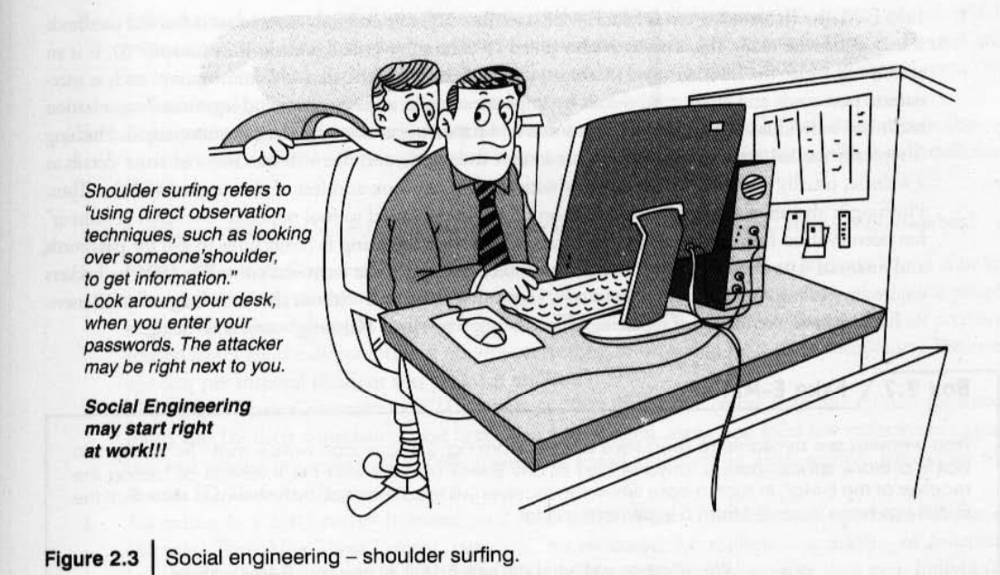
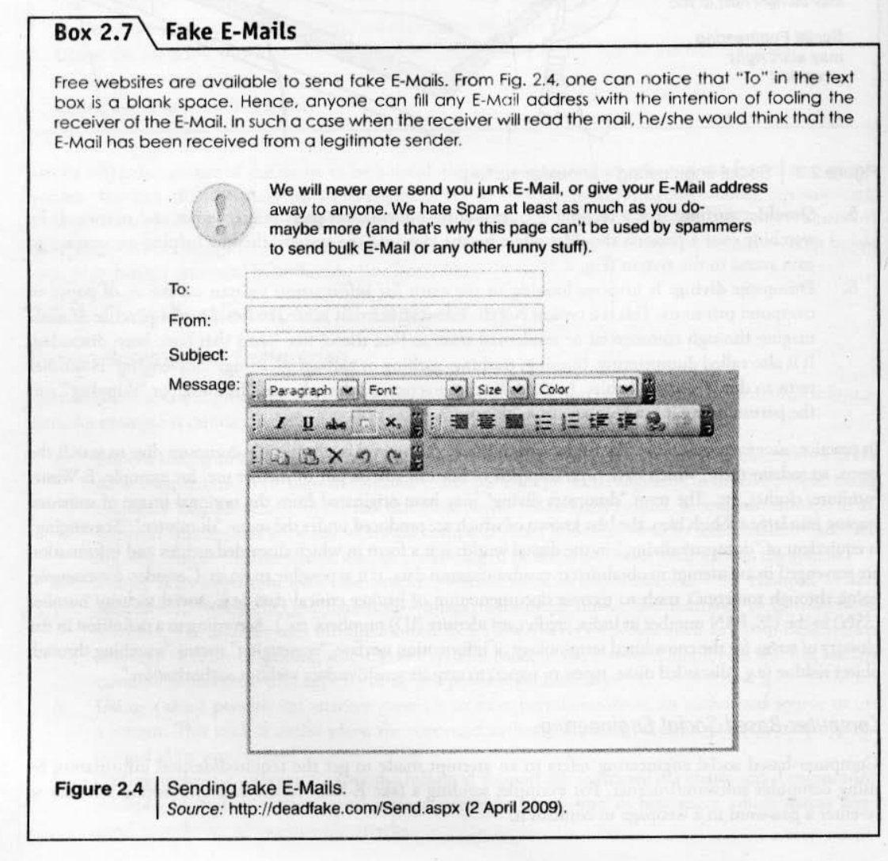
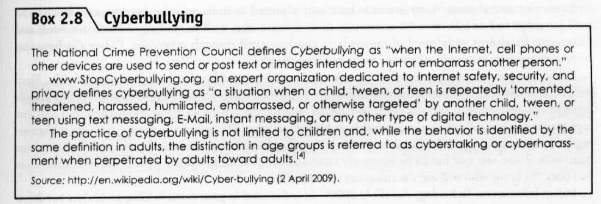

---

**Cybercrime – Definition and Origins of the Word Cybercrime and Information Security**

The term "cybercrime" traces its origins back to the word "cyber," which was coined by William Gibson in 1984 in his science fiction novel _Neuromancer_. In this context, "cyber" referred to a "consensual hallucination" or the "cyberspace," which is the conceptual space where human beings interact through networked computers.

The term "cybercrime" itself emerged from the term "cybernetics," coined by Norbert Wiener in 1948. Cybernetics is defined as the scientific study of the control and communication mechanisms in both machines and living organisms.

The definitions of "cybercrime" vary, but generally, it refers to an illegal act conducted in a computer or where the computer was directly or indirectly used. According to Webster Dictionary, crime is defined as "an act or the commission of an act that is forbidden by a public law and that makes the offender liable to punishment by that law". Cybercrime, specifically, is a criminal activity that involves a computer and the Internet to steal someone's identity or to sell contraband or stalk victims, or engage in malicious operations.

Cybercrime can be broadly classified in two ways:

1. **As a narrow definition:** This refers to crimes where the computer is the _role_ or _target_ of the crime.
2. **As a broad definition:** This encompasses crimes where the computer is the _environment_ or _context_ in which the crime occurs.

Examples of cybercrime in a narrow sense include hacking, computer sabotage, distributed denial-of-service (DDoS) attacks, and virtual child pornography. In a broad sense, examples include computer fraud, forgery, child pornography distribution, bank robbery, and drug trade.

##### Cybercrime and Information Security

Information security is fundamentally about protecting information, equipment, devices, computers, and associated networks from unauthorized access, use, disclosure, disruption, modification, or destruction. Cybersecurity, as a broader term, emphasizes safeguarding information, equipment, devices, computers, and their associated networks.

The increasing dependence on information and communication technology (ICT) and the widespread use of computers globally have brought numerous advantages but have also created avenues for misuse and opportunities for committing crimes. This has led to new risks for computer users and increased opportunities for social harm, with users, businesses, and organizations worldwide facing a constant threat from hackers.

In the context of cybercrime, information security focuses on preventing unauthorized access, protecting personal data (PII), and ensuring the integrity and availability of computer systems. The rise of cybercrime necessitates robust information security measures to counter threats like identity theft, financial fraud, and data breaches. Organizations must recognize the importance of cybersecurity because:

- They face internal costs associated with security incidents, such as loss of productivity, theft of intellectual property, and damage to reputation.
- They must implement security policies and controls to protect sensitive information.
- Cybercrime impacts various business functions, including human resources, accounting, and legal departments, making comprehensive information security crucial.

The challenge of information security in the age of cybercrime is significant due to:

- The ever-evolving nature of cyber threats.
- The large number of potential victims and the ease with which criminals can operate across geographical boundaries.
- The difficulty in estimating financial losses from cybercrime, as some organizations may choose not to disclose such incidents.
- The need for continuous vigilance and adaptation of security practices to combat new forms of attacks.

---

**Who are Cyber Criminals**

Cybercriminals are individuals or groups who commit illegal acts involving computers and the Internet12. Their activities can range from identity theft and financial fraud to malicious operations like selling contraband or stalking victims.

Cybercrime involves such activities as child pornography,credit card fraud,cyberstalking,defaming another online; gaining unauthorized access to computer systems; ignoring copyright, software licensing and trademark protection; overriding encryption to make illegal copies; software piracy and stealing another's identity (known as identity theft) to perform criminal acts.
Cybercriminals are those who conduct such acts. They can be categorized into three groups that reflect their motivation:

1. **Type I: Cybercriminals – hungry for recognition**
    
    - Hobby hackers;
        
    - IT professionals (social engineering is one of the biggest threats);
        
    - Politically motivated hackers;
        
    - Terrorist organizations.
        
2. **Type II: Cybercriminals – not interested in recognition**
    
    - Psychological perverts;
        
    - Financially motivated hackers (corporate espionage);
        
    - State-sponsored hacking (national espionage, sabotage);
        
    - Organized criminals.
        
3. **Type III: Cybercriminals – the insiders**
    
    - Disgruntled or former employees seeking revenge;
        
    - Competing companies using employees to gain economic advantage through damage and/or theft.
        

---

**Classifications of Cybercrimes**

Cybercrime encompasses a wide range of illegal activities that involve the use of computers and the internet. To understand and combat these offenses effectively, cybercrimes are classified into several categories based on the nature of the crime, the role of the computer, and the target (individuals, property, organizations, or society).

###### **1. Classification Based on Victim**

######## **1.1 Cybercrimes Against Individuals**

These crimes are targeted at specific persons, often with the aim of exploiting personal data, damaging reputation, or causing psychological harm. Common types include:

- **Email Spoofing**: This involves sending emails that appear to originate from a trusted source, but actually come from an unknown or fraudulent sender. The goal is usually to deceive the recipient into disclosing personal information or clicking malicious links.
    
- **Phishing and Spear Phishing**: Phishing involves sending fake emails or messages to trick individuals into sharing sensitive data such as passwords or banking details. Spear phishing is a more targeted version, customized to fool specific individuals.
    
- **Spamming**: The mass distribution of unsolicited emails, often used for advertising, spreading malware, or phishing.
    
- **Cyber Defamation**: Publishing false or harmful statements about someone on the internet to damage their reputation.
    
- **Cyberstalking and Harassment**: Persistent use of electronic communication to harass or intimidate someone.
    
- **Computer Sabotage**: The intentional destruction or disruption of a person’s data or computer system.
    
- **Pornographic Offenses**: The creation, distribution, or access of illegal sexual content, including content involving minors or non-consensual acts.
    
- **Password Sniffing**: Illegally capturing passwords through network monitoring tools to gain unauthorized access to systems.
    

####### **1.2 Cybercrimes Against Property**

These crimes focus on damaging or stealing digital property, including financial data, software, or intellectual assets.

- **Credit Card Frauds**: Unauthorized access to and use of someone’s credit card information for financial gain.
    
- **Intellectual Property (IP) Crimes**: These include software piracy, copyright violations, trademark theft, and the illegal use of source code or trade secrets.
    
- **Internet Time Theft**: The unauthorized use of an organization’s or individual’s internet service for personal purposes, without permission.
    

####### **1.3 Cybercrimes Against Organizations**

Organizations and companies are often the target of complex cyber-attacks that can result in data breaches, financial loss, or damage to reputation.

- **Unauthorized Access (Hacking)**: Illegally entering an organization’s computer systems without permission, often to steal, alter, or destroy data.
    
- **Password Sniffing**: Capturing organizational credentials for unauthorized access.
    
- **Denial-of-Service (DoS) Attacks**: Overloading a network or system with traffic, causing it to crash and become inaccessible.
    
- **Virus Attacks and Malware Spread**: Insertion of malicious software into systems to damage or steal information.
    
- **Email Bombing**: Flooding an email server with excessive emails to crash it or cause disruption.
    
- **Salami Attacks**: A method of cyber theft where small amounts of money are deducted from multiple accounts or transactions, often without detection.
    
- **Logic Bombs**: Malicious code triggered by specific conditions or dates to execute harmful actions.
    
- **Trojan Horse Attacks**: Malware disguised as legitimate software that, once installed, compromises the system.
    
- **Data Diddling**: Alteration of data before or after it is entered into a system, often during processing.
    
- **Industrial Espionage**: Using cyber means to spy on competitors or steal trade secrets.
    
- **Computer Network Intrusions**: Gaining unauthorized access to an organization’s network to steal or manipulate data.
    
- **Software Piracy**: The illegal copying, distribution, or use of licensed software without proper authorization.
    

######## **1.4 Cybercrimes Against Society**

These crimes affect the broader society and may target social institutions, governments, or public well-being.

- **Forgery**: Creating or using fake digital documents or certificates.
    
- **Cyberterrorism**: The use of digital technology to conduct terrorism, including attacking infrastructure, spreading propaganda, or organizing violent acts.
    
- **Web Jacking**: Gaining control over a website and modifying its content or redirecting its visitors to other malicious pages.
    

####### **1.5 Crimes Emanating from Usenet Newsgroups**

Usenet groups can serve as platforms for offensive, false, or misleading information. Misuse of these platforms may involve:

- Posting harmful, deceptive, or offensive content.
    
- Spreading misinformation.
    
- Sharing unauthorized or inappropriate files.
    

Although not always criminal, the misuse of these platforms can contribute to cybercrimes or support their execution.

---

#####  **2. Classification Based on the Role of the Computer**

Cybercrimes can also be understood based on how the computer is involved in the crime. Table 1.1 in the divides cybercrimes into the following:

######  **2.1 Computer as a Target (Narrow Sense)**

In these cases, the computer or the data stored on it is the direct target of the crime. Examples include:

- Hacking
    
- Computer sabotage
    
- Distributed Denial-of-Service (DDoS) attacks
    
- Virtual child pornography
    

###### **2.2 Computer as a Tool**

Here, the computer is used as a medium or instrument to commit the crime. The device stores information or aids in executing the illegal act. Examples include:

- Online fraud
    
- Forgery
    
- Distribution of child pornography
    

###### **2.3 Computer as the Environment or Context**

In this classification, the computer plays a supporting or peripheral role. It is not directly used to commit the crime but may help in planning, organizing, or recording evidence. Examples include:

- Using a computer to plan a robbery or drug trade
    
- Murder planned using internet-based tools or tracking
    
- Bank robbery assisted by digital surveillance tools
    

|**Role of Computer**|**Cybercrime in Narrow Sense**|**Cybercrime in Broad Sense**|
|---|---|---|
|**Computer as an Object**|Target of the attack (e.g., hacking, DDoS attacks)||
|**Computer as a Tool**|Medium to perform crimes (e.g., fraud, child porn)||
|**Computer as Environment/Context**|Not central to the crime, but part of it (e.g., murder, drug trade using tech)|Contains evidence or aids investigation|
Table : 1.1 : Broad vs. Narrow Classification

---

 **A Global Perspective on Cybercrimes**

Cybercrime, by its very nature, is a global phenomenon, deeply intertwined with the increasing interconnectedness brought about by information and communication technology (ICT) and the widespread use of computers worldwide. This global perspective highlights several key aspects:

**Borderless Nature and Evolution of Cybercrime** The concept of cybercrime is inherently global, as digital offenses can easily transcend national borders. The proliferation of ICT has created new opportunities for criminals, leading to increased risks for users, businesses, and organizations globally. Cybercrime is considered one of the "most globalized offenses" and a "modernized threat" due to its ability to operate across national boundaries, which is a direct outcome of globalization.

The definition of "cybercrime" varies across jurisdictions, but it is broadly understood to encompass illegal acts conducted using a computer or where the computer is directly or indirectly involved. For instance, Australia's statutory meaning is narrow, while the Council of Europe's Cyber Crime Treaty provides a broader definition. This broader view includes offenses against computer data and systems, computer-related offenses, content offenses, and copyright offenses. It also extends to ICT-dependent crime, white-collar crime, and economic crime.

**Global Trends and Impact** The global prevalence of cybercrime is evidenced by various statistics and trends:

- **Phishing:** There has been a significant rise in phishing attacks globally. Reports indicate that financial organizations, payment services, and auction websites are among the most targeted industries.
- **Spam:** Spam, often a vehicle for cybercrime, has seen a substantial increase over the years. Countries like Russia, Brazil, Turkey, and China have been identified as major sources of spam.
- **Financial Losses:** Organizations worldwide face internal costs from security incidents, including loss of productivity, theft of intellectual property, and reputational damage. However, accurately estimating the financial losses from cybercrime is challenging, as some organizations opt not to disclose such incidents.
- **International Involvement:** Cybercrime incidents frequently involve "Foreign National/Group" actors, highlighting the cross-border nature of these criminal activities.

**Challenges and Responses from a Global Perspective** The global nature of cybercrime presents unique challenges for information security and law enforcement:

- **Evolving Threats:** Cybercriminals constantly adapt their methods, making it difficult for security measures to keep pace.
- **Difficulty in Tracing:** The ability of criminals to operate across geographical boundaries makes it harder to trace and apprehend them.
- **Legal and Policy Frameworks:** Different countries have varying legal perspectives and frameworks to address cybercrime, which can complicate international cooperation and prosecution. For example, anti-spam legislation varies significantly globally, with some regions having "loose" laws compared to others.
- **Need for Global Cooperation:** The borderless characteristic of cybercrime necessitates international cooperation and continuous vigilance. Effective information security requires understanding these global threats, implementing preventative measures, and establishing robust incident response capabilities. Organizations like NASSCOM advocate for increased cybercrime awareness and the establishment of cyberlabs to combat these threats.

---

**Cybercrime Era: Survival Mantra for the Netizens**

In the "Cybercrime Era," netizens—individuals who spend considerable time online and have a significant online presence—need to adopt specific strategies to ensure their safety and security. These strategies can be summarized by the "5Ps of netizen security":

1. **Prevention**: Netizens must be vigilant and aware of potential cyber threats. This involves understanding the various forms of cybercrime and how they operate.
2. **Protection**: Safeguarding personal data and privacy is crucial. This includes implementing strong security measures for one's digital information and online activities.
3. **Preservation**: Ensuring data security for one's home network is an essential part of this survival mantra. Protecting your home network helps secure your personal digital environment.
4. **Perseverance**: Maintaining good security practices consistently is vital. Cyber threats are constantly evolving, so continuous vigilance and adaptation of security measures are necessary.
5. **Perception**: Understanding one's own data privacy and recognizing the security responsibilities of organizations is also key. This involves being aware of how personal data is handled by online services and companies.

Beyond individual efforts, the sources highlight broader initiatives to combat cybercrime and support netizens:

- Organizations like NASSCOM advocate for increased cybercrime awareness and the establishment of cyberlabs to combat these threats.
- Government agencies are encouraged to provide assistance to victims of cybercrimes and to enact new laws to support them.
- The importance of a forensic empowered agency to protect data is emphasized, as well as the legal frameworks like the IT Act 2000 and its amendments.

This comprehensive approach, combining individual protective measures with supportive infrastructure and legal frameworks, forms the "survival mantra" for netizens in the cybercrime era.

---

Cybercriminals plan their attacks through a series of phases, often employing social engineering tactics, engaging in cyberstalking, and leveraging locations like cybercafes for their illicit activities.

### How Criminals Plan the Attacks

Cybercrime planning typically involves five phases:

1. **Reconnaissance**: This initial phase, also known as "footprinting" or "reconnoitering," involves exploring to gather information about the target. The objective is to understand the system, its networking ports and services, computer architecture, and other security aspects needed to launch an attack. This phase can involve both passive and active attacks.
    
    - **Passive Attacks**: Involve gathering information about the target without their knowledge. This can include:
        - Searching on Google or Yahoo for information about employees.
        - Surfing online community groups like Facebook to gain information about an individual.
        - Examining an organization's website for personal or key employee information that can be used in social engineering attacks.
        - Monitoring blogs, newsgroups, and press releases.
        - Going through job postings.
        - Network sniffing to gather information on internet protocol address ranges, hidden servers, or services on the system. Passive attacks primarily breach confidentiality and do not alter information. The victim typically remains unaware of the attack, making detection the focus of security measures.
    - **Active Attacks**: Involve actively probing the network to discover individual hosts and confirm information gathered during the passive phase, such as IP addresses, operating system types and versions, and network services. These are also called "Rattling the Doorknobs" or Active Reconnaissance. Active attacks can affect the availability, integrity, and authenticity of data, and the information is modified. The victim is often informed, and prevention is the primary security focus. Examples include session hijacking, Man-in-the-Middle (MITM) attacks, impersonation, Denial of Service (DoS), and Distributed Denial of Service (DDoS) attacks.
2. **Scanning and Scrutinizing the Gathered Information**: This phase involves intelligently examining the collected information about the target. The objectives are port scanning, network scanning, and vulnerability scanning.
    
    - **Port Scanning**: Systematically scans computer ports to identify "open doors" or vulnerable access points. It's like checking every door and window of a house to see which ones are open. The response received from a port indicates if it's used and if it has weaknesses. Ports can be "Open or accepted," "Closed or not listening," or "Filtered or blocked". Common ports include FTP (20, 21), SMTP (25), Telnet (23), and HTTP (80).
    - **Scrutinizing Phase (Enumeration)**: Aims to identify valid user accounts or groups, network resources or shared resources, and the operating system (OS) and applications running on the OS.
3. **Validity of Information and Identifying Vulnerabilities**: After data collection, this phase focuses on validating the acquired information and identifying existing vulnerabilities.
    
4. **Launching an Attack and Gaining and Maintaining System Access**: This is where the attack is executed. Steps include:
    
    - Cracking passwords.
    - Exploiting privileges.
    - Executing malicious commands or applications.
    - Hiding files.
    - Covering tracks by deleting access logs to avoid detection.

### Social Engineering

Social engineering is a technique used to influence and persuade people to obtain information or perform actions against their own security policies or practices. It exploits human trust, desire to be helpful, and fear of trouble. The goal is to trick individuals into providing valuable information or access.

**Classification of Social Engineering:**

1. **Human-based Social Engineering**: Involves person-to-person interaction.
    
    - **Impersonating an employee or valid user**: Attackers pose as employees to deceive people, leveraging the fact that most people are helpful. They might pretend to be lost and ask for directions to a computer room, or act as an employee/user on the system.
    - **Posing as an important user**: Attackers pretend to be a high-level manager or CEO needing immediate assistance to gain system access.
    - **Using a third person**: An attacker claims to have permission from an authorized source to use a system, often when the legitimate personnel are on vacation or unavailable.
    - **Calling technical support**: A classic social engineering example where help-desk personnel, trained to assist users, become targets.
    - **Shoulder surfing**: Gathering information like usernames and passwords by watching someone type them in, often over their shoulder.

     

    - **Dumpster diving**: Rummaging through commercial or residential trash for discarded documents containing sensitive information (e.g., SSN, credit card numbers).

2. **Computer-based Social Engineering**: Uses computer software or the internet to gather information.
    
    - **Fake E-Mails (Phishing)**: Attackers send emails that appear legitimate to trick users into disclosing confidential information. This is known as "phishing" and is designed to capture sensitive data. Phishing often involves false emails, chats, or websites impersonating real systems.

     

    - **E-Mail attachments**: Malicious code (e.g., keyloggers, viruses, Trojans, worms) is embedded in email attachments to entice victims to open them, leading to automatic execution of the malicious code.
    - **Pop-up windows**: Used to encourage users to unintentionally install malicious software, often by offering special deals or free items.

### Cyberstalking

Cyberstalking is the use of the Internet or other electronic means to stalk or harass an individual, group, or organization. It can involve false accusations, defamation, slander, libel, monitoring, identity theft, threats, vandalism, solicitation of minors for sex, or gathering information to harass or threaten a person. It's also referred to as Internet stalking, e-stalking, or online stalking. Cyberstalking is a punishable offense under Indian law (Section 354(D), 509 IPC, and Section 67 under I.T. Amendment Act 2008).

**Types of Stalkers:** Both types are criminal offenses driven by a desire to control, intimidate, or influence a victim. Stalkers can be anonymous online strangers or known individuals.

1. **Online Stalkers**: Initiate interaction directly with the victim via the Internet, commonly using email and chat rooms. They ensure the victim recognizes the attack and may use third parties to harass.
2. **Offline Stalkers**: Begin with traditional methods like following the victim or watching their daily routine. They then use the Internet (message boards, newsgroups, personal websites, people-finding services) to gather information about the victim, who may be unaware the Internet is being used against them.

**How Stalking Works (Steps):**

1. **Personal information gathering**: Collecting data about the victim.
2. **Establishing contact and initial threats**: Contacting the victim via phone or cell phone and beginning to threaten or harass.
3. **Email contact**: Establishing contact through email.
4. **Repeated malicious emails**: Continuously sending emails with various favors or threats.
5. **Posting personal information**: Disclosing the victim's personal data on illicit service websites.
6. **Encouraging others to harass**: Other individuals, upon seeing the posted information, begin calling the victim for sexual services.
7. **Subscribing to illicit content**: Cyberstalkers may subscribe the victim's email account to numerous pornographic and sex sites, leading to unsolicited emails.

**Real-life Incident of Cyberstalking:** An Indian police case in Delhi involved Mrs. Joshi receiving nearly 40 calls over three days from locations like Kuwait, Cochin, Bombay, and Ahmedabad. A person used Mrs. Joshi's ID to chat obscenely on www.mirc.com for four consecutive days, giving out her name, address, and phone number, and encouraging others to call her. This was the first registered cyberstalking case of its kind.

### Cybercafe and Cybercrimes

Cybercafes, which offer public internet access for a fee, can inadvertently facilitate cybercrimes.

- A Nielsen Survey in India indicated that 37% of the total population uses cybercafes, with 90% being males aged 15-35, 52% graduates/postgraduates, and over 50% students. This highlights the importance of IT security and governance in these places.
- Cybercafes are used for various illicit activities, including real or false terrorist communication, stealing bank passwords, fraudulent money withdrawals, and deploying keyloggers or spyware. Shoulder surfing is also a risk.
- Cybercafes are often not classified as Network Service Providers (NSPs) under the IT Act 2000, raising questions about their responsibility for "due diligence".

**Illegal Activities Observed in Cybercafes:**

- Pirated software, operating systems, and office applications.
- Outdated antivirus software.
- Use of "deep freeze" software that clears all activity upon restart, making it difficult for police or crime investigators to trace victims.
- Lack of Annual Maintenance Contracts (AMCs), allowing criminals to install malicious code without interaction.
- Unblocked pornographic and other indecent content websites.
- Lack of awareness among cybercafe owners regarding IT security and governance guidelines.
- Infrequent or non-existent periodic visits by cyber-cell wings (state police) or cybercafe associations.

**Survival Mantra for Netizens (Safety and Security Measures in Cybercafes):**

1. **Always Logout**: Do not use automatic login. Always click "logout" or "sign out" from emails, chat services, or any password-protected site. Simply closing the browser window is insufficient as it allows subsequent users easy access to your account.
2. **Stay with the Computer**: Do not leave the system unattended while surfing or browsing. Log out and close all browser windows if you must step away.
3. **Clear History and Temporary Files**: Internet Explorer, for example, saves visited pages and passwords in history and temporary files. Before browsing, deselect checkboxes for saved passwords in AutoComplete settings. After browsing, clear history, temporary Internet files, and delete cookies.
4. **Be Alert (Avoid Shoulder Surfing)**: Remain vigilant and aware of your surroundings to prevent others from snooping your username and password.
5. **Avoid Online Financial Transactions**: Ideally, avoid online banking, shopping, or any transactions requiring sensitive personal information like credit card or bank account details. If urgent, change all passwords on a more trusted computer (e.g., at home or office) immediately after the transaction.
6. **Change Passwords**: Regularly change bank account and transaction passwords, especially after using public computers for online banking.
7. **Virtual Keyboard**: Utilize virtual keyboards provided by banks on their websites to prevent keylogger attacks.
8. **Security Warnings**: Pay utmost attention to security warnings displayed when accessing banking or financial institution websites from cybercafes.

---
