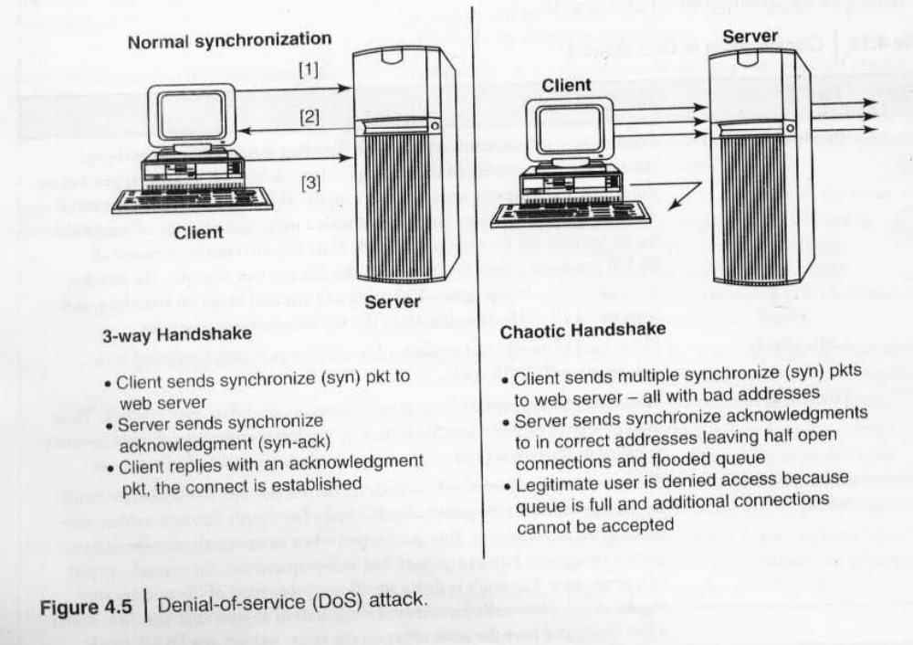

---

Cybercriminals employ a structured approach to targeting computer systems, which involves several forms of attack.

**Forms of Attack:**

1. **Initial Uncovering (Reconnaissance)**: This is the preparatory phase, often referred to as "footprinting" in hacking. It involves gathering information about the target's environment and computer architecture to find intrusion points. This can be done passively by searching public websites, news articles, online community groups (like Facebook), organization websites, blogs, newsgroups, and even job postings to learn about employees. Network sniffing can also be used in this phase to gather information on IP address ranges, hidden servers, or services without the target's knowledge.
2. **Network Probe (Investigation)**: After initial reconnaissance, attackers use more invasive techniques like "ping sweeps" and port scanning to discover individual hosts and confirm information about IP addresses, operating system types, versions, and services running on the network. This is also called "Rattling the Doorknobs" or "Active Reconnaissance".
3. **Crossing the Line toward E-crime**: At this stage, attackers exploit identified vulnerabilities in the target system to gain unauthorized access, often aiming for "root access," which provides full system privileges.
4. **Capturing the Network**: This involves taking control of the network. The attacker quickly gains internal network access and may replace existing files and services with malicious ones, such as Trojan files with backdoor passwords.
5. **Grab the Data**: Once the network is compromised, the attacker proceeds to steal confidential data, credit card information, deface webpages, alter processes, or launch further attacks from the compromised network.
6. **Covering Tracks**: This final step aims to extend the misuse of the system without detection. Attackers meticulously hide their identity and erase any traces of illicit activity, such as deleting access logs. Tools like ELSave, WinZapper, Evidence Eliminator, Traceless, and Tracks Eraser Pro are used for this purpose.

**Types of Malicious Software and Deception Tactics:**

- **Scareware**: This is scam software that uses social engineering by displaying pop-up messages (e.g., "your computer may be infected with harmful spyware programs") to create anxiety and trick users into purchasing or downloading non-beneficial, often malicious, software. Some forms of spyware and adware use scareware tactics.
- **Malvertising**: This involves malicious advertising, where malware is hidden within advertisements or embedded into webpages, subtly installing unwanted media or other malicious software when users interact with them.
- **Clickjacking**: This technique tricks users into revealing confidential information or taking control of their system by clicking on seemingly innocuous webpages. It executes embedded malicious code without the user's knowledge.
- **Ransomware**: This is a type of malware that holds a computer system or its data hostage, demanding a ransom for its restoration. It typically propagates as a computer worm, entering systems through email attachments or network vulnerabilities, disabling essential system services, and encrypting personal files.

Attackers use various websites to obtain information on system vulnerabilities, including US-CERT, CVE, Secunia, Hackstorm, Hackerwatch, Zone-H, Milworm, OSVDB, Metasploit, LibExploit, Canvas, and Core Impact.

### Proxy Servers and Anonymizers

Proxy servers and anonymizers are crucial tools for cybercriminals to obscure their digital footprint and maintain anonymity.

**Proxy Servers:** A proxy server acts as an intermediary for connections between computers on a network. Its purposes include:

- **Hiding Identity**: It allows an attacker to conceal their IP address and identity.
- **Speeding Up Access**: It can cache webpages from a web server, thereby speeding up access to resources.
- **Filtering Content**: Specialized proxy servers are used to filter unwanted content, such as advertisements.
- **IP Address Multiplexing**: It can be used as an IP address multiplexer, allowing multiple computers to connect to the internet using a single IP address. Examples of websites offering free proxy services include proxy4free.com, proxz.com, anonymitychecker.com, surf24h.com, and hidemyass.com.

**Anonymizers:** An anonymizer, also known as an anonymous proxy, is a tool designed to make internet activity untraceable. It accesses the internet on behalf of the user, protecting personal information by hiding the source computer's identifying data. These sites are used by individuals who wish to avoid leaving traces of their identity online, thereby preventing unsolicited emails from spammers or contact from cyberstalkers. Websites providing anonymizer services include anonymizer.com, browzar.com, anonymize.net, and anonymouse.ws.

**Being Anonymous while Searching on Google:** When searching online, even common tools can record user data:

- **Google Cookie**: Google was one of the first search engines to use cookies, placing a unique ID number on a user's hard disk. This cookie reads and records the unique ID number each time a user visits Google, allowing Google to build a detailed list of search terms over many years. These cookies are set to expire in 2038 unless deleted by the user.
- **Cookie (HTTP/Browser Cookie)**: A small text file containing alphanumeric characters, used for storing website preferences or authentication. Attackers can exploit these cookies as "Spyware." Cookies can be persistent (stored on the PC's hard disk) or session-based (temporary, deleted when the browser closes).
- **DoubleClick**: A Google subsidiary that provides internet ad-serving services and paid search. It utilizes "DART cookies" to facilitate these services.
- **G-Zapper**: A utility that helps users maintain anonymity while searching Google. It protects users' search history and displays information about their Google cookie (installation date, tracking duration). G-Zapper allows users to automatically delete or block the Google search cookie from future installations, preventing it from compiling reports, tracking user habits, or testing features.

---

## Phishing

Phishing is a deceptive cybercrime technique primarily aimed at tricking individuals into revealing sensitive information, such as usernames, passwords, and credit card details. It was introduced around 1996.

### Definition and Purpose

Phishing is defined as a criminally fraudulent process that attempts to acquire sensitive information by masquerading as a trustworthy entity in electronic communication. It involves sending emails that falsely claim to be from established, legitimate enterprises to scam users into surrendering private information for identity theft. The emails often direct users to bogus websites that mimic legitimate ones, set up solely to steal user information. Phishers aim to gain valuable, sometimes invaluable, information from their victims.

### How Phishing Works (Attack Phases)

Phishing attacks typically follow a structured approach involving several steps:

1. **Planning**: Criminals, known as "phishers," select their target and determine how to obtain email addresses.
2. **Setup**: Phishers identify a business or entity to spoof and create methods to deliver their deceptive messages and collect data from the target.
3. **Attack**: A phony message, appearing to be from a reputable source, is sent to the victims.
4. **Collection**: Phishers record the information victims enter on fake webpages or pop-up windows.
5. **Identity Theft and Fraud**: The collected information is then used to make illegal purchases or commit other forms of fraud.

This entire process involves the attacker taking optimum care to hide their identity from the very first step.

### Forms of Attack and Deception Tactics

Phishing is closely related to various forms of attack and deception tactics:

- **Scareware**: Scam software that uses social engineering with pop-up messages (e.g., "your computer may be infected") to create anxiety and trick users into purchasing or downloading malicious software.
- **Malvertising**: Malicious advertising where malware is hidden within ads or embedded into webpages, subtly installing unwanted media or other malicious software when users interact with them.
- **Clickjacking**: A technique that tricks users into revealing confidential information or taking control of their system by clicking on seemingly innocuous webpages, executing embedded malicious code without their knowledge.
- **Ransomware**: Malware that holds a computer system or its data hostage, demanding a ransom for restoration. It often propagates as a computer worm through email attachments or network vulnerabilities, disabling system services and encrypting personal files.
- **Spoofing**: Often used in phishing, where phishers create fake emails. Spoofing itself is not intended to steal information but to make the victim perform an action for the phisher. Phishing may require spoofing to entice victims to reveal information.

### Methods and Techniques of Phishing

Phishers use a variety of sophisticated methods and techniques:

**1. Four Core Methods:**

- **Dragnet**: Involves mass-spammed emails with falsified corporate identification (logos, names) sent to large groups, relying on false information to trigger an immediate response like clicking links to fake websites for data entry. Phishers do not identify specific victims in advance.
- **Road-and-reel**: Phishers identify specific victims in advance and convey false information to prompt their disclosure of personal and financial data. For example, a phony webpage might display a similar item for a better price to entice data entry.
- **Lobsterpot**: Focuses on spoofed websites. This involves creating bogus websites similar to legitimate corporate ones, targeting a narrowly defined class of victims. A weblink in an email leads the victim to a fake scam site that looks legitimate.
- **Gillnet**: Relies less on social engineering and more on introducing malicious code into emails and websites. This code can subtly install unwanted media, redirect users to fake sites, or record keystrokes without the user's knowledge.

**2. Phishing Techniques (UFWFSP):**

- **URL (weblink) Manipulation**: Phishers provide misspelled URLs (e.g., `www.abcbank1.com` instead of `www.abcbank.com`) to redirect users to fake sites. This includes **Homograph Attacks**, which exploit similar-looking characters in internationalized domain names (e.g., '0' for 'O').
- **Filter Evasion**: Uses graphics instead of text in emails to bypass anti-phishing filters in web browsers like Internet Explorer, Firefox, and Opera.
- **Website Forgery**: Attackers direct users to a website designed by them, altering the browser's address bar through JavaScript commands. This can also involve "cloaked" URLs or domain forwarding.
- **Flash Phishing**: Emulates legitimate websites using Flash objects, bypassing anti-phishing toolbars that do not analyze Flash content.
- **Social Phishing**: Entices sensitive data through other means, such as fake calls requesting a callback due to a "security breach." The victim calls a false number, is redirected to the phisher, who then impersonates a bank employee to collect information.
- **Phone Phishing (Mishing)**: Uses fake caller ID data to appear as a trusted organization. This includes **Vishing** (VoIP phishing) and **Smishing** (SMS phishing).
- **Innovative Phishing Attacks**: Examples include malware hidden in mobile applications (e.g., 09Droid on Android Market) that steal online banking credentials.

**3. Targeted Phishing:**

- **Spear Phishing**: A highly targeted phishing message sent to a specific organization, company, or group to gain organizational information for more focused social engineering. These emails appear genuine, as if from an employer or colleague, but the sender information is faked. The goal is often to gain access to the company's entire computer system.
- **Whaling**: A specific form of phishing or spear phishing that targets top-level executives in organizations. The emails are designed to look like critical business communications and aim to swindle confidential information. An example includes forged FBI subpoena emails that, when clicked, install keyloggers to record executive passwords.

### Types of Phishing Scams

- **Deceptive Phishing**: Broadcasts deceptive email messages (e.g., about bank account verification or system failures) to a wide group of people to entice them to reveal information.
- **Malware-based Phishing**: Involves running malicious code on the victim's system, often through email attachments, downloadable files, or by exploiting security vulnerabilities.
- **Keyloggers**: Small programs that steal information (like keystrokes) and transmit it to the phisher. They can be embedded in browsers or system holes.
- **Session Hijacking**: Monitors a user's activities until they establish legitimate credentials, then the malicious code takes over to perform unauthorized actions like transferring funds.
- **In-session Phishing**: A pop-up window launched in a parallel browser session that pretends to be from the targeted session (e.g., an online banking website).
- **Web Trojans**: Pop up to collect user credentials and transmit them to the phisher during the login process.
- **Pharming**: A new threat that aims to redirect website traffic to bogus websites. It can involve **Hosts File Poisoning** (altering a computer's hosts file to redirect legitimate website requests to a fake site) or **DNS-based Phishing** (tampering with DNS to redirect URLs to fake sites, also known as DNS hijacking).
- **System Configuration Attacks**: Phishers intrude into a user's system to modify settings for malicious purposes, such as changing saved URLs in browser favorites to redirect to fake sites.
- **Data Theft**: Stealing critical and confidential data from corporate servers and the web, often used in business espionage.
- **Content Injection Phishing**: Replaces parts of a legitimate website's content with false information.
- **Man-in-the-Middle Phishing**: The phisher positions themselves between the user and a legitimate website, recording input while still passing it to the server so the user's transactions appear unaffected.
- **Search Engine Phishing**: Phishers create attractive, often too-good-to-be-true, websites that are legitimately indexed by search engines. Users find these sites during normal searches and are then tricked into revealing personal information.
- **SSL Certificate Phishing**: Targets web servers with SSL certificates to create deceptive websites displaying familiar "lock" icons, even though the site is fraudulent. While the SSL certificate may appear legitimate, smart users can detect the deception by checking for an extended validation SSL certificate.

### Three P's of Cybercrime

Phishing is part of a broader group known as the "Three P's of Cybercrime":

- **Phishing**: As described above, to steal personal information.
- **Pharming**: Redirects website traffic to bogus sites, often by cracking ISP or DNS server vulnerabilities.
- **Phoraging**: The process of collecting data from various online sources (like matrimonial or social networking sites) to build a victim's identity, with the ultimate goal of identity theft.

### Advanced Forms of Phishing

- **Tabnapping or Tabjacking**: Invades web browser tabs that are not in use ("napping") and redirects them to a phished webpage if the tab has been idle. This is judged by the absence of mouse movement, scrollbar movement, or keystrokes. Common targets include banking/financial institutes, Gmail, Facebook, Instagram, and WhatsApp.
- **DNS Hijacking**: An illegal change to a DNS server that redirects a URL to a different, often malicious, website. Attackers use Trojans to replace legitimate DNS server assignments with bogus ones, making the redirection go unnoticed.
- **Click Fraud**: An internet crime in pay-per-click online advertising where a person or automated program imitates legitimate user clicks to generate charges without actual interest in the advertisement's target. It can be done by manually clicking ad hyperlinks or using automated software/bots.

### Statistics and Trends

- Phishing attacks are monitored daily on websites like phishtank.com.
- In May 2009, over 3,650 non-English phishing websites were recorded. The most common top-level domains used were ".com" (50%), ".net" (9%), and ".org" (5%).
- According to a Q4-2009 report, financial organizations, payment services, and auction websites were the most targeted industries. Ports 80 (HTTP), 443 (S-HTTP), and 8080 (WEB SERVER) were commonly used by phishers.
- The number of phishing hosts showed a significant rise between July 2006 and July 2007.

### Countermeasures and Protection

Several measures can be taken to prevent becoming a victim of phishing attacks:

- **Keep Antivirus Up-to-Date**: Ensure security software is current.
- **Do Not Click on Hyperlinks in Emails**: Avoid clicking suspicious links.
- **Use Anti-Spam Software**: Utilize tools to filter unwanted emails.
- **Verify HTTPS (SSL)**: Check for secure connections when entering sensitive information.
- **Use Anti-Spyware Software**: Protect against spyware, which can be part of phishing attacks.
- **Get Educated**: Understand phishing tactics.
- **Use Microsoft Baseline Security Analyzer (MBSA)**.
- **Firewall**: Employ firewalls for network protection.
- **Use Backup System Images**: Have backups to restore systems if compromised.
- **Do Not Enter Sensitive Information in Pop-up Windows**: Avoid disclosing data in unexpected pop-ups.
- **Secure the Hosts File**: Protect this file from malicious alterations.
- **Protect Against DNS Pharming Attacks**.
- **Avoid Online Financial Transactions in Cybercafes**: If urgent, change passwords immediately after using a more trusted computer.
- **Always Logout**: Ensure logging out of services in public computers, not just closing the browser.
- **Clear History and Temporary Files**: Delete browsing history and temporary files on public computers.
- **Be Alert for Shoulder Surfing**: Be aware of surroundings when entering information in public.
- **Use Virtual Keyboard**: Many banks offer virtual keyboards to avoid keylogger attacks.

**Recognizing Legitimate Websites**: Tools like McAfee Site Advisor provide security ratings for websites. The SPS (Sanitizing Proxy System) algorithm offers a robust approach to thwart phishing with two-level filtering and flexibility.

**Reducing Spam Emails**:

- Limit sharing personal email addresses on public platforms.
- Never reply to or open spam emails, as this confirms the email address's validity.
- Disguise email addresses when posting publicly (e.g., "RajeevATgmailDOTcom").
- Use alternate email addresses for personal or shopping websites, not business ones.
- Do not forward emails from unknown recipients.
- Preview emails before opening them.
- Never use an email address as a screen name in chat groups.
- Never respond to "remove from mailing list" requests in spam emails.

### Organizations and Tools

- **Anti-Phishing Working Group (APWG)**: An international consortium founded in 2003, with over 3,200 members, dedicated to combating phishing and identity theft.
- **US-CERT, CVE, Secunia, Hackstorm, Hackerwatch, Zone-H, Milworm, OSVDB, Metasploit, LibExploit, Canvas, and Core Impact**: Websites and tools cybercriminals use to obtain information on system vulnerabilities.
- **Microsoft phishing filter, Google Phishing filter (Firefox), Opera Fraud Protection**: In-built anti-phishing filters in web browsers.

---

## Password cracking

Password cracking is the process of recovering passwords that have been stored in or transmitted by a computer system. It is a key topic in cybersecurity, particularly within the context of cybercrime tools and methods.

**Purpose of Password Cracking** The main purposes of password cracking include:

1. **Recovering forgotten passwords**.
2. **Preventive measure** by system administrators to identify easily crackable passwords.
3. **Gaining unauthorized access** to a system.

**Manual Password Cracking Steps** An attacker attempting to manually crack a password will typically follow these steps:

1. Find a valid user account, such as an Administrator or Guest account.
2. Create a list of possible passwords.
3. Rank the passwords from high to low probability.
4. Key-in each password.
5. Repeat the process until a successful password is found.

**Password Cracking Tools** Various tools are available for password cracking:

- **Cain & Abel**: A password recovery tool for Microsoft Operating Systems that can recover many password types, decrypt scrambled passwords, and recover wireless network keys.
- **John the Ripper**: A free and open-source software that detects weak Unix passwords.
- **THC-Hydra**: A network logon cracker supporting many different protocols.
- **Aircrack-ng**: A set of tools for wireless networks, enabling WEP key cracking.
- **LOphtCrack**: A password auditing and recovery tool for Windows, allowing local password hashes to be retrieved and audited.
- **AirSnort**: A wireless LAN (WLAN) tool for recovering encryption keys.
- **Solar Winds**: Provides network discovery/monitoring/attack tools.
- **Pwdump**: A Windows password recovery tool that can dump local and remote NT LAN Manager (NTLM) hashes.
- **RainbowCrack**: A hash cracker that creates large-scale time-memory trade-offs.
- **Brutus**: A fast, flexible remote password cracker.
- **Solarwinds**: Tools for network discovery/monitoring/attack, designed to identify security vulnerabilities.
- **Hash Crack**: A hash cracker for large-scale time-memory trade-offs.

**Types of Password Cracking Attacks** Password cracking attacks can be classified into three main categories:

1. **Online Attacks**: Involve executing an automated program to try each password in a list until a match is found.
    
    - **Man-in-the-middle (MITM) attack** (also known as "bucket-brigade attack" or "Janus attack"): The attacker establishes a connection between the victim and the server, intercepting communications, hashing passwords, and passing the connection to the legitimate server. This method is used to obtain passwords for email accounts on public websites (like Yahoo, Hotmail, Gmail) and financial websites to gain access to banking services.
2. **Offline Attacks**: Performed from a location other than the target system, often requiring physical access to the computer to copy the password file onto removable media. The goal is to obtain passwords in clear text format.
    
    - **Dictionary Attack**: Attempts to match all words from a dictionary to crack the password (e.g., "Administrator").
    - **Hybrid Attack**: Substitutes numbers and symbols to dictionary words (e.g., "Adm1n1strator").
    - **Brute Force Attack**: Attempts all possible permutations and combinations of letters, numbers, and special characters (e.g., "Adm!n@09").
3. **Non-electronic Attacks**: These include social engineering, shoulder surfing, and dumpster diving, which are explained in Chapter 2.
    

**Password Strength**

- **Weak Passwords**: Easily guessed, short, common, or system default passwords. Examples include common personal names ("Susan"), repeated letters ("aaaa"), pet names ("rover"), simple sequences ("abc123", "1234"), common terms ("admin", "password"), keyboard sequences ("QWERTY"), dates ("12/3/75"), usernames ("nbusr123"), or simple letter substitutions ("p@S$V/ord").
- **Strong Passwords**: Long, random, or otherwise difficult to guess. They are chosen by the user and their crack time varies based on the attacker's resources and the password's value. Examples include phrases ("Convert £100 to Euros!"), mixed numbers and letters used on mass user accounts ("382465304H"), or non-dictionary words with mixed alpha, numeric, and punctuation characters ("PIeai@3", "MoOoOfln245679", "t3wahSetyeT4").
- **Random Passwords**: Stronger as they include a mix of upper and lower case letters, numbers, and other symbols. However, their difficulty in remembering increases the chance of users writing them down, making them vulnerable to other attacks.

**Password Policies and Security Measures** General guidelines for password policies that can be implemented organization-wide include:

- Passwords and user logon identities (IDs) should be unique for each authorized user.
- Passwords should consist of a minimum of eight alphanumeric characters, avoiding common names or phrases.
- Computer-controlled lists of prescribed password rules and periodic testing (e.g., for letter and number sequences, character repetition, initials, common words, and standard names) should be used to identify weaknesses.
- Passwords should be kept private, not shared with friends or colleagues, and not coded into programs or written down anywhere.
- Passwords should be changed every 30/45 days or less. Most operating systems (OS) can enforce automatic expiration and prevent reuse.
- User accounts should be frozen after five failed logon attempts, and erroneous password entries should be recorded in an audit log.
- Sessions should be suspended after 15 minutes (or a specified period) of inactivity, requiring re-entry of passwords.
- Successful logons should display the date and time of the last logon/logoff.
- Logon IDs and passwords should be suspended after a specified period of non-use.
- For high-risk systems, excessive violations should trigger an alarm and allow for simulation of a continuing session with dummy data for the failed user.

For netizens, specific advice to avoid falling victim to hacked email or financial accounts includes:

- Keep business, personal, and banking email/financial accounts separate.
- Passwords should not be shared with relatives or friends.
- Do not reuse previously used passwords when renewing.
- Do not store passwords on mobile phones or PDAs, as these devices are prone to cyberattacks.
- Before clicking web links in emails from banking/financial institutions, ensure the email's legitimacy to avoid phishing attacks.
- Similarly, for SMS from banking/financial institutions, ensure legitimacy to avoid smishing attacks.
- If accounts are hacked, contact the respective agencies/institutes immediately.

---

## Keyloggers and Spywares

Keyloggers and Spywares are significant tools and methods used in cybercrime, primarily designed to intercept and collect information from computer systems.

### Keyloggers

**Definition and Purpose** Keystroke logging, commonly known as keylogging, is the practice of covertly noting or logging the keys struck on a keyboard without the user's awareness. Keyloggers offer a quick and easy way to capture passwords and monitor a victim's IT-savvy behavior. The purpose of keyloggers in cybercrime is to gain unauthorized access to systems by stealing credentials.

**Classification** Keyloggers can be classified into two main types:

1. **Software Keyloggers**
    
    - These are software programs installed on computer systems, typically located between the operating system (OS) and the keyboard hardware.
    - They record every keystroke made by the user.
    - Often, software keyloggers are installed onto a system by Trojans or viruses without the user's knowledge.
    - Cybercriminals frequently install these tools on insecure public computers, such as those in cybercafes or libraries, to easily obtain information about victims.
    - A typical software keylogger might consist of two files installed in the same directory: a Dynamic Link Library (DLL) file that performs the recording, and an executable (EXE) file that installs the DLL and triggers its operation.
    - Examples include All-in-One Keylogger, Stealth Keylogger, Perfect Keylogger, KGB Spy, Spy Buddy, Elite Keylogger, Cyberspy, Powered Keylogger, XPC Spy, Spytech Spyagent, and Stealth.
2. **Hardware Keyloggers**
    
    - These are small physical hardware devices that require physical access to the computer system for installation.
    - They are connected to the PC and/or keyboard and save every keystroke to a file or the device's memory.
    - Cybercriminals have been known to install these devices on ATM machines to capture ATM card PINs, as each keypress on the ATM keyboard is registered by the keylogger.
    - These keyloggers are designed to look like an integrated part of the systems, making their presence unnoticed by users.
    - Examples of websites providing information on hardware keyloggers include keyghost.com, keelog.com, keydevil.com, and keykatcher.com.

**Anti-Keyloggers** Anti-keyloggers are tools designed to detect and remove keyloggers installed on a computer system. Their advantages include:

- Firewalls typically cannot detect keylogger installations, whereas anti-keyloggers can.
- Unlike some antivirus and anti-spyware programs, anti-keyloggers do not require regular updates of signature bases to function effectively.
- They help prevent Internet banking fraud by thwarting password capture by keyloggers.
- They aid in preventing identity (ID) theft and securing email and instant messaging/chatting.

### Spywares

**Definition and Function** Spyware is a type of malicious software (malware) that is installed on computers to collect information about users without their knowledge. Its presence is usually hidden from the user, and it is secretly installed on the user's personal computer. In some cases, spyware, including keyloggers, might be intentionally installed by the owner of a shared, corporate, or public computer to secretly monitor other users.

**Information Collected and Impact** Spyware programs secretly monitor the user and collect personal information about the victim, such as Internet surfing habits, patterns, and visited websites. These programs can alter internet settings, leading users to complain about slower internet speeds.

**Examples** Examples of spyware include 007 Spy, Spector Pro, eBlaster, Remotespy, Stealth Recorder Pro, Stealth Website Logger, Flexispy, Wiretap Professional, PC PhoneHome, and SpyArsenal Print Monitor Pro.

**Relationship with Malware** Keyloggers and Spyware fall under the broader category of "malware" (malicious software), which is designed to infiltrate a computer system without the owner's informed consent. Malware represents various forms of hostile, intrusive, or annoying software or program code.

---

## **Virus and Worms**

Viruses and worms are both types of malicious software (malware) designed to infiltrate computer systems. They are often used by criminals for various attacks.

**Computer Viruses** A computer virus is a program that "infects" legitimate programs by modifying them to include a copy of itself, which can then "evolve". Viruses spread without the user's knowledge or permission. They contain malicious instructions that can cause damage or annoyance. A virus passes from computer to computer similar to how a biological virus spreads from person to person. They can be triggered by specific events (e.g., after a certain number of executions), time-driven effects (e.g., a specific date like Friday the 13th), or occur randomly.

**Typical actions of a virus include:**

- Displaying a message to prompt an action that may set off the virus.
- Deleting files within the infected system.
- Scrambling data on a hard disk.
- Causing erratic screen behavior.
- Halting the system (PC).
- Replicating themselves to propagate further harm.
- Modifying themselves to potentially escape detection.

**Types of Viruses:** Viruses can be categorized based on their attack methods on various system elements:

- **Boot Sector Viruses:** These infect the storage media where the operating system (OS) is stored and used to start the computer. They spread to other systems through shared infected disks and pirated software.
- **Program Viruses:** These become active when program files (usually with extensions like .bin, .com, .exe, .ovl, .drv) are executed, and they make copies of themselves.
- **Multipartite Viruses:** A hybrid of boot sector and program viruses, infecting program files along with the boot record when the infected program is active.
- **Stealth Viruses:** These camouflage or mask themselves, making detection difficult for antivirus software. An example is the Brain virus.
- **Polymorphic Viruses:** These act like "chameleons," changing their binary pattern (signature) each time they spread (multiply and infect new files), making them hard for antivirus programs to detect. Polymorphic generators are routines that link with existing viruses to hide them under polymorphism.
- **Macro Viruses:** These are programmed as macros embedded in documents and spread when the document is opened. Once on a victim's computer, every document produced will become infected.
- **Active X Java Control:** Web browsers have settings for Active X and Java Commands; unawareness of managing these settings can invite threats from unwanted software.

**Examples of Viruses:** Conficker, INF/AutoRun, Win32 PSW, OnLineGames, Win32/Agent (Trojan), Win32/FlyStudio (Trojan with backdoor characteristics), Win32/Pacex.Gen, Win32/Qhost, WMA/TrojanDownloader.GetCodec.

**Computer Worms** A computer worm is a self-replicating malware program that spreads through a network without needing a host program. Unlike viruses, worms do not need to attach themselves to an existing program. They can send copies of themselves to other nodes on the network without user intervention. Worms typically cause some harm to the network, often by consuming bandwidth, while viruses tend to corrupt or modify files on a targeted computer.

**Examples of Worms:** Morris Worm, ILOVEYOU, Nimda, Code Red, Melissa, MSBlast, Sobig, Storm Worm, Michelangelo, Jerusalem.

**Distinction between Viruses and Worms** The sources highlight key differences between viruses and worms:

|Facet|Virus|Worm|
|:--|:--|:--|
|**Different types**|Stealth virus, self-modified virus, encryption with variable key virus, polymorphic code virus, metamorphic code virus.|E-Mail worms, instant messaging worms, Internet worms, IRC worms, file-sharing, networks worms.|
|**Spread mode**|Needs a host program to spread.|Self-spreading, without user intervention.|
|**What is it?**|A software program that copies itself and infects data or information without user knowledge; needs a host program to carry it for spreading.|A self-replicating software program that spreads through a network; can send copies through the network.|
|**Inception**|Creeper virus (early 1970s, ARPANET).|Shockwave Rider (science fiction novel, 1975).|
|**Prevalence**|Very high.|Moderate.|

Both viruses and worms are typically delivered as E-Mail attachments or downloaded files. Worms specifically use holes in network protocols directly for propagation.

## Virus spread via :-

---

## Trojan Horses and Backdoors

Trojan Horses and Backdoors are both types of malicious software (malware) used by cybercriminals to gain unauthorized access and control over computer systems.

**Trojan Horses** A Trojan Horse is a type of malware that disguises itself as, or is contained within, seemingly harmless programming or data. Its primary goal is to gain control of a system and cause harm once activated. Unlike viruses, Trojan Horses do not self-replicate; they require a user to execute them, often by being enticed to open an attachment or download a file. They can be delivered via web browsers, email attachments, or downloaded software.

**Typical actions of a Trojan Horse include:**

- Erasing, overwriting, or corrupting data on the computer.
- Helping to spread other malware.
- Deactivating or interfering with antivirus software and firewalls.
- Allowing remote access to your computer.
- Uploading and downloading files without the user's knowledge.
- Gathering email addresses and using them for spam.
- Causing the system to slow down, restart, or shut down.
- Reinstalling themselves after being disabled.
- Disabling the task manager or control panel.
- Copying fake links to false websites.
- Displaying pornographic sites, playing sounds/videos, or displaying images.
- Logging keystrokes to steal information such as passwords or credit card numbers.

Trojan Horses are often delivered as email attachments or can be installed by hackers to commandeer a computer. Some phishing techniques, like Gillnet, can inject a Trojan Horse into a system, which then logs user actions and sends stolen data to the phisher. Blended threats can bundle Trojan Horses with other malware like viruses and worms.

**Backdoors** A backdoor is a method of accessing a computer program or system that bypasses normal security mechanisms or authentication procedures. Programmers might initially create backdoors for troubleshooting, but attackers can detect or install them as part of an exploit. Backdoors operate in the background, remain hidden from the user, and are considered highly dangerous because they allow a malicious person to perform virtually any action on the compromised system.

**A backdoor can enable an attacker to perform various actions, such as:**

- Creating, deleting, renaming, copying, or editing files.
- Changing system settings and altering the Windows registry.
- Running, controlling, and terminating applications.
- Installing arbitrary software.
- Controlling computer hardware devices and modifying related settings.
- Shutting down or restarting a computer without user permission.
- Stealing sensitive personal information.
- Logging user activity and tracking web browsing habits.
- Recording keystrokes and capturing screenshots.
- Sending all gathered data to a predefined email address.
- Infecting files, corrupting installed applications, and damaging the entire system.
- Distributing infected files to remote computers and performing attacks against hacker-defined remote hosts.
- Installing hidden FTP servers that malicious persons can use.
- Degrading Internet connection speed and overall system performance.
- Providing uninstall features and hiding processes, files, and other objects to complicate its removal.

**Examples of Backdoor Trojans include:**

- **Back Orifice:** Enables a user to control a computer running Microsoft Windows OS from a remote location.
- **Bifrost:** Infects Windows 95 through Vista.
- **SAP backdoors:** Exploits vulnerabilities in SAP (Enterprise Resource Planning) systems, which are central to business processes.
- **Onapsis Bizploit:** An open-source ERP penetration testing framework that assists security professionals in discovering and exploiting ERP vulnerabilities.

**Distinction and Relationship:** While backdoors are a method of access, Trojan Horses are a _delivery mechanism_ that often _contain_ or _install_ backdoors. A Trojan Horse brings the malicious payload (which could be a backdoor) into the system, and once executed, that payload can then create persistent unauthorized access via a backdoor.

**Protection against Trojan Horses and Backdoors:** To protect against these threats, it is recommended to:

- **Avoid suspect websites and weblinks:** Do not download free or pirated software from untrusted sources, as these often contain Trojans.
- **Surf the web cautiously:** Be careful when connecting to or downloading information from peer-to-peer (P2P) networks, as they are known to spread malicious software like Trojans.
- **Install and maintain antivirus/Trojan remover software:** Antivirus software often has built-in features to protect against various malware, including Trojans.

---

## Steganography

Steganography is an art and science that focuses on "sheltered writing," meaning it involves hiding the existence of a message or communication. The term originates from two Greek words: "Steganos," meaning "covered," and "graphein," meaning "to write" or "concealed writing". It is a method of attempting to conceal information.

**How Steganography Works** In steganography, a secret message is embedded within a "cover medium" in such a way that its presence is not obvious. The cover medium can be various forms of innocent data, such as audio, still images, or video. For example, in a digital image, the least significant bit of each word can be used to form a message without causing any noticeable change to the image. A "stegokey" or password is required for this process.

**Purpose and Use** Steganography is used to embed a hidden "trademark" in images, music, and software, a technique also referred to as watermarking. This digital watermarking can be used to detect illegal copying of digital images.

**Steganalysis** Steganalysis is the art and science of detecting messages that have been hidden using steganography. Its primary goal is to identify suspected packages and determine whether they contain an encoded payload, and if possible, to recover that payload. Automated tools are available to help detect steganographed data/information hidden in image, audio, and video files.

**Relationship with Cryptography** The source material does not explicitly detail the _difference_ between steganography and cryptography in a dedicated section, but it can be inferred that while cryptography focuses on securing the _content_ of a message, steganography focuses on securing its _existence_.

**Tools for Steganography** The sources provide a list of websites that offer steganography tools:

- [DiSi-Steganograph](https://www.jjtc.com/Steganography/tools.html)
- [Invisible Folders](https://fspro.net/hide-folders/)
- [Invisible Secrets](https://www.east-tec.com/invisiblesecrets/)
- [Stealth Files](https://stealth-files.software.informer.com/4.0/)
- [DriveCrypt Plus (DCPP)](https://www.securstar.com/en/drivecrypt-plus-pack.html)
- [MP3Stego](https://www.petitcolas.net/steganography/mp3stego/)

An advanced form of information hiding mentioned is using Sudoku puzzles and SMS. Messages can be concealed within a Sudoku puzzle image and communicated via SMS; the recipient solves the puzzle to extract the hidden data.
#### simple code implementation :-

- [Kaggle Link](https://www.kaggle.com/code/adi2606/image-steganography-lsb)

---

## Denial of Service (DoS) and Distributed Denial of Service (DDoS) attacks

Denial of Service (DoS) and Distributed Denial of Service (DDoS) attacks are significant cyber threats aimed at disrupting the availability of services.

### Denial of Service (DoS) Attacks

DoS is a criminal act where an attacker aims to flood the victim's network bandwidth or fill their email inbox with spam, thereby depriving legitimate users of access to services. The primary purpose of a DoS attack is not to gain unauthorized access to systems or data, but rather to prevent intended users from utilizing a service.

**How DoS Attacks Work** DoS attacks can achieve their goal through various methods:

- **Resource Consumption** Attackers often target high-profile web servers that host services like bank credit card payment gateways, mobile phone networks, and even root name servers. They might employ techniques such as buffer overflows.
- **IP Spoofing and Flooding** The attacker spoofs their IP address and floods the victim's network with repeated requests. Because the IP address is fake, the victim's machine continuously waits for a response, which consumes significant network bandwidth and ultimately leads to system breakdown.

**Symptoms of a DoS Attack** The US Computer Emergency Response Team identifies several symptoms of a DoS attack:

- Unusually slow network performance, such as when opening files or accessing websites.
- Unavailability of a specific website.
- Inability to access any website.
- A dramatic increase in the volume of spam emails received, often referred to as an "E-mail Bomb".

**What a DoS Attack Does** A DoS attack fundamentally aims to prevent service usage. It accomplishes this by:

- Flooding a network with excessive traffic to prevent legitimate communication.
- Disrupting connections between two systems, thereby blocking service access.
- Preventing a specific individual from accessing a service.
- Disrupting service to a particular system or person.

**Classification of DoS Attacks** DoS attacks are classified into several types:

- **Bandwidth Attacks** These attacks involve heavily loading websites, which consumes significant memory and bandwidth, eventually causing the site to become unavailable.
- **Logic Attacks** These attacks exploit vulnerabilities found in network software, such as web servers or the TCP/IP stack.
- **Protocol Attacks** These attacks leverage specific features or implementation bugs within protocols installed on the victim's system to consume an excessive amount of its resources.
- **Unintentional DoS Attacks** Unlike deliberate attacks, these occur when an enormous, sudden surge in popularity overloads a website, rather than a malicious act by an individual or group.

**Types or Levels of DoS Attacks** Specific types of DoS attacks include:

- **Flood Attack (Ping Flood)** This is one of the earliest forms of DoS. An attacker sends a large number of ping packets to overwhelm the victim's network. While simple to launch, it is difficult to prevent and requires the attacker to have a faster network connection than the victim.
- **Ping of Death Attack** This attack involves sending oversized Internet Control Message Protocol (ICMP) packets, which is a core protocol of the IP Suite. When received, these malformed packets can crash, freeze, or reboot the victim's system, leading to a DoS.
- **SYN Attack (TCP SYN Flooding)** In this attack, the attacker initiates a TCP connection with a SYN (synchronize) message, possibly using a legitimate or spoofed source address. The server responds with a SYN-ACK, but the client never sends the final ACK. This causes the server to allocate memory for pending connections, filling its buffer space and preventing other legitimate systems from communicating.
- **Teardrop Attack** This attack involves forging fragmented packets that overlap, confusing the receiving host when it attempts to reassemble them. This can cause the system to hang or crash due to a bug in its TCP/IP fragmentation reassembly code. Operating systems like Windows 3.1x, 95, NT, and specific Linux versions have been vulnerable.
- **Smurf Attack** This attack generates significant computer network traffic by flooding a victim's network with spoofed broadcast ping messages. The attacker sends an ICMP echo request to a network's broadcast address with the victim's spoofed IP as the source. All hosts on that network reply to the victim, overwhelming it. Internet Relay Chat (IRC) servers are often primary targets.
- **Nuke** An older DoS attack that uses fragmented or invalid ICMP packets sent to a target. It often leverages a modified ping utility to repeatedly send corrupt data, eventually bringing the affected computer to a halt. It exploits vulnerabilities such as the NetBIOS handler in Windows 95 (targeting TCP port 139), which can cause the system to lock up and display a Blue Screen of Death (BSOD).

**Tools Used to Launch DoS Attacks** Several tools can be used to launch DoS attacks:

- **Jolt2** Attacks Windows-based machines, consuming 100% of CPU time by processing illegal packets.
- **Nemesy** Generates random packets with spoofed source IP addresses.
- **Targa** Capable of running 8 different types of DoS attacks.
- **Crazy Pinger** Sends large ICMP packets.
- **SomeTrouble** A remote flooder and bomber tool developed in Delhi.

### Distributed Denial of Service (DDoS) Attacks

A DDoS attack is an advanced form of DoS where an attacker uses multiple compromised computers to attack a single target system. By exploiting security vulnerabilities, the attacker takes control of numerous computers, forcing them to send massive amounts of data to a website or to send spam to specific email addresses.

The key distinction of DDoS is its distributed nature; the attack originates from multiple machines simultaneously. These compromised computers are often referred to as "zombie systems" or "secondary victims," while the intended target is known as the "primary victim".

### Protection and Countermeasures for DoS/DDoS Attacks

Protecting against DoS and DDoS attacks requires a multi-layered approach:

- **Implement Router Filters** Router filters can reduce exposure to certain attacks.
- **Install Patches** Apply patches to guard against vulnerabilities like TCP SYN flooding if such filters are available in your system.
- **Disable Unused Services** Limit an attacker's ability to execute a DoS attack by disabling any network services that are unused or inessential.
- **Enable Quota Systems** Utilize quota systems on your operating system to manage resource consumption.
- **Monitor System Performance** Regularly observe system performance and establish baselines for normal activity to detect anomalies.
- **Examine Physical Security** Routinely check the physical security of your systems.
- **Use Configuration Monitoring Tools** Employ tools (e.g., Tripwire) to detect any changes in configuration information or other files that could indicate a compromise.
- **Maintain Hot Spares** Invest in and maintain "hot spares"—machines that can be quickly deployed if a similar machine is disabled by an attack.
- **Redundant Network Configuration** Invest in redundant and fault-tolerant network configurations to ensure continuous availability.
- **Backup Schedules and Policies** Establish and maintain regular backup schedules and policies for critical configuration information.
- **Strong Password Policies** Implement and enforce appropriate password policies, particularly for highly privileged accounts like Unix root or Microsoft Windows NT Administrator.

**Tools for Detecting DoS/DDoS Attacks** Several tools can help detect DoS/DDoS attacks:

- **Zombie Zapper**: A free open-source tool designed to stop zombie flooding packets.
- **Remote Intrusion Detector (RID)**: A computer language tool that detects common vulnerabilities and exposures (CVEs).
- **Security Auditor's Research Assistant (SARA)**: Gathers information about hosts and networks and detects network services.
- **Find_DDoS**: Scans for systems that are likely to contain DDoS programs.
- **DDoS Ping**: Detects zombie and Tribe Flood Network programs.

---

##  **SQL injection**

SQL Injection is a type of computer language attack designed for relational database management systems (RDBMS). It exploits a security vulnerability in the database language, where the vulnerability is present if input is filtered incorrectly for string literal escape characters embedded in SQL statements or if user input is not strongly typed and thereby unexpectedly executed. This allows malicious attackers to inject client-side script into webpages viewed by other users. Essentially, an attacker can use this vulnerability to manipulate the database or execute unwanted programming or scripting commands.

### How SQL Injection Attacks Work

The attacker's objective is to gain unauthorized access to a database by inserting or "injecting" malicious SQL code into input fields of an application, which is then executed by the database. This can lead to the database performing actions unintended by the application's developer.

The typical steps for an SQL Injection attack are:

1. **Input validation**: The attacker looks for webpages that display HTML commands such as `POST` or `GET` or `FORM`.
2. **Source code checking**: The attacker attempts to check the source code of the webpage.
3. **Vulnerability exploitation**: The attacker inserts a single quote character `'` into a text box, which is then transmitted to the web server. The server, attempting to interpret the malformed SQL query, may display an error message that indicates an SQL injection vulnerability. This error often provides clues about the type of database and structure, which the attacker can exploit further.
4. **Database query manipulation**: The attacker sends `SELECT` statements or `SQL` commands to the database via a web form. A legitimate user might enter queries and additions through the `SQL` statement. An attacker, however, can command a `SQL` prompt or display a table from the database. This allows the attacker to gain a high-value target and potentially steal sensitive data. For instance, a user can enter a username and password, and an SQL query determines if the user has a valid username and password. The attacker can then inject SQL to bypass authentication.

Some variations of SQL Injection attacks include:

- **Blind SQL Injection**: This is used when a web application is vulnerable to SQL injection, but the vulnerability does not directly display the data. Instead, the attacker deduces information based on the application's responses, which might include error messages, different content, or time delays.

### Tools Used for SQL Server Penetration

Several tools can be used for SQL Server penetration, which might involve SQL Injection attacks:

- **AppDetectivePro**: A network-based, discovery, and vulnerability assessment scanner that discovers database applications within the infrastructure and assesses security strength. It gathers information about hosts and networks and detects network services. It integrates database asset management, regulatory compliance, and vulnerability management.
- **DbProtect**: It enables organizations to manage database security, manage risk, and bolster regulatory compliance. It integrates database asset management, vulnerability management, audit, and threat management.
- **Database Scanner (ISS)**: An integrated part of Internet Security Systems' Database Scanner. It is a dynamic threat protection platform that assesses online business risks by identifying security exposures in the database. The database scanner detects functionality, monitors compliance, and generates detailed reports.
- **SQL Invoker**: An NT-based tool that locates Microsoft SQL (MSSQL) servers and tries to connect with the default System Administrator (SA) account. It lists SQL commands that are executed if the connection is successful.
- **NGSSQLCrack**: A password cracking tool for MSSQL servers that can bypass weak passwords. It recovers user accounts with weak passwords, identifies strong ones, and provides the overall vulnerability assessment.
- **Microsoft SQL Fingerprint (MSSQLFP) Tool**: Identifies MSSQL servers, versions, builds, and vulnerable versions of Microsoft SQL Server.

### How to Protect from SQL Injection Attacks

Preventing SQL Injection attacks requires several steps:

1. **Input validation**:
    - Replace all single quotes (`'`).
    - Sanitize user input to ensure that characters that might be interpreted as SQL commands are handled correctly. This includes managing special characters, sequences, and character repetition.
    - Validate numerical inputs for integrity and ensure that numeric values are checked using query string validation.
    - Keep all text box and form fields short to limit user input.
2. **Error reporting**: SQL errors should not be displayed to outside users to prevent attackers from gaining information about the system. Developers should handle and control error reporting to prevent full query syntax errors or other file errors that can be used by attackers.
3. **Other preventions**:
    - The default system accounts for SQL Server should never be used.
    - Isolate database servers and web servers. Both should reside on different machines.
    - Most often, attackers may use several extended stored procedures (such as `xp_cmdshell` and `xp_grantlogin`) in SQL injection attacks. In such extended stored procedures, user-defined functions, etc., are not allowed or are unused, and these features must be removed.
    - Technocrimanals need to know more on this topic, as mentioned in References.

---

## **Buffer Overflow**

Buffer Overflow, or buffer overrun, is an anomaly where a process attempts to store data in a buffer outside the memory region that has been allocated for it. This type of error can occur when a program writes beyond the boundaries of a fixed-size buffer, overwriting adjacent memory. Such an overflow can corrupt program variables, program flow control data, including program variables and program flow control data.

This vulnerability is present in many software vulnerabilities and operating systems, and it can be maliciously exploited. Exploiting a buffer overflow typically involves sending malformed input that causes the program to overwrite specific memory regions, which attackers can then use to execute unwanted programming or scripting commands.

### How Buffer Overflows Occur

A buffer overflow typically happens in C and C++ programming languages, which allow direct memory access and do not automatically check for boundaries within the data being written to any part of memory. This means that data written to a buffer (the buffer in C++ types) may exceed the boundaries of that array.

When a program or process tries to store more data than a temporary data storage area can hold, a buffer overflow occurs. This extra data spills over into adjacent memory locations, overwriting existing data. This can result in:

- Corruption of data.
- Overwriting adjacent buffers.
- Corrupting the valid data held in them.
- Accidental program or script execution errors.

The integrity of security-critical data depends heavily on controlling bounds checking.

### Types of Buffer Overflow

The sources identify the following types of buffer overflows:

- **Stack-Based Buffer Overflow**: This occurs when a program writes to a memory region on the program's stack call out of the intended data structure, usually a fixed-length buffer. Stack is a memory space in which automatic variables and other function parameters are allocated. Function parameters are allocated on the stack (e.g., local variables) and are not automatically initialized by the system, unless they are initialized by the user in the program. When a function has completed its cycle, the variables and the return value to the variable in the stack is removed. Overwriting a local variable can modify the program's behavior, and overwriting the return address in the stack frame can cause the program to execute code at an attacker-controlled address.
- **Heap Buffer Overflow**: This happens in the heap data area, a memory space where dynamic objects are allocated. In either case, the overflow occurs accidentally by an application programmer, or it may result from a deliberate exploit. A buffer is vulnerable to an overflow if it does not properly verify that the source will fit into the destination.

### Attacker Exploitation

Attackers can exploit stack-based buffer overflows to manipulate the program in various ways, including:

1. Overwriting a local variable in the buffer's memory to change the program's behavior.
2. Overwriting the return address in a stack frame, causing the program to execute at an attacker-controlled address.
3. Exploiting the factors that contribute to overflows, such as null bytes in addresses, variability in the location of shellcode, and differences between environments.

Attackers use various techniques to achieve unauthorized code execution through buffer overflows, including the use of "NOOP sleds" which are NOP (short form of no-operation) instructions used in assembly language programming. The idea is to bypass issues with memory alignment and ensure that the program counter hits the NOP sled, leading to the execution of the attacker's shellcode.

### Preventing Buffer Overflow Attacks

To minimize buffer overflow vulnerabilities:

1. **Assessment of Secure Code**: Developers should be educated about minimizing data storage in C libraries and preventing unintended characters or any other special characters from causing memory overflows.
2. **Disable Stack Execution**: This involves implementing mechanisms to prevent a program from executing code on the stack and non-terminated functions.
3. **Compiler Checks**: Various compiler tools can check for integrity and detect functionality issues.
4. **Dynamic Run-Time Checks**: Applications should be designed to prevent unauthorized access. This can include preloaded components that provide safer versions of standard unsafe functions.

Tools mentioned that can help defend against or detect buffer overflows include:

- **StackGuard**: Released in 1997, it's a compiler approach that provides buffer overflow protection and identifies security exposures in the database.
- **ProPolice**: An enhancement of the Stack-smashing protector.
- **LibSafe**: A system-wide and automatically attached library that intercepts all calls made to library functions vulnerable to buffer overflows.

---

## **Attacks on Wireless Networks **

