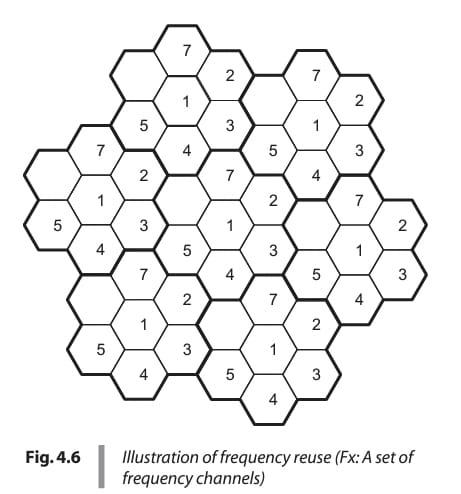

1. **Define the terms** _"cell," "cluster", “Co-channel Interference”, “Channel Assignment”_ **and** _"frequency reuse"_ **in a cellular network.**

In a cellular network, several fundamental concepts are crucial for understanding its operation and design. Here are the definitions of the terms you've queried:

- **Cell:** A **cell is the basic geographic unit of a cellular system**. It represents the radio area covered by a cell-site (or base station) located at its center. This coverage area is also referred to as a "footprint". Cells are typically depicted as **hexagons** in cellular system design because this shape simplifies showing adjacent cells without overlaps or gaps, ensuring continuous coverage. In reality, actual cell shapes can be more circular or irregular due to buildings and terrain. A basic cellular system consists of many low-power transmitters, each designed to serve a small area, which is a cell.
    
- **Cluster:** A **cellular cluster is a group of cells that collectively use a different set of frequencies in each cell**. Within a cluster, there is **no reuse of channels**. The number of cells within a cluster is known as the **cluster size (K)**. All available channels (N) are allocated among the K cells in a single cluster. This cluster can then be **repeated multiple times in a systematic manner** to cover a designated large geographical service area.
    
- **Co-channel Interference:** This type of interference arises because the **same frequency channel is used repeatedly in different, spatially separated cells**. Cells that use the same set of frequencies are termed **cochannel cells**. If a cellular system is not properly designed, **cochannel interference may occur due to the simultaneous use of the same channel** in these cochannel cells, leading to a degradation in received signal quality. In a fully equipped hexagonal cellular system, there are typically **six cochannel interfering cells in the first tier**. Interference is recognized as the major limiting factor in the performance of cellular communication systems.
    
- **Channel Assignment:** This term refers to the **allocation of specific channels to cell-sites on a long-term basis and to mobile units on a short-term basis during a call**. The main goal of channel assignment strategies is to **stabilize fluctuations in call blockage probability** across the network over time. Channel assignment aims to cause **minimum cochannel and adjacent channel interference**.
    
    - **Fixed Channel Assignment (FCA):** In this strategy, each cell is assigned a fixed set of frequency channels for relatively long periods. It is simple to implement and works well under uniform and high traffic loads.
    - **Dynamic Channel Assignment (DCA):** Channels are assigned dynamically from a central pool as new call requests or hand-off requests arrive. This method aims to minimize blocking probability and adapt to varying traffic loads.
    - **Hybrid Channel Assignment:** This scheme combines both fixed and dynamic approaches, where a portion of channels are fixed, and others are dynamically borrowed when needed, while maintaining minimum reuse distance.
- **Frequency Reuse:** **Frequency reuse is the core concept of cellular communications**. It involves **dividing a large geographical service area into many smaller contiguous cells** and using low-power transmitters in each cell. The essence is to **reuse the allocated radio spectrum or a given set of frequency channels in different cells** that are sufficiently separated in space, without causing significant interference. This technique is crucial for **enhancing spectrum efficiency and significantly increasing user capacity** in both FDMA and TDMA systems. The frequency reuse factor (q), expressed as D/R (distance between cochannel cells D, to cell radius R), determines the minimum distance for repeating a set of frequencies. However, improper design can lead to serious cochannel interference.

---

2. **Explain how frequency reuse improves system capacity in a cellular network.**

In a **cellular network**, **frequency reuse** is a fundamental concept designed to significantly **enhance spectrum efficiency** and **system capacity** while maintaining desired signal quality.

Here's how it works and improves capacity:

- **Division into Cells**: The core principle of cellular communication is to divide a large geographical service area into numerous smaller, contiguous geographical areas called **cells**. Each cell is served by its own **cell-site** (or low-power base station) typically located at its center.
- **Limited Spectrum and Reuse**: Conventional radio communication systems face limitations due to limited RF spectrum, restricting the number of simultaneous users. Frequency reuse addresses this by allowing the same set of frequencies (channels) to be reused in different, spatially separated cells without causing excessive interference. This is crucial for **enhancing system capacity**.
- **Cellular Clusters and Channel Allocation**: A **cellular cluster** is a group of cells where each cell uses a different set of frequencies, ensuring no reuse of channels within that cluster. The total available frequency channels are allocated to the cells within a single cluster. This cluster can then be **replicated** multiple times across the larger geographical service area. Each adjacent cell within a cluster operates on different frequencies to avoid interference.
- **Increasing Capacity through Reuse**:
    - By dividing a large area into smaller cells and reusing frequencies, the system can **serve more users** simultaneously within the same allocated RF spectrum.
    - For example, a non-cellular system might support 100 voice channels. If that same service area is divided into seven cells using frequency reuse, the total number of supported channels can increase to 175.
    - The overall **system capacity (C)** is theoretically determined by multiplying the number of clusters in the system (M) by the total number of channels allocated to a cluster (N), or C = M × N.
- **Impact of Cell Size and Cluster Size**:
    - **Smaller Cells**: Making cells smaller allows frequencies to be reused at shorter distances. This increases the number of cells covering a given area, which in turn leads to a higher number of clusters and available channels, thus boosting overall system capacity. This is often referred to as **cell splitting**. For instance, if a cell's radius is halved, the number of required cells to cover the same area increases fourfold, leading to a fourfold increase in overall system capacity (New system capacity = 4^n × original system capacity, where 'n' is the number of times of uniform cell splitting).
    - **Cluster Size (K)**: The cluster size (K, the number of cells in a cluster) also impacts capacity. A decrease in cluster size (lower K) leads to an increase in the number of channels allocated per cell, thereby increasing the capacity per cell and the overall system capacity. When K is minimized, capacity (C) is maximized.
- **Managing Interference (The Trade-off)**: While frequency reuse drastically increases capacity, it introduces a major challenge: **cochannel interference**. Cochannel interference occurs when cells using the same frequency channels are too close to each other. To maintain desired signal quality, this interference must be kept at an acceptable level.
    - **Mitigation Strategies**: Measures to reduce cochannel interference and optimize capacity include:
        - **Proper Frequency Management**: Intelligent planning to assign channel groups to avoid interference.
        - **Spatial Separation**: Ensuring adequate distance between cells using the same frequencies. This distance is defined by the **frequency reuse distance (D)** and **frequency reuse ratio (q = D/R)**, where R is the cell radius.
        - **Cell Sectoring**: Using directional antennas at the cell-site to divide cells into sectors (e.g., three or six sectors), which reduces interference and allows for increased system capacity.
        - **Lowering Antenna Heights**: Can reduce cochannel interference in certain terrain types.
        - **Dynamic Channel Assignment**: Real-time allocation of channels based on traffic load and interference levels, which improves resource utilization compared to fixed assignments.
        - **Power Control**: Adjusting transmitted power to minimize interference, especially crucial in CDMA systems.

In essence, frequency reuse enables the cellular system to **efficiently utilize the limited radio spectrum** by making it available in multiple geographically separated areas, thereby dramatically increasing the total number of simultaneous communication links the system can support.

---

3. **Illustrate a cellular network with a cluster of seven cells and label the frequency reuse pattern.**

A cellular network is designed to enhance spectrum efficiency and system capacity while maintaining desired signal quality. This is achieved by dividing a large geographical area into smaller contiguous coverage areas called **cells**, each served by its own cell-site or low-power base station. The core concept enabling this is **frequency reuse**.

In a cellular system, frequency reuse involves selecting and allocating channel groups for all cellular base stations. This allows cells that are sufficiently physically separated to reuse the same set of frequencies without causing cochannel interference. Within a **cluster**, which is a group of cells where each cell uses a different set of frequencies, there is no reuse of channels. The entire cluster can then be replicated systematically to cover a large geographical service area.

A common and often-used frequency reuse pattern is the **7-cell cluster**.

#### Illustration of a Cellular Network with a 7-Cell Cluster and Frequency Reuse

A typical cluster of seven cells, each designed for frequency reuse, can be **illustrated as shown in Figure 4.6** of the sources [fig 4.6].

This illustration typically shows:

- A central cell, labeled '1' (or 'F1'), which represents a set of frequency channels .
- Surrounding this central cell are six adjacent cells, labeled '2', '3', '4', '5', '6', and '7' (or 'F2' through 'F7'), each assigned a _different_ set of frequency channels from the central cell and from each other within the cluster .
- **The frequency reuse pattern is evident as this entire cluster of seven unique frequency sets (F1-F7) is then systematically repeated across the larger service area** . For example, other cells labeled '1' in distant clusters would be reusing the same frequency channels as the central cell '1', and similarly for cells labeled '2' through '7' .

The purpose of this pattern is to ensure that cells using the **same frequencies (cochannel cells)** are separated by a sufficient **reuse distance (D)** to minimize cochannel interference, which is a major concern in frequency reuse. Other adjacent cells within a cluster operate on different frequencies to avoid interference.

_The Advanced Mobile Phone Service (AMPS) system, for instance, uses a **seven-cell reuse pattern**_.

---

4. **Compare fixed channel assignment and dynamic channel assignment strategies, highlighting their advantages and disadvantages.**

In a cellular network, **channel assignment strategies** are crucial for efficiently managing the limited radio spectrum, directly influencing system capacity and interference levels. Two primary approaches are **Fixed Channel Assignment (FCA)** and **Dynamic Channel Assignment (DCA)**, with a hybrid approach also utilized. These strategies determine how frequency channels are allocated to cells and mobile subscribers to optimize performance while adhering to the principles of **frequency reuse**.

### Fixed Channel Assignment (FCA)

**Definition:** In **Fixed Channel Assignment (FCA)**, each cell is permanently assigned a specific set of frequency channels. The total available channels are partitioned into groups, and each cell is allocated one of these groups. This allocation is typically long-term, with set-up and voice channels assigned to the cell-site for extended periods. The primary goal of this assignment is to minimize **cochannel** and **adjacent channel interference** within the cellular system.

**Advantages:**

- **Simplicity of Implementation:** FCA schemes are straightforward to implement.
- **Fixed Parameters:** They allow for fixed parameters, such as power and frequency, for transceivers.
- **Predictable Performance:** FCA offers reasonably good performance under **uniform and/or high traffic loads**.
- **Decentralized Decision-Making:** Cells can independently decide their channel allocation, meaning no run-time coordination is required for channel assignment.
- **Optimal Under Constant Traffic:** If traffic density is constant across all cells, the total available channels are simply divided by the cluster size and assigned uniformly, which is an optimum assignment.

**Disadvantages:**

- **Inefficient Spectrum Utilization:** In practice, mobile traffic often changes with time and location, leading to non-uniform traffic distribution. This can result in **higher call blocking probabilities** in some cells (hot spots) due to channel unavailability and lower utilization in others, leading to **poor utilization of the available frequency spectrum**.
- **Localized Congestion (Hot Spots):** This is a major issue with FCA, as cells may experience **localized congestion** even if other cells have free channels. This might necessitate techniques like **channel borrowing** from neighboring cells.
- **Complexity with Non-Uniformity:** While non-uniform channel assignment can be used to equalize channel utilization, it makes the channel-assignment algorithm significantly more complex.
- **Static Nature:** The regular frequency-reuse pattern configurations might not work practically if channels are not fixed.

### Dynamic Channel Assignment (DCA)

**Definition:** In **Dynamic Channel Assignment (DCA)**, channels are not fixed to specific cells. Instead, all available channels are maintained in a **central common pool**. Channels are assigned **dynamically** to cells as new requests for radio resources (for new calls or hand-offs) arrive in the system. When a call is completed, the assigned channel is returned to this central pool. Any channel from the pool can be assigned to any cell, provided interference constraints are satisfied to maintain desired signal quality.

**Advantages:**

- **Adaptability to Traffic Load:** DCA schemes are highly adaptable to **traffic load changes** and the overall cellular network environment.
- **Better Resource Utilization:** They provide **better utilization of available channel resources** by allocating channels where they are most needed, thereby reducing the probability of call blockage.
- **Improved Load Balancing:** DCA helps in **improved load balancing** across the network.
- **Better Performance in Low Traffic:** DCA schemes generally perform much better than FCA under **low-to-moderate traffic loads**.
- **Reduced Call Blocking/Termination:** It reduces fluctuations in call-blocking probabilities and **forced call terminations**.

**Disadvantages:**

- **Increased Overhead and Complexity:** DCA requires **significant overhead** for channel management, including channel locking (preventing reuse of a borrowed channel in nearby cochannel cells).
- **Exhaustive Checking:** It necessitates **exhaustive checking** to ensure interference constraints are met before assigning a channel.
- **Channel Assignment Delay:** The dynamic nature can lead to **channel assignment delays** as the system must track and allocate channels in real-time.
- **Hardware Requirements:** It requires **tunable frequency base stations** and mobile terminals with varying power ranges.
- **Performance Under Heavy Traffic:** DCA generally performs **less satisfactorily than FCA under heavy traffic conditions**.
- **Difficulty in Maintaining Reuse Distance:** Due to the dynamic nature, maintaining the exact minimum reuse distance for all channels can be challenging, which may lead to less effective frequency reuse.
- **Sub-optimal Channel Reuse:** DCA schemes may not maximize overall channel reuse because they handle randomly generated new calls.

### Hybrid Channel Assignment (HCA)

**Hybrid Channel Assignment (HCA)** combines the features of both FCA and DCA. In this scheme, a portion of the total frequency channels is assigned statically (fixed channels) to each cell, while the remaining channels are kept in a central pool for dynamic allocation or **channel borrowing** when a cell's fixed channels are exhausted.

**Advantages of HCA:**

- **Combines Benefits:** It aims to leverage the advantages of both static and dynamic schemes.
- **Reduced Overhead:** It offers lower overhead for channel management and run-time operation.
- **Hot Spot Mitigation:** HCA can help in **reduction of hot spots** and improve channel-load balancing.
- **Improved Service for Moderate Traffic:** It has been observed to provide **better service than FCA for traffic up to 50%**.

**Disadvantages of HCA:**

- **Similar Issues to DCA:** Channel borrowing in HCA can present similar challenges to DCA, such as **channel locking** and increased system overheads.
- **Coordination Criticality:** If not properly coordinated, the benefits of both static and dynamic channel assignment strategies can be lost.

---

5. **Analyze the impact of cluster size on system capacity and interference in a cellular network.**  
   _Discuss the trade-off between larger and smaller clusters._

In a cellular network, the **cluster size (K)** is a fundamental design parameter that significantly impacts both **system capacity** and **interference**. A cellular cluster is defined as a group of cells where each cell uses a different set of frequencies, ensuring no reuse of channels within that cluster. The cluster can then be systematically replicated to cover a larger geographical service area. The cluster size (K) is related to the shift parameters (i, j) in a hexagonal geometry by the formula **K = i² + j² + i × j**.

### Impact on System Capacity

The **total number of channels available (N)** is uniformly allocated to each cluster. Therefore, the number of channels per cell (J) within a cluster is given by **J = N / K**.

- **Inverse Relationship:** This means that as the **cluster size (K) decreases, the number of channels (J) allocated per cell increases**, thus increasing the capacity per cell.
- **Overall System Capacity:** The overall system capacity (C) is the product of the number of clusters in the system (M) and the total number of channels allocated to a cluster (N), so **C = M × N**. Since N = J × K, the total system capacity can also be expressed as **C = M × J × K**. If K is decreased while keeping the cell size constant, more clusters (M) are needed to cover the same geographical area. This, combined with more channels per cell, leads to a **significant increase in the total system capacity**.

**Examples from sources highlight this increase:**

- A system with 32 cells and a reuse pattern of 7 (K=7) yields a total system capacity of 1536 channels. If the same area is covered with 128 cells (implying smaller cells) while keeping channels per cell at 48, the new system capacity jumps to 6144 channels.
- In another example, if a mobile communication system with 1000 voice channels moves from a 20-cell area with K=4 to a 100-cell area with K=4, the system capacity increases from 5000 users to 25000 users. Further reducing the cluster size to K=7 (which increases K here, meaning smaller cells in this context or higher reuse across the system) for 700 cells could reach 100,000 users.

### Impact on Cochannel Interference

**Cochannel interference** is a major limiting factor in cellular system performance, arising because the same frequency channels are reused in different, spatially separated cells. The degree of cochannel interference is determined by the **frequency reuse ratio (q)**, which is defined as the ratio of the distance between two nearest cochannel cells (D) to the cell radius (R), i.e., **q = D/R**. This ratio is directly related to the cluster size K by the formula **q = √3K**.

- **Relationship to C/I:** The carrier-to-interference ratio (C/I) at a typical mobile receiver is inversely proportional to the number of interfering cells and the path loss exponent, and directly proportional to the frequency reuse ratio raised to the power of the path loss exponent. For six cochannel interfering cells in the first tier and a path-loss exponent of 4, the relationship simplifies to **C/I ≈ (1/6) * q^4**.
- **Higher K, Lower Interference:** As the **cluster size (K) increases, the frequency reuse distance (D) increases proportionally**, leading to a larger frequency reuse ratio (q). This greater separation between cochannel cells **reduces the cochannel interference**, improving signal quality (higher C/I).
- **Lower K, Higher Interference:** Conversely, a **smaller cluster size (K) means cochannel cells are closer together**, resulting in a smaller frequency reuse ratio (q) and thus **increased cochannel interference**, which can degrade signal quality (lower C/I).

For instance, an acceptable C/I of 18 dB typically requires a cluster size of K=7 in an omnidirectional antenna system. If C/I needs to be 20 dB, K=9 is required.

### Trade-off Between Larger and Smaller Clusters

The design of a cellular system inherently involves a **trade-off between increasing system capacity and managing interference**. This trade-off is directly influenced by the choice of cluster size (K).

- **Larger Cluster Size (Higher K):**
    
    - **Capacity Impact:** Leads to **fewer channels per cell**, which limits the number of simultaneous users a single cell can support. This generally results in **less overall system capacity** per unit area if the number of cell sites remains constant.
    - **Interference Impact:** Provides **greater spatial separation between cochannel cells (larger D/R ratio)**, leading to **less cochannel interference** and better signal quality (higher C/I).
- **Smaller Cluster Size (Lower K):**
    
    - **Capacity Impact:** Allows for **more channels per cell** for a given total spectrum, leading to a **higher overall system capacity** by enabling more frequent frequency reuse. This is achieved by dividing the service area into smaller cells, which in turn means more clusters can be packed into the same area.
    - **Interference Impact:** Results in **less spatial separation between cochannel cells**, thereby **increasing cochannel interference** and potentially degrading signal quality (lower C/I). This requires more robust interference reduction methods.

**Optimizing the Cluster Size:** The goal is to select an **optimum value of K** that maximizes system capacity while maintaining the signal-to-cochannel interference ratio at an acceptable level. In many mobile radio environments, K=7 is often not sufficient to avoid interference, but increasing K further reduces the number of channels per cell and spectrum efficiency.

Techniques like **cell sectoring** (using directional antennas) can mitigate the interference caused by a smaller cluster size. For instance, dividing a cell into three (120°) or six (60°) sectors can significantly reduce cochannel interference and allow for the use of smaller cluster sizes (e.g., K=4 instead of K=7) while still achieving desired C/I levels. This effectively increases system capacity without necessarily increasing the cluster size, but it can lead to decreased trunking efficiency and more frequent hand-offs.

---

6. **Evaluate different interference reduction techniques used in cellular networks.**  
   _Which method is the most effective, and why?_

Cellular networks employ various techniques to mitigate interference, which is a major limiting factor in system performance. Interference can broadly be categorized into **cochannel interference** (from cells using the same frequencies) and **adjacent-channel interference** (from channels close in frequency). Additionally, **multipath interference** (due to signals arriving via different paths) is an unavoidable phenomenon.

Here's an evaluation of different interference reduction techniques:

- **Frequency Management and Channel Assignment**:
    
    - **Good frequency management plans** involve strategically dividing the allocated RF spectrum into channels and assigning them to cells to increase spectrum efficiency while minimizing interference.
    - **Fixed Channel Assignment** reserves specific channels for each cell.
    - **Dynamic Channel Assignment** allows flexible channel allocation based on real-time traffic load, aiming to reduce call blocking and improve spectrum utilization by avoiding busy or noisy channels.
    - **Channel Borrowing** allows a cell to temporarily use channels from neighboring cells if its own are busy, which helps manage increased traffic but requires careful management to avoid interference.
- **Cell Design Parameters:**
    
    - **Increasing Separation between Cochannel Cells**: This is achieved by selecting a suitable frequency reuse pattern (cluster size K). A larger separation (higher K) reduces interference. However, this trade-off means fewer channels are available per cell, which reduces the system capacity for a given spectrum.
    - **Lowering Antenna Heights at the Cell-Site**: This can reduce cochannel interference, especially in specific terrains like hills or valleys, by confining the radiated power to a smaller area. This, however, trades off with the coverage area.
    - **Proper Selection of Cell-Site Locations**: Strategic placement of cell sites can help optimize radio coverage and minimize interference patterns by considering terrain and obstructions.
    - **Reducing Transmitted Power at the Cell-Site/Mobile**: Transmitting at the minimum necessary power level effectively reduces interference to other users and cells.
- **Antenna System Design Considerations:**
    
    - **Using Directional Antennas at the Cell-Site (Cell Sectoring)**: This technique divides a cell into smaller sectors (e.g., three 120° sectors or six 60° sectors), using directional antennas instead of omnidirectional ones. This **significantly reduces cochannel interference** by focusing radiated energy, thereby **increasing system capacity**. For instance, a 3-sector design with K=7 can achieve a C/I of 24.5 dB compared to 17 dB for an omnidirectional design.
    - **Antenna Tilting**: Deliberately focusing radiated energy downwards helps reduce interference to neighboring cells and can enhance weak signal spots within the cell's coverage.
- **Signal Processing and System Features:**
    
    - **Diversity Schemes at the Receiver**: These techniques involve combining multiple independently faded versions of the transmitted signal (e.g., space diversity using multiple antennas). They are highly effective in **reducing multipath fading** and improving received signal quality and bit-error rates.
    - **Equalization**: Used to overcome intersymbol interference (ISI) caused by channel time dispersion in digital transmission systems, improving receiver performance.
    - **Channel Coding (Forward Error Correction - FEC) and Interleaving**: These techniques add controlled redundancy to the transmitted data to protect against errors caused by noise and fading, thereby improving signal reliability and overall system performance without increasing bandwidth or transmit power.
    - **Hand-Off Mechanisms**: While primarily for call continuity as a mobile moves, hand-off decisions (e.g., based on received signal strength, bit error rate) are critical in managing interference and preventing call drops.

**Most Effective Method and Why:**

The sources indicate that **CDMA (Code Division Multiple Access) systems, particularly with their reliance on power control and soft hand-offs, offer the most comprehensive and fundamental solution to interference management, leading to a large increase in overall system capacity**.

Here's why these features are highlighted as most effective in the context of cellular networks:

1. **Fundamental Interference Limitation**: Unlike FDMA or TDMA systems which are limited by available bandwidth, **CDMA systems are inherently interference-limited**. This means that any reduction in interference directly translates to a linear increase in system capacity.
2. **Power Control to Address Near-Far Problem**: This is arguably the **most critical aspect** for CDMA systems. In CDMA, all users transmit on the same frequency simultaneously. Without power control, a mobile subscriber close to the base station could overwhelm the signals from distant mobiles (the "near-far problem"). **Automatic power control** ensures that signals from all mobile users arrive at the base station with nearly equal power. This allows the system to overcome the near-far problem and achieve high frequency utilization efficiency, directly boosting capacity.
3. **Soft Hand-offs**: Specific to CDMA, soft hand-off is a powerful **interference reduction mechanism**. It allows a mobile to communicate with multiple candidate cell-sites simultaneously. This provides **diversity gain**, improving received signal quality and **reducing call drops**. By maintaining connections with multiple cells, it effectively lowers the interference floor and contributes to increased capacity and coverage.
4. **Frequency Reuse in Every Cell**: CDMA's inherent interference resistance properties allow it to **use the same set of frequencies in every cell**. This is a significant advantage over FDMA/TDMA which require careful frequency planning and spatial separation for frequency reuse to avoid cochannel interference. This universal frequency reuse dramatically increases the overall system capacity.

While cell sectoring (using directional antennas) is highly effective for FDMA/TDMA systems by reducing interference and increasing capacity within those frameworks, CDMA's fundamental design, particularly its reliance on accurate power control and soft hand-offs, allows for a superior and more flexible approach to managing interference across the entire network, leading to a "large improvement in the overall system capacity".

---

7. **Consider a single high-power transmitter that can support 40 voice channels over an area of 140 km² with the available spectrum.**  
   _If this area is equally divided into seven smaller areas (cells), each supported by lower power transmitters so that each cell supports 30% of the channels, then determine:_  
   - (a) **Coverage area of each cell**  
   - (b) **Total number of voice channels available in the cellular system**  
   _Comment on the results obtained._

**Given Information:**

- Initial service area covered by a single high-power transmitter = **140 km²**.
- Initial total voice channels supported by the single high-power transmitter = **40**.
- The area is divided into **seven smaller cells**.
- Each smaller cell supports **30% of the original channels**.

**Calculations:**

**(a) Coverage area of each cell:**

- To find the coverage area of each cell, divide the total service area by the number of smaller areas (cells).
- **Coverage area of each cell = 140 km² / 7 cells = 20 km²**.

**(b) Total number of voice channels available in the cellular system:**

- First, determine the number of voice channels supported by _each_ smaller cell:
    - Channels per cell = 30% of 40 channels = 0.3 × 40 = **12 channels/cell**.
- Next, calculate the total number of voice channels available in the entire cellular system by multiplying the channels per cell by the total number of cells.
- **Total number of voice channels = 12 channels/cell × 7 cells = 84 channels**.

**Comment on the results obtained:**

- **Significant Increase in Channels**: As observed from these results, the total number of available channels in the cellular system (84 channels) is significantly higher compared to the non-cellular system (40 channels) that originally covered the same area with a single high-power transmitter.
- **Increased System Capacity**: This demonstrates that the **system capacity is increased** by dividing a large geographical area into smaller cells and reusing frequencies. The core concept of cellular communication is designed to enhance spectrum efficiency and system capacity while maintaining desired signal quality.
- **Interference Management**: However, it is crucial to manage the allocation of channels carefully among the various cells to prevent interference between channels, especially in adjacent cells. Cells that are physically distant enough can reuse the same set of frequencies without causing cochannel interference, while adjacent cells within a cluster must operate on different frequencies.

---

8. **Calculate the number of times the cluster of size 4 has to be replicated in order to approximately cover the entire service area of 1765 km² with the adequate number of uniform-sized cells of 7 km² each.**

The given parameters are:

- **Size of the cluster (K): 4**
- **Area of a cell (Acell): 7 km²**
- **Total service area (Asystem): 1765 km²**

Here's the calculation:

1. **Calculate the coverage area of a cluster (Acluster):** The coverage area of a cluster is found by multiplying the cluster size (K) by the area of a cell (Acell).
    
    - Acluster = K × Acell
    - Acluster = 4 × 7 km² = **28 km²**
2. **Calculate the number of clusters in the service area (M):** The number of times the cluster has to be replicated to cover the entire service area is determined by dividing the total service area (Asystem) by the area of one cluster (Acluster).
    
    - M = Asystem / Acluster
    - M = 1765 km² / 28 km² ≈ **63 clusters**

Therefore, the cluster of size 4 would have to be replicated approximately **63 times** to cover the entire service area of 1765 km² with uniform-sized cells of 7 km² each.

---

9. **A mobile communication system is allocated RF spectrum of 25 MHz and uses RF channel bandwidth of 25 kHz so that a total number of 1000 voice channels can be supported in the system.**  
   - (a) **If the service area is divided into 20 cells with a frequency reuse factor of 4, compute the system capacity.**  
   - (b) **The cell size is reduced so that the service area is now covered with 100 cells. Compute the system capacity while keeping the frequency reuse factor as 4.**  
   - (c) **The cell size is further reduced so the same service area is now covered with 700 cells and the frequency reuse factor is 7. Compute the system capacity.**

The common parameters for this mobile communication system are:

- **Total allocated RF spectrum: 25 MHz**
- **RF channel bandwidth: 25 kHz**
- **Total number of voice channels (N): 1000**.
    - This is derived from the allocated spectrum and channel bandwidth: 25 MHz / 25 kHz = 1000 channels.
- **Capacity of a cluster:** In a cellular system based on the frequency-reuse concept, all available channels (N) are allocated uniformly to each cluster. Therefore, the capacity of a cluster is **1000 channels**.

Let's compute the system capacity for each scenario:

**(a) If the service area is divided into 20 cells with a frequency reuse factor of 4:**

1. **Number of cells covering the area:** 20 cells.
2. **Frequency reuse factor (cluster size, K): 4**.
3. **Determine the number of clusters (M):** The number of clusters is calculated by dividing the total number of cells by the cluster size.
    - M = Number of cells / K = 20 / 4 = **5 clusters**.
4. **Compute the system capacity (C):** The overall system capacity (C) is theoretically determined by multiplying the total number of channels allocated to a cluster (N) by the number of clusters in the system (M).
    - C = N × M = 1000 channels/cluster × 5 clusters = **5000 channels**.

**(b) The cell size is reduced so that the service area is now covered with 100 cells, keeping the frequency reuse factor as 4:**

1. **Number of cells covering the area:** 100 cells.
2. **Frequency reuse factor (cluster size, K): 4**.
3. **Determine the new number of clusters (M):**
    - M = Number of cells / K = 100 / 4 = **25 clusters**.
4. **Compute the new system capacity (C):**
    - C = N × M = 1000 channels/cluster × 25 clusters = **25,000 channels**.

**(c) The cell size is further reduced so the same service area is now covered with 700 cells and the frequency reuse factor is 7:**

1. **Number of cells covering the area:** 700 cells.
2. **Frequency reuse factor (cluster size, K): 7**.
3. **Determine the new number of clusters (M):**
    - M = Number of cells / K = 700 / 7 = **100 clusters**.
4. **Compute the new system capacity (C):**
    - C = N × M = 1000 channels/cluster × 100 clusters = **100,000 channels**.

**Comment on the results obtained:**

The calculations demonstrate a clear relationship between the number of cells, cluster size, and overall system capacity. **Increasing the number of cells covering a given service area significantly increases the system capacity**. This is because a greater number of cells, for a given cluster size, allows for a greater number of clusters to be replicated across the service area. Each cluster contains the full set of available channels, so more clusters directly lead to higher overall capacity.

For instance, by increasing the number of cells from 20 to 100 while keeping the cluster size at 4, the system capacity increased five-fold (from 5,000 to 25,000 channels). Further increasing the number of cells to 700, even with a larger cluster size of 7, resulted in a substantial increase to 100,000 channels, showing the dramatic impact of cell division and frequency reuse on system capacity.

The principle of **frequency reuse** is core to this capacity enhancement. However, there is a trade-off: minimizing the cluster size (K) maximizes capacity, but it also increases **cochannel interference** because cochannel cells (cells using the same frequencies) are located closer together. Therefore, the selection of the frequency reuse factor (K) is a critical design trade-off, balancing the desire for high capacity with the need to maintain an acceptable level of signal-to-cochannel interference and ensure desired signal quality.

---

10. **Consider that a geographical service area of a cellular system is 4200 km². A total of 1001 radio channels are available for handling traffic. Suppose the area of a cell is 12 km².**  
    - (a) **How many times would the cluster of size 7 have to be replicated to cover the entire service area? Calculate the number of channels per cell and the system capacity.**  
    - (b) **If the cluster size is decreased from 7 to 4, does it result in an increase in system capacity?**  
    _Comment on the results obtained._

The given parameters for the cellular system are:

- **Geographical service area (Asys): 4200 km²**
- **Total radio channels (N): 1001**
- **Area of a cell (Acell): 12 km²**

Let's break down the calculations:

**(a) Cluster of size 7 (K = 7):**

1. **Coverage area of a cluster:** The coverage area of a cluster is calculated by multiplying the cluster size (K) by the area of a cell (Acell).
    
    - Area of a cluster (Acluster) = K × Acell = 7 × 12 km² = **84 km²**.
2. **Number of times the cluster would have to be replicated:** This is determined by dividing the total geographical service area (Asys) by the area of one cluster (Acluster).
    
    - Number of clusters (M) = Asys / Acluster = 4200 km² / 84 km² = **50 clusters**.
3. **Number of channels per cell:** The number of channels per cell (J, or cell capacity) is found by dividing the total number of available channels (N) by the cluster size (K).
    
    - Number of channels per cell (J) = N / K = 1001 / 7 = **143 channels/cell**.
4. **System capacity:** The overall system capacity (C) is calculated by multiplying the total number of available channels per cluster (N) by the number of clusters in the service area (M).
    
    - System capacity (C) = N × M = 1001 × 50 = **50,050 channels**.

**(b) Decrease in cluster size from 7 to 4 (K = 4):**

1. **Coverage area of the new cluster:** With the reduced cluster size, the new area of a cluster is calculated.
    
    - New Area of a cluster (Acluster) = K × Acell = 4 × 12 km² = **48 km²**.
2. **Increased number of clusters:** With the smaller cluster size, more clusters are needed to cover the same service area.
    
    - New Number of clusters (M) = Asys / Acluster = 4200 km² / 48 km² ≈ **87 clusters**.
3. **New system capacity:** Assuming the total number of available channels per cluster (N) remains 1001, the system capacity increases with more clusters.
    
    - New system capacity (C) = N × M = 1001 × 87 = **87,087 channels** (rounded from 87,000 in source due to precise calculation of 87 clusters).

**Comment on the results obtained:**

The results clearly indicate that **decreasing the cluster size from 7 to 4 significantly increases the system capacity**.

- With a cluster size of 7, the system could support **50,050 channels**.
- By decreasing the cluster size to 4, the system capacity increases to approximately **87,087 channels**.

This increase in capacity is due to the greater number of times the cluster can be replicated to cover the entire service area when the cluster size is smaller. A smaller cluster size means more channels are available per cell.

However, this increase in capacity comes with a trade-off. A lower cluster size (K) means that cochannel cells (cells using the same set of frequencies) are located closer together. This **reduces the frequency reuse distance (D)** for a given cell radius (R), increasing the **average signal-to-cochannel interference**. This increased interference must be maintained at an acceptable level to ensure desired signal quality. Therefore, the choice of the frequency reuse factor (K) needs to balance maximizing capacity with keeping interference within tolerable limits.

---
