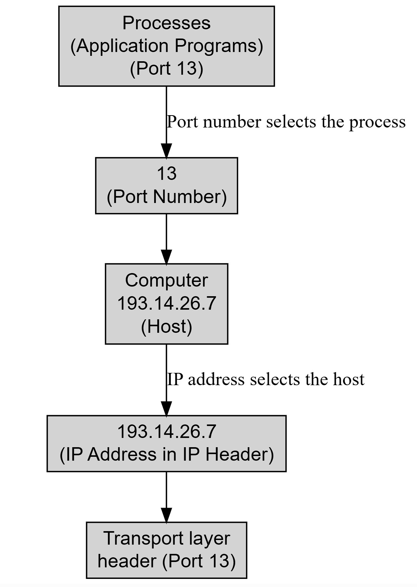

1. **Explain the concept of layered network architecture. Discuss the advantages of using a layered model in communication networks.**  
   
   A **layered network architecture** is a **conceptual framework** used to **understand and design the architecture of computer networks**. It works by **breaking down the complex process of data communication into smaller, manageable, and standardized layers**. This approach allows for the definition of how data should be transmitted from one device to another, irrespective of the underlying hardware or software differences.

Two primary examples of network models that employ this layered approach are the **OSI (Open Systems Interconnection) model** and the **TCP/IP (Transmission Control Protocol/Internet Protocol) model**. The OSI model is a theoretical framework developed by the International Organization for Standardization (ISO), comprising seven layers: Physical, Data Link, Network, Transport, Session, Presentation, and Application. In contrast, the TCP/IP model is a more practical and widely implemented model, consisting of four layers: Link, Internet, Transport, and Application. Each layer within these models performs a distinct function and communicates with the layers directly above and below it.

The **advantages of using a layered model** in communication networks are significant and include:

- **Promotes Interoperability**: The layered approach ensures that hardware and software from different vendors can communicate and work together.
- **Easier Troubleshooting**: By dividing the complex communication process into discrete layers, it becomes simpler to identify and resolve network issues.
- **Facilitates Development and Evolution**: Each layer can be developed, tested, and implemented independently. As long as a layer adheres to its defined interfaces, it can evolve without affecting other layers. This is particularly true for TCP/IP, which allows flexibility in adapting to different physical implementations without specifying a particular Physical Layer.
- **Separation of Concerns**: The model ensures that each layer has specific functions and responsibilities, which simplifies the design and management of network systems. For example, the Physical Layer handles the actual physical connection and bit transmission, while the Data Link Layer is responsible for node-to-node delivery and error-free data transfer over the physical layer.
- **Standardization**: The reliance on open standards and protocols ensures consistent communication methods across diverse systems.
- **Scalability**: Layered models like TCP/IP are highly scalable, making them suitable for networks ranging from small local area networks (LANs) to vast wide area networks (WANs) like the Internet.
- **Flexibility**: The architecture supports various routing protocols, data types, and communication methods, allowing it to adapt to different networking needs.
- **Reliable Data Transfer**: Protocols within the transport layer, such as TCP, include mechanisms for error-checking and retransmission, ensuring reliable data delivery even over long distances or through various network conditions. While the underlying network layer (like IP) may be unreliable, reliability can be implemented at the transport layer to meet application needs.
   
---

2. **Describe the seven layers of the OSI model with their functions. Use a diagram to illustrate how data is encapsulated and decapsulated across layers.**  
   
   
   The **OSI (Open Systems Interconnection) Model** is a **conceptual framework** developed by the International Organization for Standardization (ISO) that outlines how different computer systems communicate over a network. Its primary goal is to **understand and design the architecture of computer networks** by **breaking down the complex process of data communication into smaller, manageable, and standardized layers**. This layered approach fosters **interoperability** among hardware and software from various vendors and simplifies **troubleshooting** and **development**.

The OSI Model consists of **seven distinct layers**, each with specific functions and responsibilities:

- **Layer 1: Physical Layer**
    
    - **Responsibility**: This is the **lowest layer** and is responsible for the **actual physical connection between devices**. It handles the **transmission of individual bits** from one node to the next. When receiving data, it converts the signal into 0s and 1s before sending them to the Data Link Layer.
    - **Functions**:
        - **Bit Synchronization**: Provides a clock to synchronize both the sender and receiver at the bit level.
        - **Bit Rate Control**: Defines the transmission rate, i.e., the number of bits sent per second.
        - **Physical Topologies**: Specifies how network devices/nodes are arranged (e.g., bus, star, mesh topology).
        - **Transmission Mode**: Defines how data flows between connected devices (Simplex, Half-duduplex, and Full-duplex).
    - **Common Devices**: Hub, Repeater, Modem, and Cables.
- **Layer 2: Data Link Layer (DLL)**
    
    - **Responsibility**: Ensures **node-to-node delivery of messages**. Its main function is to guarantee **error-free data transfer** from one node to another over the physical layer. It identifies the packet's network protocol type, such as TCP/IP, and handles error prevention and "framing".
    - **Sublayers**: It is divided into two sublayers: **Logical Link Control (LLC)** and **Media Access Control (MAC)**. The MAC sub-layer helps determine which device controls the shared channel when multiple devices are present.
    - **Data Form**: Packets at this layer are referred to as **Frames**.
    - **Functions**:
        - **Framing**: Provides a method for the sender to transmit a meaningful set of bits to the receiver, typically by attaching special bit patterns to the beginning and end of the frame.
        - **Physical Addressing**: Adds **physical addresses (MAC addresses)** of the sender and/or receiver to the header of each frame.
        - **Error Control**: Detects and retransmits damaged or lost frames.
        - **Flow Control**: Coordinates the amount of data that can be sent before acknowledgment to prevent data corruption.
    - **Common Devices**: Switches and Bridges.
- **Layer 3: Network Layer**
    
    - **Responsibility**: Handles the **transmission of data from one host to another located in different networks**. It is also responsible for **packet routing**, selecting the shortest path among available routes.
    - **Data Form**: Segments from the Transport layer are referred to as **Packets** in the Network layer.
    - **Functions**:
        - **Routing**: Determines the most suitable route from source to destination.
        - **Logical Addressing**: Defines an addressing scheme to uniquely identify each device across networks, placing the sender and receiver's **IP addresses** in the packet header.
    - **Common Devices**: Routers and switches.
- **Layer 4: Transport Layer**
    
    - **Responsibility**: Provides services to the application layer and uses services from the network layer. It is responsible for the **end-to-end delivery of the complete message** and ensures **process-to-process delivery**. It also handles acknowledgment of successful data transmission and re-transmission if errors are found.
    - **Data Form**: Data in the transport layer is referred to as **Segments**.
    - **Functions**:
        - **Segmentation and Reassembly**: Accepts messages from upper layers, breaks them into smaller units (segments), adds a header to each, and reassembles them at the destination.
        - **Service Point Addressing (Port Addressing)**: Includes a port address in the header to ensure messages are delivered to the correct process. This mechanism allows for **multiplexing** (many processes sending to one transport layer) and **demultiplexing** (transport layer delivering to appropriate process based on port number).
    - **Services**: Can be **connection-oriented** (connection established, data transferred, then released) or **connectionless** (packets sent without prior connection establishment). It can also be **reliable** (with flow and error control) or **unreliable**.
    - **Common Protocols**: TCP, UDP, NetBIOS, PPTP.
- **Layer 5: Session Layer**
    
    - **Responsibility**: Manages the **establishment, management, and termination of connections (sessions)** between two devices. It also provides **authentication and security** functions.
    - **Functions**:
        - **Session Establishment, Maintenance, and Termination**: Allows processes to establish, use, and terminate a connection.
        - **Synchronization**: Allows processes to add checkpoints (synchronization points) in the data to help identify errors and re-synchronize data properly.
        - **Dialog Controller**: Enables two systems to communicate in half-duplex or full-duplex modes.
    - **Common Protocols**: NetBIOS, PPTP.
- **Layer 6: Presentation Layer**
    
    - **Responsibility**: Also known as the **Translation layer**. It extracts data from the application layer and manipulates it into the required format for network transmission.
    - **Functions**:
        - **Translation**: Converts data formats (e.g., ASCII to EBCDIC).
        - **Encryption/Decryption**: Encodes and decodes data to ensure privacy, using a key.
        - **Compression**: Reduces the number of bits to be transmitted over the network.
    - **Common Protocols**: JPEG, MPEG, GIF, TLS/SSL.
- **Layer 7: Application Layer**
    
    - **Responsibility**: This is the **top-most layer**. It is implemented by network applications and produces the data to be transferred. It serves as a **window for application services to access the network** and for displaying received information to the user.
    - **Functions**:
        - **Network Virtual Terminal (NVT)**: Allows a user to log on to a remote host.
        - **File Transfer Access and Management (FTAM)**: Enables users to access, retrieve, manage, and control files on a remote computer.
        - **Mail Services**: Provides email service.
        - **Directory Services**: Offers distributed database sources and access to global information about objects and services.
    - **Common Protocols**: SMTP, FTP, DNS.

### Data Encapsulation and Decapsulation Across Layers

As data travels down the OSI model from the Application Layer to the Physical Layer on the sending device, it undergoes a process called **encapsulation**. Each layer adds its own control information, typically in the form of a **header**, to the data received from the layer above it. This header contains information relevant to that specific layer's functions. For instance, the Data Link Layer adds MAC addresses to its frames, and the Network Layer adds IP addresses to its packets. The Transport Layer performs **segmentation**, breaking larger data into smaller units, and adds source and destination port numbers.

(Please note: The provided sources conceptually describe the layered architecture and the addition of headers, but **do not include a specific diagram to illustrate how data is encapsulated and decapsulated across layers**. The following description provides a conceptual overview of this process.)

**Encapsulation (Sender Side - Down the Stack):**

1. **Application Layer (Layer 7)**: The user interacts with an application (e.g., email client), which creates the original data.
2. **Presentation Layer (Layer 6)**: The data is formatted, potentially encrypted, and compressed.
3. **Session Layer (Layer 5)**: Manages the session for communication.
4. **Transport Layer (Layer 4)**: The data is broken into smaller **segments**, and a **Transport Layer header** (containing port numbers, sequence numbers, etc.) is added to each segment. This is sometimes referred to as the **payload** for the Network Layer.
5. **Network Layer (Layer 3)**: Each segment becomes a **packet** (or datagram), and a **Network Layer header** (containing source and destination IP addresses) is added.
6. **Data Link Layer (Layer 2)**: Each packet becomes a **frame**, and a **Data Link Layer header and trailer** (containing MAC addresses, error-checking codes) are added.
7. **Physical Layer (Layer 1)**: The frame is converted into a **stream of bits** and transmitted over the physical medium.

**Decapsulation (Receiver Side - Up the Stack):**

As the bits travel up the OSI model from the Physical Layer to the Application Layer on the receiving device, they undergo **decapsulation**. Each layer removes the header (and trailer, if present) that was added by its peer layer on the sending side, processes the information in that header, and then passes the remaining data to the layer above it.

1. **Physical Layer (Layer 1)**: Receives the raw bit stream from the physical medium and converts it into frames, passing them up.
2. **Data Link Layer (Layer 2)**: Receives frames, checks for errors, removes the Data Link Layer header and trailer, and passes the packets up.
3. **Network Layer (Layer 3)**: Receives packets, examines the Network Layer header (IP addresses) for routing, and passes the segments up.
4. **Transport Layer (Layer 4)**: Receives segments, reassembles them into the original message, uses the Transport Layer header (port numbers) to direct the data to the correct application process, and passes the data up.
5. **Session Layer (Layer 5)**: Manages the session, handling synchronization if necessary.
6. **Presentation Layer (Layer 6)**: Decrypts and decompresses the data, restoring it to its original format.
7. **Application Layer (Layer 7)**: The application receives the data and presents it to the user.

This encapsulation and decapsulation process is crucial for the modularity and functionality of layered network architectures, ensuring that each layer handles its specific tasks without needing to understand the details of other layers.
   
---

3. **Compare the OSI and TCP/IP models in terms of architecture, functionality, and layer responsibilities.**  
   
   Both the **OSI (Open Systems Interconnection) Model** and the **TCP/IP (Transmission Control Protocol/Internet Protocol) Model** are conceptual frameworks designed to **understand and design the architecture of computer networks** by **breaking down the complex process of data communication into smaller, manageable, and standardized layers**. This layered approach aims to promote **interoperability** among hardware and software from different vendors, simplify **troubleshooting**, and aid in **development**.

However, they differ in their architecture, functionality, and layer responsibilities:

### Architectural Differences

- **OSI Model**: This is a **theoretical model** developed by the International Organization for Standardization (ISO) and consists of **seven distinct layers**: Physical, Data Link, Network, Transport, Session, Presentation, and Application. Each layer has specific functions and responsibilities. The OSI model follows a **vertical approach**.
- **TCP/IP Model**: This model is **more practical and widely implemented** in real-world networks, especially on the Internet. It is a **concise version of the OSI model**, comprising **four layers**: the Network Access Layer (sometimes referred to as Link Layer), Internet Layer, Transport Layer, and Application Layer. TCP/IP follows a **horizontal approach**.

The TCP/IP model effectively combines several OSI layers:

- The **Network Access Layer** in TCP/IP represents the functionalities of both the **Physical Layer** and the **Data Link Layer** from the OSI model.
- The **Application Layer** in TCP/IP combines the responsibilities of the **Session Layer**, **Presentation Layer**, and **Application Layer** from the OSI model.

### Functional Differences and Layer Responsibilities

Here's a comparison of how each model handles communication functions across its layers:

- **Layer 1: Physical Layer (OSI) vs. Network Access Layer (TCP/IP)**
    
    - **OSI Physical Layer**: This is the **lowest layer** and is responsible for the **actual physical connection between devices**. It handles the **transmission of individual bits** from one node to the next, converting signals into 0s and 1s. Functions include **bit synchronization**, **bit rate control**, defining **physical topologies** (e.g., bus, star, mesh), and specifying the **transmission mode** (Simplex, Half-duplex, Full-duplex). Common devices associated are **Hubs, Repeaters, Modems, and Cables**.
    - **TCP/IP Network Access Layer**: This layer identifies the **packet's network protocol type** (e.g., TCP/IP) and provides **error prevention and "framing"**. It is considered the point where the TCP/IP stack interfaces with the underlying network hardware. Unlike OSI, the TCP/IP model **does not explicitly cover the physical layer**, as it is designed to be **independent of the underlying physical media** (e.g., Ethernet, Wi-Fi, fiber optics), assuming these details are handled by hardware components and specific standards.
- **Layer 2: Data Link Layer (OSI) vs. Network Access Layer (TCP/IP)**
    
    - **OSI Data Link Layer (DLL)**: Responsible for **node-to-node delivery of messages**, ensuring **error-free data transfer** between adjacent nodes over the physical layer. It is divided into two sublayers: **Logical Link Control (LLC)** and **Media Access Control (MAC)**. Data at this layer are called **Frames**. Functions include **Framing** (attaching bit patterns to define a meaningful set of bits), **Physical Addressing** (adding MAC addresses to headers), **Error Control** (detecting and retransmitting damaged/lost frames), **Flow Control** (coordinating data flow to prevent corruption), and **Access Control** (determining which device controls a shared channel). Common devices are **Switches and Bridges**.
    - **TCP/IP Network Access Layer**: As noted above, it incorporates the **framing** and **error prevention** aspects, identifying the network protocol type for incoming data. It handles the **low-level hardware details**.
- **Layer 3: Network Layer (OSI) vs. Internet Layer (TCP/IP)**
    
    - **OSI Network Layer**: Responsible for the **transmission of data from one host to another located in different networks**. It manages **packet routing**, selecting the shortest path. It defines an addressing scheme, placing **sender and receiver's IP addresses** in the packet header to uniquely identify each device across networks. Data at this layer are called **Packets**. **Routers and switches** implement this layer.
    - **TCP/IP Internet Layer**: This layer **parallels the functions of OSI's Network layer**. Its primary role is to provide **addressing and routing of packets across networks**. It defines protocols responsible for the **logical transmission of data over the entire network**. Key protocols include **IP (Internet Protocol)** for delivering packets based on IP addresses (IPv4 and IPv6), **ICMP (Internet Control Message Protocol)** for network problem reporting, and **ARP (Address Resolution Protocol)** for finding hardware addresses from IP addresses. In TCP/IP, the Internet layer provides **connectionless services** (via IP).
- **Layer 4: Transport Layer (OSI) vs. Transport Layer (TCP/IP)**
    
    - **OSI Transport Layer**: Provides services to the application layer and uses services from the network layer. It is responsible for the **end-to-end delivery of the complete message** and ensures **process-to-process delivery**. It handles **acknowledgment of successful data transmission** and **re-transmission if errors are found**. Data at this layer are called **Segments**. Functions include **Segmentation and Reassembly** (breaking messages into smaller units and reassembling them) and **Service Point Addressing** (using port addresses to deliver messages to the correct application process). It can offer **connection-oriented** or **connectionless** services, and can be **reliable** (with flow and error control) or **unreliable**. Common protocols include **TCP, UDP, NetBIOS, PPTP**.
    - **TCP/IP Transport Layer**: Protocols at this layer **exchange data receipt acknowledgments** and **retransmit missing packets to ensure that packets arrive in order and without error**, enabling **end-to-end communication**. The two main protocols are:
        - **TCP (Transmission Control Protocol)**: A **connection-oriented** and **reliable** protocol that ensures **ordered and error-checked delivery of data**. It manages data transmission, includes **error checking, recovery mechanisms, flow control, congestion control**, and performs **data segmentation and reassembly**. It requires a handshake (SYN, ACK) to establish connections.
        - **UDP (User Datagram Protocol)**: A **connectionless** and **unreliable** protocol that provides a **datagram delivery service**. It does not verify connections or guarantee delivery/order, making it **faster and more efficient for small amounts of data** where reliability is not critical (e.g., DNS, DHCP, VoIP, streaming). It also uses port numbers for process-to-process communication.
- **Layer 5: Session Layer (OSI)**
    
    - **OSI Session Layer**: Manages the **establishment, management, and termination of connections (sessions)** between two devices. It also provides **authentication and security** functions. Key functions include **session establishment/maintenance/termination**, **synchronization** (adding checkpoints to data), and **dialog control** (allowing half-duplex or full-duplex communication). Protocols like **NetBIOS and PPTP** operate here.
    - In TCP/IP, these functions are **combined within the Application Layer**.
- **Layer 6: Presentation Layer (OSI)**
    
    - **OSI Presentation Layer**: Often called the **Translation layer**, it extracts data from the application layer and **manipulates it into the required format** for network transmission. Functions include **translation** (e.g., ASCII to EBCDIC), **encryption/decryption** (using a key for privacy), and **compression** (reducing bits for transmission). Protocols like **JPEG, MPEG, GIF, TLS/SSL** are associated with this layer.
    - In TCP/IP, these functions are **combined within the Application Layer**.
- **Layer 7: Application Layer (OSI) vs. Application Layer (TCP/IP)**
    
    - **OSI Application Layer**: This is the **top-most layer**, implemented by network applications. It serves as a **window for application services to access the network** and for **displaying received information to the user**. Functions include **Network Virtual Terminal (NVT)** for remote login, **File Transfer Access and Management (FTAM)**, **Mail Services**, and **Directory Services**. Common protocols are **SMTP, FTP, DNS**.
    - **TCP/IP Application Layer**: This layer combines the functionalities of the OSI Application, Presentation, and Session layers. It is responsible for **end-to-end communication** and **error-free delivery of data**, shielding upper-layer applications from networking complexities. Protocols include **HTTP/HTTPS** (for web communication), **FTP** (for file transfer), **SMTP** (for email), and **DNS** (for domain name resolution).

### Data Encapsulation and Decapsulation Across Layers

_(Please note: The provided sources conceptually describe layered architecture and the addition of headers, but **do not include a specific diagram to illustrate how data is encapsulated and decapsulated across layers**.)_

**Encapsulation (Sender Side - Down the Stack):** As data moves down the OSI model (or TCP/IP model) on the sending device, it undergoes **encapsulation**. Each layer receives data from the layer above it and adds its own **control information**, typically in the form of a **header**, to the data. This process transforms the data into a **Protocol Data Unit (PDU)** specific to that layer.

1. **Application Layer (OSI/TCP-IP L7)**: The original data is generated by the application.
2. **Presentation/Session Layers (OSI L6/L5)**: Data is formatted, encrypted, compressed, and session management is handled. In TCP/IP, these functions are part of the application layer.
3. **Transport Layer (OSI/TCP-IP L4)**: The data is segmented into smaller units (segments), and a **Transport Layer header** (containing port numbers, sequence numbers for TCP, etc.) is added to each segment. This segment becomes the payload for the network layer.
4. **Network Layer (OSI L3) / Internet Layer (TCP-IP L3)**: Each segment is encapsulated into a **packet** (or datagram), and a **Network/Internet Layer header** (containing source and destination IP addresses) is added.
5. **Data Link Layer (OSI L2) / Network Access Layer (TCP-IP L2)**: Each packet is transformed into a **frame**, and a **Data Link Layer header and trailer** (containing MAC addresses, error-checking codes like CRC) are added.
6. **Physical Layer (OSI L1) / (Implicit in TCP-IP L1)**: The frame is converted into a **stream of bits** and transmitted over the physical medium.

**Decapsulation (Receiver Side - Up the Stack):** As the bit stream travels up the OSI (or TCP/IP) model on the receiving device, it undergoes **decapsulation**. Each layer removes the header (and trailer) that was added by its corresponding layer on the sending side, processes the information in that header, and then passes the remaining data to the layer above it.

1. **Physical Layer (OSI L1) / (Implicit in TCP-IP L1)**: Receives the raw bit stream from the physical medium and converts it into frames, passing them up.
2. **Data Link Layer (OSI L2) / Network Access Layer (TCP-IP L2)**: Receives frames, checks for errors, removes the Data Link Layer header and trailer, and passes the packets up.
3. **Network Layer (OSI L3) / Internet Layer (TCP-IP L3)**: Receives packets, examines the Network/Internet Layer header (IP addresses) for routing, and passes the segments up.
4. **Transport Layer (OSI/TCP-IP L4)**: Receives segments, reassembles them into the original message, uses the Transport Layer header (port numbers) to direct the data to the correct application process, and passes the data up.
5. **Session/Presentation Layers (OSI L5/L6)**: Manages the session, decrypts, decompresses, and formats the data. In TCP/IP, these functions are handled by the application layer.
6. **Application Layer (OSI/TCP-IP L7)**: The application receives the final, processed data and presents it to the user.

This process ensures that each layer can perform its specialized tasks, allowing for modularity, flexibility, and interoperability in complex network communications.
   
---

4. **Explain the TCP/IP protocol suite. Describe the functions of each layer and list the common protocols associated with each layer.**  
   
   The TCP/IP (Transmission Control Protocol/Internet Protocol) model is a **fundamental framework for computer networking** that defines how data is transmitted reliably over networks. Developed by the Department of Defense (DoD) in the 1970s, it is a more practical and widely implemented model compared to the OSI model, especially on the Internet. It works by dividing data into packets at the sender's end and recombining them at the receiver's end to ensure accuracy during transfer. The TCP/IP model is flexible and adaptable, as it does not specify a particular physical layer, allowing it to work with various physical media and network technologies.

The TCP/IP model consists of four layers: the Network Access Layer, the Internet Layer, the Transport Layer, and the Application Layer.

Here are the functions and common protocols for each layer:

- **1. Network Access Layer** (also referred to as the Link Layer)
    
    - **Functions**: This layer is responsible for identifying the packet's network protocol type (e.g., TCP/IP). It also provides **error prevention** and **framing**, which involves organizing bits into meaningful units for transmission. From the sender's perspective, it generates data and initiates connection requests, while on the receiver's end, it processes and manages incoming data.
    - **Common Protocols**: Examples include **Point-to-Point Protocol (PPP) framing** and **Ethernet IEEE 802.2 framing**.
- **2. Internet Layer** (also referred to as the Network Layer)
    
    - **Functions**: This layer defines the protocols responsible for the **logical transmission of data across the entire network**. Its main role is **routing packets** from a source host to a destination host, determining the shortest or most suitable path available. It assigns each device a **unique IP address** for identification and uses routing tables to guide packets to their destination.
    - **Common Protocols**:
        - **IP (Internet Protocol)**: Responsible for delivering packets between hosts using IP addresses found in packet headers. It has two versions: **IPv4**, which is widely used, and **IPv6**, which is growing in adoption due to the limited number of IPv4 addresses. Mobile IP, an extension to the Internet Protocol, allows mobile nodes to stay connected to the Internet without changing their IP address, addressing mobility issues.
        - **ICMP (Internet Control Message Protocol)**: Provides hosts with information about network problems and is encapsulated within IP datagrams.
        - **ARP (Address Resolution Protocol)**: Used to find the hardware (MAC) address of a host when its IP address is known.
- **3. Transport Layer**
    
    - **Functions**: This layer provides services to the application layer and receives services from the network layer. It is responsible for **end-to-end delivery of the complete message**. It breaks messages into **smaller segments** at the sender and reassembles them at the receiver. This layer also implements **flow and error control** to ensure proper data transmission and adds source and destination **port numbers** to its header for process-to-process delivery. It supports multiplexing, allowing multiple devices to share the same network connection. Transport layer protocols can be either **connection-oriented** or **connectionless**, and can provide **reliable** or unreliable services based on application needs.
    - **Common Protocols**:
        - **TCP (Transmission Control Protocol)**: A **connection-oriented and reliable protocol** that ensures ordered and error-checked delivery of data between applications. TCP manages data transmission, including error checking, recovery mechanisms, flow control, and congestion control. It is used by applications requiring high reliability.
            - **Key Features of TCP**:
                - **Connection-oriented**: Requires connection establishment and release.
                - **Reliable**: Guarantees data delivery to the destination.
                - **Error Checking**: Provides extensive error-checking through flow control and acknowledgments.
                - **Sequencing**: Ensures packets arrive in order at the receiver.
                - **Retransmission**: Lost packets can be retransmitted.
                - **Header Length**: Variable, 20-60 bytes.
                - **Applications**: HTTP, HTTPS, FTP, SMTP, Telnet.
        - **UDP (User Datagram Protocol)**: A **connectionless and unreliable protocol** that does not guarantee delivery, order, or error checking. UDP is simpler, faster, and more efficient than TCP due to its minimal overhead. It is suitable for applications where speed and low latency are prioritized over absolute reliability.
            - **Key Features of UDP**:
                - **Datagram-oriented/Connectionless**: No connection establishment, maintenance, or termination overhead.
                - **Unreliable**: Does not guarantee data delivery.
                - **Basic Error Checking**: Uses checksums for basic error detection, but no flow or error control.
                - **No Sequencing**: Order of arrival is not guaranteed; application layer must manage it if needed.
                - **No Retransmission**: Lost packets are not retransmitted by UDP.
                - **Header Length**: Fixed 8-byte header.
                - **Applications**: VoIP, DNS, DHCP, TFTP, SNMP, RIP, NTP.
    - **Port Numbers**: The Internet Assigned Number Authority (IANA) divides port numbers into three ranges: **Well-known ports (0-1023)**, **Registered ports (1024-49151)**, and **Dynamic/Private ports (49152-65535)**. The combination of an IP address and a port number is called a **socket address**, which uniquely identifies a process on a host.
- **4. Application Layer**
    
    - **Functions**: This layer combines the functionalities of the Application, Presentation, and Session layers from the OSI model. It is where network applications produce the data to be transferred and where received information is displayed to the user. It provides an interface for application services to access the network.
    - **Common Protocols**:
        - **HTTP (Hypertext Transfer Protocol)** / **HTTPS (HTTP Secure)**: Used by the World Wide Web to manage communication between web browsers and servers. HTTPS adds SSL (Secure Socket Layer) for encryption, making it suitable for secure transactions.
        - **SSH (Secure Shell)**: A terminal emulation software that sets up an encrypted session over a TCP/IP connection.
        - **NTP (Network Time Protocol)**: Synchronizes computer clocks to a standard time source, crucial for consistent timing in distributed systems.
        - **FTP (File Transfer Protocol)**: Handles how files are sent over the Internet.
        - **SMTP (Simple Mail Transfer Protocol)**: Used for sending and receiving email.
        - **DNS (Domain Name System)**: Provides distributed database services for global information about various objects and services.

**Comparison of TCP and IP** TCP and IP are distinct but complementary protocols:

- **Purpose**: **TCP** ensures **reliable, ordered, and error-checked data delivery** between applications, while **IP** provides **addressing and routing** of packets across networks.
- **Connection Type**: **TCP is connection-oriented**, requiring a connection to be established before data transfer, whereas **IP is connectionless**, simply routing packets without prior setup.
- **Error Handling**: **TCP includes error checking and recovery mechanisms**, but **IP itself does not handle errors**.
- **Flow and Congestion Control**: **TCP manages flow control and network congestion**, but **IP does not**.
- **Data Segmentation**: **TCP breaks data into smaller segments and reassembles them** at the destination, while **IP breaks data into packets but does not handle reassembly**.
- **Header Size**: TCP headers are typically larger (20-60 bytes) compared to IP headers (typically 20 bytes).
- **Reliability**: **TCP guarantees delivery, reliability, and order**, while **IP does not guarantee delivery, reliability, or order**.
- **Acknowledgment**: **TCP acknowledges receipt of data packets**, while **IP does not**.

**Advantages and Disadvantages of the TCP/IP Model**

- **Advantages**:
    
    - **Interoperability**: Allows different types of computers and networks to communicate effectively.
    - **Scalability**: Highly adaptable for both small and large networks, from LANs to global WANs like the Internet.
    - **Standardization**: Based on open standards and protocols, ensuring compatibility across different devices and software.
    - **Flexibility**: Supports various routing protocols, data types, and communication methods.
    - **Reliability**: TCP/IP includes error-checking and retransmission features (via TCP) for reliable data transfer.
- **Disadvantages**:
    
    - **Complex Configuration**: Setting up and managing large TCP/IP networks can be intricate and prone to configuration errors.
    - **Security Concerns**: TCP/IP was not originally designed with robust security in mind, leading to vulnerabilities that require added security protocols like SSL/TLS.
    - **Inefficiency for Small Networks**: The overhead and complexity can be unnecessary for very small networks compared to simpler protocols.
    - **Limited by Address Space**: IPv4 has a finite address space, which can lead to address exhaustion issues in large networks (though IPv6 addresses this).
    - **Data Overhead**: TCP adds significant overhead to ensure reliable transmission, which can reduce efficiency for small data packets or in speed-critical networks.
   
---

5. **What is addressing in networking? Explain physical, logical, port, and specific addressing with examples.**  

In networking, **addressing** refers to the mechanisms used to identify and locate a specific destination among many devices or processes in a network. This enables the delivery of data to the correct recipient. Different layers of the network model utilize different types of addresses, each serving a specific purpose in the end-to-end communication process.

Here are the key types of addressing in networking:

*   **Physical Addressing (MAC Address)**
    *   **Description**: The physical address, commonly known as a MAC (Media Access Control) address, is used at the Data Link Layer. It is a unique hardware identifier assigned to a network interface card (NIC).
    *   **Function**: The Data Link Layer is responsible for **node-to-node delivery** of messages over a single physical link. When a packet arrives in a network, the Data Link Layer uses the MAC address to transmit it to the correct host. For connections that are not point-to-point, a MAC address is needed to select one node out of several.
    *   **Usage**: The Data Link Layer adds the physical (MAC) addresses of both the sender and receiver into the header of each frame. The MAC sub-layer also helps determine which device controls a shared communication channel at a given time.
    *   **Example**: When a device needs the receiver's MAC address, it can send an Address Resolution Protocol (ARP) request on the network, asking "Who has that IP address?", and the destination host will respond with its MAC address. A "packet" at the Data Link Layer is referred to as a "Frame".

*   **Logical Addressing (IP Address)**
    *   **Description**: Logical addresses, specifically IP (Internet Protocol) addresses, are used at the Network Layer. These addresses are designed to uniquely and universally identify each device across different networks.
    *   **Function**: The Network Layer is responsible for the **transmission of data from one host to another host located in different networks** (also known as **host-to-host delivery**). It also handles **routing**, determining the most suitable path for a packet from the source to the destination.
    *   **Usage**: The sender and receiver's IP addresses are placed in the header by the Network Layer. There are two versions of IP: IPv4 and IPv6, with IPv4 being the most common currently, and IPv6 growing due to IPv4 address limitations.
    *   **Example**: If you send an email to a friend, the email is broken into smaller packets and sent to the Internet Layer for routing. The Internet Layer assigns an IP address to each packet and uses routing tables to find the best route for delivery across the network.

*   **Port Addressing (Service Point Addressing)**
    *   **Description**: Port addresses, also known as service point addresses, are used at the Transport Layer. They are 16-bit numbers, allowing a range from 0 to 65,535.
    *   **Function**: The Transport Layer is responsible for **process-to-process delivery**, ensuring that a message (or a segment of a message) is delivered to the correct application program (process) on the destination host. While the IP address selects the specific host, the port number then selects the specific process on that host.
    *   **Usage**: The Transport Layer header includes the source and destination port numbers. These port numbers are typically pre-configured or manually set. The combination of an IP address and a port number is called a **socket address**, which uniquely defines a client or server process for a connection. This mechanism allows for multiplexing (many processes sending packets through one transport layer protocol) and demultiplexing (transport layer delivering messages to appropriate processes based on port numbers).
    *   **IANA Ranges**: Port numbers are divided into three ranges by the Internet Assigned Numbers Authority (IANA):
        *   **Well-known ports**: 0 to 1023 (assigned and controlled by IANA).
        *   **Registered ports**: 1024 to 49,151 (not controlled but can be registered with IANA to prevent duplication).
        *   **Dynamic (or private) ports**: 49,152 to 65,535 (neither controlled nor registered; can be used by any process).
    *   **Examples**: Web applications typically use port 80. Protocols like DNS (Domain Name System), DHCP (Dynamic Host Configuration Protocol), NTP (Network Time Protocol), TFTP, RTSP, and RIP often use UDP (User Datagram Protocol) at the transport layer for their query/response messages, as these require quick response times and are tolerant of some packet loss.

The term "specific addressing" is not a formally defined separate category of addressing in the sources, but rather a descriptor for how each of the above addressing types fulfills its role. Each type of address (physical, logical, and port) provides a **specific** way to identify a particular entity (node, host, or process) at its respective layer within the network hierarchy.

---

6. **Explain the concept of process-to-process delivery. How does the Transport Layer ensure reliable communication between applications?**

   In networking, **process-to-process delivery** is a crucial function of the **Transport Layer**, ensuring that a message, or a segment of a message, is delivered to the **correct application program (process)** on the destination host. This is distinct from **node-to-node delivery**, handled by the Data Link Layer between neighboring nodes over a single link, and **host-to-host delivery**, handled by the Network Layer for datagrams between two hosts. Real communication fundamentally occurs between two application programs, necessitating process-to-process delivery.

The most common method for achieving process-to-process communication is through the **client/server paradigm**, where a client process on a local host requests services from a server process, typically on a remote host. For this communication, identifiers for the local host, local process, remote host, and remote process are needed.

The Transport Layer ensures communication between applications through:

*   **Addressing (Port Addressing / Service Point Addressing)**
    *   To direct a message to the correct process on a selected host, the Transport Layer uses **port addresses**, also known as **service point addresses**. While the **IP address selects the specific host** among many in the world, the **port number then selects one of the processes on that particular host**.
    *   The Transport Layer header includes both the source and destination port numbers. These port numbers are generally configured, either by default or manually. For instance, a web application often uses port 80 as its default.
    *   The **Internet Assigned Numbers Authority (IANA)** divides port numbers into three ranges:
        *   **Well-known ports**: Ranging from 0 to 1023, these are assigned and controlled by IANA.
        *   **Registered ports**: From 1024 to 49,151, these are not assigned or controlled by IANA but can be registered to prevent duplication.
        *   **Dynamic (or private) ports**: From 49,152 to 65,535, these are neither controlled nor registered and can be used by any process.
    *   The **combination of an IP address and a port number is called a socket address**, which uniquely defines a client or server process for a connection.

*   **Multiplexing and Demultiplexing**
    *   The addressing mechanism facilitates **multiplexing** and **demultiplexing** at the Transport Layer.
    *   **Multiplexing** occurs at the sender's side, where multiple processes may need to send packets through a single Transport Layer protocol, creating a many-to-one relationship.
    *   **Demultiplexing** occurs at the receiver's side, where the Transport Layer receives datagrams from the Network Layer and delivers each message to the appropriate process based on the port number.

The Transport Layer ensures **reliable communication** by offering different types of services:

*   **Connection-Oriented vs. Connectionless Service**
    *   A Transport Layer protocol can be either **connectionless** or **connection-oriented**.
    *   In a **connectionless service** (like UDP), packets are sent without establishing or releasing a connection. Packets are not numbered, may be delayed, lost, or arrive out of sequence, and there's no acknowledgment.
    *   In a **connection-oriented service** (like TCP), a connection is first established, data is transferred, and then the connection is released.

*   **Reliable vs. Unreliable Service**
    *   The Transport Layer service can be **reliable** or **unreliable**. If the application layer requires reliability, a reliable Transport Layer protocol implementing flow and error control is used, leading to a slower and more complex service.
    *   Even though the Data Link Layer performs error checking, the Network Layer (especially in the Internet) is often unreliable ("best-effort delivery"). Therefore, reliability must be implemented at the Transport Layer to guarantee end-to-end error control.

*   **Protocols for Reliability (TCP vs. UDP)**
    *   The TCP/IP protocol suite includes **Transmission Control Protocol (TCP)** and **User Datagram Protocol (UDP)** for the Transport Layer. A newer protocol, SCTP, also exists.
    *   **TCP is a connection-oriented and reliable protocol**. It ensures reliable, ordered, and error-checked delivery of data between applications. It manages data transmission between devices, ensuring data integrity and order. TCP includes mechanisms for error checking, recovery, flow control, and congestion control. It segments data into smaller packets and reassembles them at the destination. TCP acknowledges the receipt of data packets, and retransmission of lost packets is possible. Examples of applications using TCP include HTTP, HTTPS, FTP, and SMTP.
    *   **UDP is a connectionless and unreliable protocol**. It offers a datagram delivery service without verifying connections between hosts. UDP is faster, simpler, and more efficient than TCP due to less overhead. It's suitable for applications that can tolerate some data loss or require quick response times, such as VoIP, online gaming, DNS lookups, DHCP, NTP, TFTP, and RIP. UDP provides basic error-checking using checksums but does not provide flow or error control. It also supports broadcasting and multicasting.
      
---

7. **What is UDP? Compare and contrast UDP with TCP in terms of connection, reliability, speed, and use cases. Provide examples where UDP is preferred.**

 **User Datagram Protocol (UDP)** is a Transport Layer protocol within the Internet Protocol (IP) suite. It is a communication protocol used across the internet, particularly for time-sensitive transmissions like video playback or DNS lookups. UDP is known for being an **unreliable and connectionless protocol**, meaning it does not need to establish a connection before data transfer. It is considered lightweight and efficient due to its minimal overhead.

### Comparison of UDP with TCP

Here's a comparison of UDP and Transmission Control Protocol (TCP) based on the requested criteria:

*   **Connection**
    *   **UDP**: UDP is a **connectionless** protocol. This means that packets are sent from one party to another without the need for prior connection establishment or connection release. It is described as a datagram-oriented protocol, having no overhead for opening, maintaining, or terminating a connection.
    *   **TCP**: TCP is a **connection-oriented** protocol. Communicating devices must establish a connection before transmitting data and close it after the data transfer is complete.

*   **Reliability**
    *   **UDP**: UDP is **unreliable**. It does not guarantee delivery, order, or error checking beyond basic checksums. Packets may be delayed, lost, or arrive out of sequence, and there is no acknowledgment mechanism. It primarily relies on IP and ICMP for error reporting and provides no flow or error control. If reliability is required, it must be managed by the application layer.
    *   **TCP**: TCP is a **reliable** protocol. It ensures reliable, ordered, and error-checked delivery of data between applications. It manages data transmission between devices, guaranteeing data integrity and order. TCP includes mechanisms for error checking and recovery, such as retransmission of lost packets.

*   **Speed**
    *   **UDP**: UDP is **faster, simpler, and more efficient** than TCP. This is because it does not have the overhead of establishing a connection and ensuring reliable data delivery. Its low latency contributes to faster response times.
    *   **TCP**: TCP is **comparatively slower** than UDP due to the overhead involved in connection management, reliability features, and retransmission mechanisms. It also has a larger header size, typically 20-60 bytes, compared to UDP's fixed 8-byte header.

*   **Use Cases**
    *   **UDP**: UDP is suited for applications that can tolerate some data loss or require quick response times, as it provides low-latency and loss-tolerating connections. It is effective for **simple request-response communication** with small data sizes where flow and error control are less critical. UDP also supports **multicasting**.
        *   **Examples**:
            *   **VoIP (Voice over Internet Protocol) services** (e.g., Skype, WhatsApp) use UDP for real-time voice communication because delays due to congestion control are noticeable, making UDP's fast and efficient transmission preferred.
            *   **DNS (Domain Name System)** uses UDP for its query/response messages, which are typically small and require quick response times.
            *   **DHCP (Dynamic Host Configuration Protocol)** uses UDP for dynamically assigning IP addresses to devices, as its messages are small and delay from packet loss is generally not critical.
            *   Other applications and protocols that use UDP include **NTP (Network Time Protocol), BOOTP, TFTP, RTSP, and RIP**. Online gaming and video/music streaming also prefer UDP due to its speed and tolerance for some data loss.
    *   **TCP**: TCP is primarily utilized when a **safe and trustworthy communication procedure is necessary**. It is used by protocols like **HTTP, HTTPS, FTP, SMTP, and Telnet**. Examples include email, web browsing, and military services, where data integrity and order are paramount.
  
---

8. **Discuss how data is transmitted from a sender to a receiver through the OSI model. Include roles of each layer and the addressing used in each stage.** 

Data transmission from a sender to a receiver through the **OSI (Open Systems Interconnection) model** involves a structured, layered process, where each of the seven layers performs specific functions and uses distinct addressing mechanisms to ensure the successful and accurate delivery of information. This layered approach facilitates interoperability between diverse hardware and software and simplifies troubleshooting.

Here’s a breakdown of data transmission through each layer from sender to receiver:

### Sender Side: Data Encapsulation and Transmission

As data moves down the OSI stack at the sender, each layer adds its own header (and sometimes a trailer) to the data received from the layer above, a process known as encapsulation.

1.  **Application Layer (Layer 7)**
    *   **Role**: This is the top layer, implemented by network applications. It is responsible for producing the data to be transferred and serves as a window for application services to access the network. It also displays received information to the user. Protocols like SMTP, FTP, and DNS operate at this layer. The concept of **process-to-process delivery** begins here, as real communication occurs between application programs (processes).
    *   **Addressing**: At this stage, the focus is on the application itself rather than network addresses. The application is the "process" that needs to communicate.

2.  **Presentation Layer (Layer 6)**
    *   **Role**: Also known as the Translation layer, it extracts data from the application layer and manipulates it into the required format for network transmission. This includes **translation** (e.g., ASCII to EBCDIC), **encryption/decryption**, and **compression** to reduce the number of bits transmitted.
    *   **Addressing**: No specific network addressing occurs at this layer.

3.  **Session Layer (Layer 5)**
    *   **Role**: This layer is responsible for the **establishment, management, and termination of connections (sessions)** between two devices. It provides **synchronization** by adding checkpoints to data, allowing for re-synchronization if an error occurs. It also controls the **dialog** between systems (e.g., half-duplex or full-duplex).
    *   **Addressing**: No specific network addressing occurs at this layer.

4.  **Transport Layer (Layer 4)**
    *   **Role**: The Transport Layer is responsible for **process-to-process delivery**, ensuring a message, or a segment of a message, is delivered to the **correct application program (process)** on the destination host. It receives formatted data from upper layers, performs **segmentation** (breaking messages into smaller units), and adds a header to each segment. It can implement **flow and error control** to ensure proper data transmission, especially for reliable services. Protocols like TCP and UDP operate here.
    *   **Addressing**: To direct data to the correct process, the transport layer header includes a **service point address** or **port address**. It adds **source and destination port numbers** to its header. The **destination port number** identifies the specific application process on the target host (e.g., port 80 for web applications). Port numbers are categorized into **well-known ports** (0-1023), **registered ports** (1024-49,151), and **dynamic (or private) ports** (49,152-65,535). The **combination of an IP address and a port number is called a socket address**, which uniquely defines a client or server process. This layer also handles **multiplexing** at the sender's side, where multiple processes send packets through a single transport layer protocol.

5.  **Network Layer (Layer 3)**
    *   **Role**: The Network Layer is responsible for **host-to-host delivery** of data across different networks. It determines the **best route (routing)** for packets from the source to the destination. The data at this layer is referred to as **packets**. Networking devices like routers and switches operate here.
    *   **Addressing**: It adds **logical addresses (IP addresses)** of the sender and receiver to the header of each packet. The **destination IP address selects the specific host** among many in the world. This layer provides a unique and universal addressing scheme.

6.  **Data Link Layer (Layer 2)**
    *   **Role**: This layer is responsible for **node-to-node delivery** of messages, ensuring error-free data transfer between two neighboring nodes over a physical link. It divides packets from the Network Layer into **frames**. Functions include **framing** (attaching special bit patterns to frame beginnings and ends), **error control** (detecting and retransmitting damaged or lost frames), **flow control** (coordinating data flow rate), and **access control** (determining which device controls the shared channel at a given time). It is divided into two sublayers: Logical Link Control (LLC) and Media Access Control (MAC).
    *   **Addressing**: It adds **physical addresses (MAC addresses)** of the sender and/or receiver to the header of each frame. The Destination MAC address is crucial for delivery to a specific node, especially if the connection is not point-to-point.

7.  **Physical Layer (Layer 1)**
    *   **Role**: This is the lowest layer, responsible for the **actual physical connection** between devices. It handles information in the form of **bits** and is responsible for transmitting individual bits from one node to the next. Key functions include **bit synchronization** (providing a clock for sender and receiver), defining the **transmission rate**, specifying **physical topologies** (bus, star, mesh), and defining the **transmission mode** (Simplex, Half-duplex, Full-duplex).
    *   **Addressing**: At this layer, data exists as raw bitstreams (0s and 1s). There is no higher-level addressing mechanism at the physical layer itself.

### Receiver Side: Data Decapsulation and Delivery

At the receiver, the process is reversed (decapsulation). Each layer strips off the header (and trailer) added by its corresponding layer at the sender, processes the information, and passes the remaining data up to the next higher layer, until the original data reaches the application layer.

*   **Physical Layer**: Receives the signal (bits), converts them into 0s and 1s, and sends them to the Data Link Layer.
*   **Data Link Layer**: Receives the bits, reassembles them into frames, performs error checking, and uses the destination MAC address to deliver the frame to the host.
*   **Network Layer**: Receives packets, uses the IP address for routing decisions if the packet needs to go to another network, and identifies the destination host.
*   **Transport Layer**: Receives segments, performs sequencing and reassembly of the segmented data, reads the **destination port number** from the header, and forwards the data to the **respective application process**. It handles **demultiplexing**, delivering messages to the appropriate process based on the port number.
*   **Session, Presentation, and Application Layers**: Process the data by managing the session, translating/decrypting/decompressing, and finally presenting the original message to the end-user application.
 
---

9. **Analyze a real-time application scenario (e.g., video streaming or online gaming). Justify the use of UDP over TCP for this application.** 

For real-time applications such as **video streaming and online gaming**, User Datagram Protocol (UDP) is generally preferred over Transmission Control Protocol (TCP) due to its characteristics that align better with the demands of such scenarios.

Let's analyze this using video streaming as an example:

*   **Application Requirements**: Video streaming and online gaming are highly **time-sensitive transmissions**. The primary goal is to deliver data as quickly as possible to maintain a smooth, continuous experience, even if it means sacrificing some data integrity. Delays, interruptions, or significant latency are far more detrimental to the user experience than the loss of a few data packets.

*   **Connection**:
    *   **UDP is connectionless**. This means that data packets are sent directly from the sender to the receiver without the need to establish or terminate a formal connection. For video streaming, this eliminates the overhead associated with the "handshake" process (like SYN, ACK, SYN-ACK) that TCP requires. This **reduces setup time and continuous connection management overhead**, allowing data to flow almost immediately.
    *   In contrast, **TCP is connection-oriented**, requiring communicating devices to establish and close a connection for data transfer. This overhead introduces latency that is undesirable for real-time media.

*   **Reliability**:
    *   **UDP is unreliable**. It does not guarantee delivery, order, or extensive error checking beyond basic checksums. While this might seem counterintuitive, for real-time video, if a packet is lost or arrives out of sequence (e.g., a frame of video), retransmitting it would mean it arrives too late to be useful for current playback. It's more efficient to simply drop the late packet and proceed with the most current data, allowing the video to continue with minor, often unnoticeable, glitches rather than significant freezes or buffering delays. UDP provides **no retransmission of lost packets**.
    *   **TCP, on the other hand, is a reliable protocol** that ensures ordered, error-checked, and guaranteed delivery of data. If a packet is lost, TCP will detect it and retransmit it. While crucial for applications like file transfers or web browsing where every bit must arrive correctly, this retransmission mechanism introduces delays that can severely impact the fluidity of a real-time stream. If reliability is required, it must be managed by the application layer when using UDP.

*   **Speed**:
    *   **UDP is faster, simpler, and more efficient** than TCP. This speed advantage comes from its minimal overhead: it doesn't need to establish connections, maintain sequence numbers for every packet, or manage retransmissions. This results in **lower latency and faster response times**. For video streaming, this means more frames per second can be transmitted with less delay, leading to a smoother viewing experience.
    *   TCP is comparatively slower due to the overhead of its reliability features, including connection management, flow control, acknowledgments, and retransmission mechanisms.

*   **Header Size and Overhead**:
    *   **UDP has an 8-byte fixed header**, which is minimal. This small header size reduces the amount of non-payload data needing to be transmitted, maximizing bandwidth efficiency for the actual video or game data.
    *   **TCP has a variable header length of 20-60 bytes**, which adds more overhead to each packet, further contributing to slower transmission for real-time applications.

*   **Use Cases and Specific Examples**:
    *   **VoIP services** like Skype and WhatsApp use UDP for real-time voice communication because **delays due to congestion control are noticeable**, making UDP's fast and efficient transmission preferred.
    *   **Online gaming** also prefers UDP due to its speed and tolerance for some data loss [UDP comparison in previous turn]. Minor packet loss in a game (e.g., a momentary glitch in character movement) is less disruptive than a complete halt in gameplay due to TCP waiting for retransmissions.
    *   **DNS (Domain Name System)** uses UDP for its query/response messages, which are typically small and require quick response times.
    *   **DHCP (Dynamic Host Configuration Protocol)** uses UDP for dynamically assigning IP addresses, where message size is small and delay from packet loss is not generally critical.
    *   Other protocols like NTP, BOOTP, TFTP, RTSP, and RIP also utilize UDP.

---

10. **With a neat diagram, explain how the Transport Layer in the TCP/IP model handles process-to-process communication using port numbers and headers.**

  The **Transport Layer** in the TCP/IP model is fundamentally responsible for **process-to-process delivery**. This means it ensures that data not only reaches the correct host but also the specific application or process running on that host. To achieve this, the Transport Layer utilizes **port numbers** and incorporates them within its **headers**.

Here's a breakdown of how it works:

*   **Process Identification**: While the Internet Layer (Network Layer in OSI) uses **IP addresses** to identify and route data to a specific host on a network, it's the Transport Layer that further refines this delivery. It uses **port numbers** (also known as **service point addresses**) to distinguish between different application processes running on that selected host. For instance, a web server typically listens for requests on port 80, which is its default port.

*   **Header Inclusion**:
    *   At the **sender's side**, when an application generates data, the Transport Layer receives this data. It then performs **segmentation**, breaking the message into smaller units, and adds its own **header** to each segment.
    *   This header includes crucial information: a **Source Port** number (identifying the sending application's port) and a **Destination Port** number (identifying the receiving application's port).
    *   For example, the User Datagram Protocol (UDP) header is a **fixed 8-byte header** which includes 16-bit fields for both the Source Port and Destination Port. While not explicitly detailed for TCP here, TCP also includes these port numbers in its header, which is typically 20-60 bytes.

*   **Socket Addresses**: The combination of an **IP address** and a **port number** is termed a **socket address**. This socket address uniquely identifies a specific client process or a server process on the network. For instance, "193.14.26.7:13" would represent a specific process on the host with IP address 193.14.26.7, listening on port 13.

*   **Delivery at the Receiver**:
    *   When data arrives at the **receiver's host**, the Network Layer uses the IP address in the packet header to direct it to the correct host.
    *   Once at the host, the Transport Layer takes over. It reads the **destination port number** from its header and then directs the data to the appropriate application process that is listening on that specific port.
    *   The Transport Layer is also responsible for **reassembling** the segmented data into the complete original message.

*   **Multiplexing and Demultiplexing**: The use of port numbers enables both multiplexing and demultiplexing at the Transport Layer.
    *   **Multiplexing** occurs at the sender, where data from multiple application processes (many-to-one relationship) is passed down to a single Transport Layer protocol instance for transmission.
    *   **Demultiplexing** happens at the receiver, where the Transport Layer directs incoming data (from one-to-many relationship) to the correct application process based on the port number in the header.

The diagram below illustrates how an IP address selects the host, and a port number then selects the specific process on that host, enabling process-to-process communication.

**Figure: IP Addresses versus Port Numbers**

This diagram depicts that data, after being routed to a host by its **IP address**, is then directed to the correct application **process** on that host using the **port number** found in the Transport Layer header.
  
---
