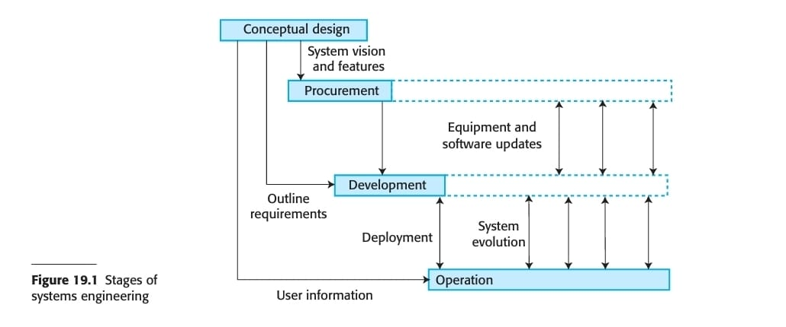
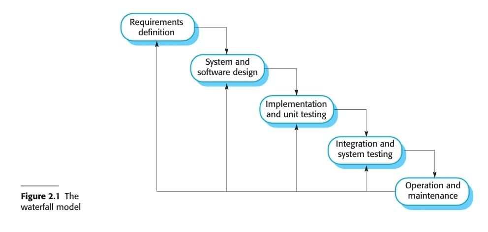
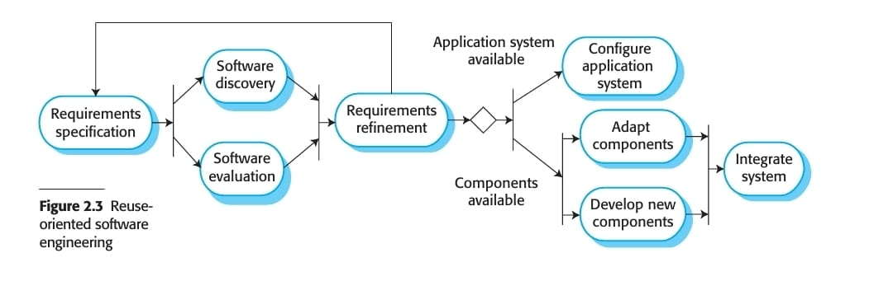
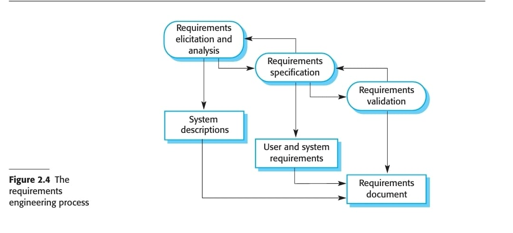
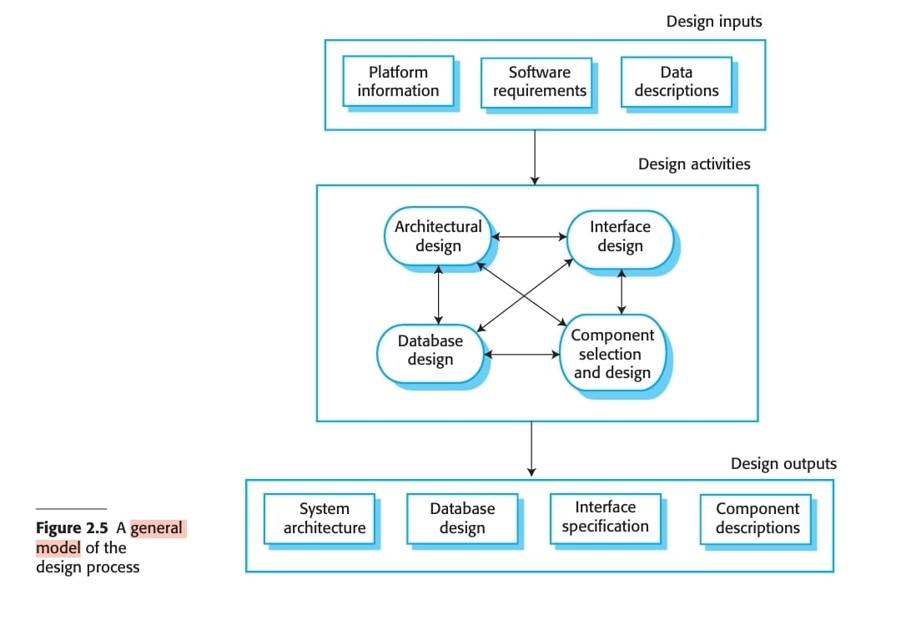
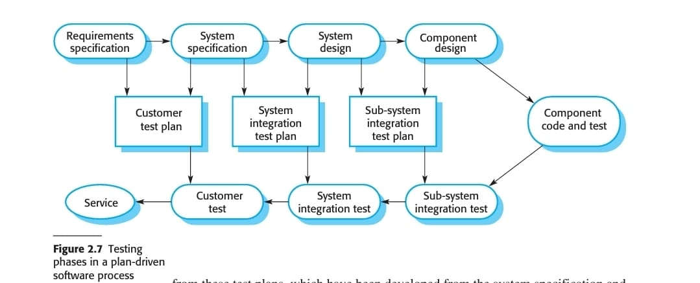
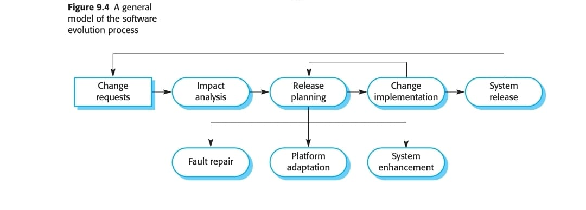
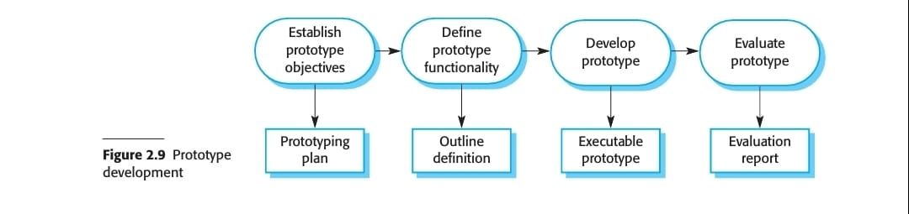
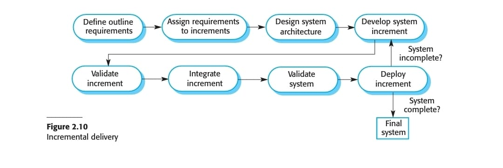

1. Define Software Engineering.

  Software engineering is an engineering discipline concerned with all aspects of software production, from the initial concept and system specification through to operation and maintenance. It involves applying theories, methods, and tools selectively while working within organizational and financial constraints to find solutions.

Key aspects of software engineering include:

- **Purpose**: Its primary purpose is to produce reliable and trustworthy systems economically and quickly. It supports professional software development, which involves teams rather than individuals, and software that is maintained and changed throughout its life.
- **Scope**: It is not just about the technical processes of software development but also includes activities such as software project management and the development of supporting tools, methods, and theories.
- **Systematic Approach**: Software engineers generally adopt a systematic and organized approach, although a more creative, less formal approach might be suitable for certain types of software, such as interactive web-based systems and mobile apps.
- **Distinction from Programming**: It encompasses techniques for program specification, design, and evolution, which are typically not relevant for personal software development. It's fundamentally about managing the complexities of building large and evolving software systems.
- **Interdisciplinary Nature**: Software engineering is related to both computer science and systems engineering.
    - **Computer Science**: Focuses on the theories and methods underlying computers and software systems, whereas software engineering addresses the practical problems of producing software.
    - **Systems Engineering**: Is a broader field concerned with all aspects of developing and evolving complex systems where software plays a major role, including hardware development, policy and process design, and system deployment. Software engineering is a part of this more general process.

The discipline emerged in 1968 in response to the "software crisis," where individual programming approaches did not scale effectively for large and complex systems, leading to unreliability, cost overruns, and late deliveries.

---

2. Define Systems Engineering. Explain the different phases of Systems Engineering
with block diagrams.

Systems engineering is an engineering discipline focused on the comprehensive design and evolution of entire complex systems where software plays a significant role. It addresses all aspects of computer-based systems development, encompassing hardware, software, and process engineering. Systems engineers are tasked with specifying the system, defining its overarching architecture, and integrating diverse parts to create the finished product. This includes considering the capabilities of hardware and software, as well as the system's interactions with human users and its environment. It's a broad field that spans procuring, specifying, developing, deploying, operating, and maintaining both technical and sociotechnical systems.

The lifetime of large, complex systems is typically structured into four overlapping stages, as illustrated by a general process model:



Below are the principal stages of systems engineering:

1. **Conceptual Design** This is the initial systems engineering activity where the concept of the required system is developed. It involves investigating the idea's feasibility and formulating an overall vision for the system. The purpose of the system, its necessity, and the high-level features users might expect are defined in non-technical language. This stage also identifies broad constraints, such as the need for interoperability with other systems. The outcome of this phase is typically a system vision document, which is used to inform users about the system and serves as a basis for defining tender documents and refining system requirements.
    
2. **Procurement (or Acquisition)** During this stage, the conceptual design is further refined to provide information for decisions regarding the system development contract. This includes determining how functionality will be distributed across hardware, software, and operational processes. Decisions are also made on which hardware and software to acquire, which suppliers will develop the system, and the terms and conditions of the supply contract. This process aims to decide what system to buy and who should supply it. Procurement may occur multiple times, extending into the development and operation phases, especially as new equipment and software become available.
    
3. **Development** This stage involves the actual development or purchase of system elements and their integration to create the final system. The system requirements, refined from the conceptual design, act as the bridge to this process. Development processes typically include detailed requirements definition, system design, hardware and software engineering, system integration, and testing. During this phase, operational processes are defined, and training courses for system users are designed. System development processes usually follow a plan-driven, "waterfall" model because different system elements are independently developed by various contractors, necessitating early interface design and comprehensive understanding of requirements before hardware development. Sub-activities within development include requirements engineering, architectural design, requirements partitioning, subsystem engineering, system integration, system testing, and system deployment.
    
4. **Operation** In this final stage, the system is deployed, users are trained, and the system is put into practical use. Operational processes, as defined during development, often need to change to reflect the real working environment where the system is used. The system continuously evolves as new requirements are identified and implemented. This evolution may involve further development and additional hardware/software procurement. Eventually, the system's value may decline, leading to its decommissioning and replacement.
    
These stages are not strictly sequential but overlap and involve continuous feedback, with changes and updates occurring throughout the system's lifetime.

---
3. With a neat diagram, explain the working of a waterfall model. List its advantages and
disadvantages.

The waterfall model is one of the earliest and, in some contexts, least used software life cycle models. It represents a simplified, high-level, and abstract description of a software process. Derived from engineering process models used in large military systems, it presents software development as a series of distinct, sequential stages. This approach is often considered a "plan-driven process," where, in principle, all activities are planned and scheduled before development commences.

The model is sometimes illustrated as a "V-Model" to highlight how basic levels of testing correspond to early development phases. The phases are typically viewed as "fault creation phases" on the left side of the "V" and "fault detection phases" on the right.

### Working of the Waterfall Model

The waterfall model progresses through several stages, with the output of one phase serving as the input for the next. In principle, each phase produces one or more approved documents, and the subsequent phase does not begin until the preceding one is complete.

The principal stages are:

1. **Requirements Analysis and Definition**: This initial phase involves consulting with system users to establish the system's services, constraints, and goals, which are then defined in detail to form the system specification.
2. **System and Software Design**: Requirements are allocated to either hardware or software systems. An overall system architecture is established, and software design identifies fundamental software system abstractions and their relationships.
3. **Implementation and Unit Testing**: The software design is translated into a set of programs or program units. Each unit is then verified to ensure it meets its specific requirements.
4. **Integration and System Testing**: Individual program units are integrated and tested together as a complete system to confirm that all software requirements have been satisfied. After successful testing, the software is delivered to the customer.
5. **Operation and Maintenance**: This is typically the longest phase. The system is installed and put into practical use. Maintenance includes correcting errors discovered post-delivery, improving existing functionalities, and enhancing the system's services as new requirements emerge.

A common representation of the waterfall model is shown below:



### Advantages

- **Structured Management**: The framework aligns well with hierarchical management structures.
- **Clear Deliverables**: Each phase has clearly defined end products and exit criteria, which simplifies project management and progress tracking.
- **Parallel Work**: Once detailed design is complete, different teams can work in parallel on separate units, potentially shortening the overall development time.
- **Foundation for Critical Systems**: Formal development processes (e.g., using the B method) can be applied within this model for systems with strict safety, reliability, or security requirements, which aids in demonstrating compliance to regulators.
- **Ease of Understanding**: It is widely understood and serves as a reference framework for other software development models.

### Disadvantages

- **Inflexibility to Change**: The model strictly adheres to a sequential process, making it costly to correct defects introduced in early phases if they are discovered later in the cycle. There is very little iterative or incremental development.
- **Delayed Feedback**: There is a very long feedback cycle between requirements specification and system testing, often with the customer being absent from intermediate stages.
- **Emphasis on Analysis over Synthesis**: The model focuses heavily on analysis in the early stages, with synthesis (bringing components together) only truly occurring at the integration testing phase.
- **Unrealistic Linear Progression**: In practice, software development is rarely a simple linear process; phases often overlap, and feedback loops are necessary (e.g., design problems might be found during coding).
- **Need for "Perfect Foresight"**: It assumes that the system can be completely understood and functionally decomposed from the outset. This reliance on "perfect foresight" can be perilous if requirements are unstable or not fully known, leading to potential rework.
- **Limited Applicability**: The model is primarily appropriate for systems with well-understood and stable requirements, such as certain higher-level systems engineering processes, but it is generally considered inappropriate for most types of modern software development where flexibility and responsiveness to change are crucial.

---

4. Briefly explain the two types of Evolutionary Development model. Explain the
various activities of Evolutionary Development Model with a neat diagram.

Evolutionary development is a prominent derivative of the traditional waterfall model, designed to address its limitations, particularly concerning flexibility and user feedback. Instead of delivering the system in a single, large release, it involves developing the software through a series of increments or builds.

There are primarily two types of evolutionary development models:

1. **Customer-Driven Evolutionary Development**: In this approach, while a sequence of builds is presumed, only the initial build is strictly defined at the outset. Subsequent builds are identified and shaped largely in response to priorities and suggestions from the customer or user. This allows the system to evolve progressively, directly addressing the changing needs and feedback of the users as development proceeds. This foreshadows the customer-driven principles seen in agile methodologies.
    
2. **Spiral Model**: Developed by Barry Boehm, the spiral model shares an evolutionary flavor but distinguishes itself by determining increments primarily based on risk assessment rather than solely on client suggestions. It integrates elements of rapid prototyping and evolutionary development. Each loop of the spiral involves four key phases: determining objectives, analyzing risks, developing and testing the increment, and planning for the next iteration. This iterative risk-driven approach allows for the systematic management of project risks as the system evolves.
    

### Activities of Evolutionary Development Model

The core activities in an evolutionary development model are interleaved and iterative, allowing for continuous refinement based on feedback. This approach typically proceeds through several versions, starting with an initial implementation and evolving the software incrementally.

The general activities can be summarized as follows:

- **Initial Specification and Outline Description**: An outline description of the system's requirements is established, though not necessarily in exhaustive detail, especially for later increments.
- **Concurrent Activities (Specification, Development, Validation)**: Unlike the strictly sequential waterfall model, these fundamental software process activities are interleaved. This means that parts of the system are specified, developed, and validated in parallel or in rapid succession for each increment. This interleaving facilitates rapid feedback.
- **Iterative Development of Versions**: The process cycles through the development of multiple versions or increments. An initial version is created, followed by intermediate versions, leading eventually to a final version. Each iteration builds upon the previous one, incorporating new features and refinements.
- **Feedback Integration**: A key characteristic is the rapid feedback loop across activities. This makes it easier to obtain customer feedback on the development work, as they can comment on demonstrations of the software as it progresses. This also significantly reduces the cost associated with implementing requirements changes later in the development cycle, as less analysis and documentation need to be redone compared to the waterfall model.

The process continues in an iterative manner until the required system is fully developed and meets the evolving needs of the customer.

The diagram below illustrates the general process model for incremental development, which underpins evolutionary development:

```
                                +-----------------------+
                                |  Outline Description  |
                                +-----------+-----------+
                                            |
                                            |
                                            v
                                +-----------------------+
                                |  Concurrent Activities|
                                |                       |
                                | +-------------------+ |
                                | | Specification     | |
                                | | (Initial Version) | |
                                | +-------------------+ |
                                |           ^           |
                                |           |           |
                                | +-------------------+ |
                                | | Development       | |
                                | | (Intermediate     | |
                                | |  Versions)        | |
                                | +-------------------+ |
                                |           ^           |
                                |           |           |
                                | +-------------------+ |
                                | | Validation        | |
                                | | (Final Version)   | |
                                | +-------------------+ |
                                +-----------------------+
```

  ---
  5. With a neat diagram, explain the reuse-oriented software engineering.


### **Reuse-Oriented Software Engineering**

**Definition:**  
Reuse-Oriented Software Engineering (ROSE) is a software development approach that focuses on the integration and configuration of **existing reusable components** (like libraries, frameworks, and COTS systems) rather than developing the entire system from scratch.

This approach helps in reducing development time, cost, and risks while improving overall software quality and reliability.


### **Phases of Reuse-Oriented Software Engineering**

According to Figure 2.3 , the general process model for reuse-based development includes the following stages:

1. **Requirements Specification:**
    
    - Initial system requirements are proposed.
        
    - These requirements do not need to be very detailed but should include essential functionalities and desirable features.
        
2. **Software Discovery and Evaluation:**
    
    - Search for existing components or systems that meet the required functionality.
        
    - Evaluate whether these components satisfy the essential requirements and are suitable for integration.
        
3. **Requirements Refinement:**
    
    - Refine and modify the initial requirements based on available reusable components.
        
    - If suitable components are not found, return to the discovery phase to explore alternatives.
        
4. **Application System Configuration:**
    
    - If an off-the-shelf (COTS) system fits the requirements, it is configured and adapted for the new system.
        
5. **Component Adaptation and Integration:**
    
    - If no full system is available, individual components are adapted and integrated.
        
    - Some new components may be developed to complete the system.
        


### **Diagram: Reuse-Oriented Software Engineering Process**




### **Advantages of Reuse-Oriented Software Engineering**

- Reduces development time and cost.
    
- Enhances reliability due to reuse of tested components.
    
- Allows faster delivery of systems.
    
- Minimizes development effort.
    


### **Disadvantages**

- May require compromises in requirements.
    
- Limited control over third-party component updates.
    
- Integration issues may arise due to incompatibility.
    
- Customization might be restricted.
    

---

6. With a neat diagram, explain the Requirements Engineering process

Requirements engineering (RE) is the process of understanding and defining what services a system is required to provide, as well as identifying the constraints on its operation and development. It is a critical stage in the software process, as errors made here can lead to significant problems in later design and implementation stages.

The Requirements Engineering process involves three key, interleaved activities:

1. **Requirements elicitation and analysis**: This involves discovering requirements by interacting with system stakeholders.
2. **Requirements specification**: This is the process of converting these discovered requirements into a standard, documented form.
3. **Requirements validation**: This activity checks that the requirements accurately define the system the customer truly desires.

While these activities are often shown sequentially, in practice, requirements engineering is an iterative process where these activities are interleaved.

The general process model for Requirements Engineering is illustrated in the following diagram:



Figure 2.4 The requirements engineering process.

Here's a more detailed explanation of each activity:

- **Requirements Elicitation and Analysis** This process aims to understand the work that stakeholders do and how a new system might support that work. Software engineers work with stakeholders to gather information about the application domain, work activities, desired services and features, performance needs, and hardware constraints. This stage is difficult because stakeholders may not clearly articulate their needs, express requirements in their own implicit terms, or have conflicting views.
    
    This activity includes several sub-activities:
    
    - **Requirements discovery and understanding**: Interacting with stakeholders to uncover their requirements, including domain requirements from documentation and existing systems. Techniques include interviews (closed or open) and observation (ethnography).
    - **Requirements classification and organization**: Taking the unstructured collection of requirements and grouping related ones into coherent clusters. Viewpoints, which group requirements from specific stakeholder groups, can be used for this.
    - **Requirements prioritization and negotiation**: Resolving conflicts among requirements from multiple stakeholders through negotiation and compromise.
    - **Requirements documentation**: Documenting the requirements, which may involve creating an early draft of the requirements document or maintaining them informally on shared spaces. The analyst's understanding of the requirements improves with each cycle of this iterative process.
- **Requirements Specification** This is the process of formally writing down the user and system requirements in a requirements document. User requirements are high-level, abstract statements, usually in natural language with diagrams, describing what the system should provide to users and its operating constraints. System requirements are more detailed descriptions of the software system's functions, services, and operational constraints, intended for system developers and potentially forming part of a contract.
    
    Ideally, requirements should be clear, unambiguous, complete, and consistent, although this is rarely fully achievable due to inherent conflicts and varying interpretations. Natural language is commonly used, often supplemented with tables, forms, graphical models (like UML diagrams), or even mathematical specifications for critical systems. A standard format, consistent language, highlighting of key parts, avoidance of jargon, and inclusion of a rationale for each requirement are recommended to minimize misunderstandings.
    
- **Requirements Validation** This process checks that the requirements truly define the system the customer wants, overlapping with elicitation and analysis as it aims to find problems with the requirements. It is crucial because errors in the requirements document can lead to extensive and costly rework if discovered later in the development cycle or after system deployment.
    
    Validation involves several types of checks:
    
    - **Validity checks**: Ensuring the system meets the customer's real needs.
    - **Consistency checks**: Confirming no conflicts or contradictory descriptions exist within the requirements.
    - **Completeness checks**: Verifying that all intended functions and constraints are defined.
    - **Realism checks**: Assessing whether requirements can be implemented within the proposed budget and schedule, considering existing technologies.
    - **Verifiability**: Ensuring requirements are written such that a set of tests can demonstrate the delivered system meets each specified requirement.
    
    Validation techniques include requirements reviews (systematic analysis by a team), prototyping (developing an executable model for user feedback), and test-case generation (designing tests from requirements to reveal problems). Developing tests from user requirements before code is written is an integral part of test-driven development.
    

The entire Requirements Engineering process is influenced by the inevitable changes to requirements due to evolving stakeholder understanding, organizational shifts, and changes in the system's environment. This necessitates **Requirements Change Management**, a formal process for handling change proposals, assessing their impact and cost, and maintaining consistency between the requirements document and the system implementation.

---

7. With a neat diagram, explain the general model of the design process.

 The software design and implementation stage is where an executable software system is developed. Software design is a creative process focused on identifying software components and their relationships based on customer requirements. It's not a clear-cut, sequential process; designers develop the design in stages, iteratively refining solutions and backtracking as needed.

A software design outlines the software's structure, data models and structures, interfaces between components, and sometimes the algorithms used. While design is always present, it's not always formally documented; sometimes it resides in a programmer's mind or is sketched informally. Implementation is the process of realizing this design as a program. Design decisions should consider implementation issues.

The general model of the design process involves inputs, activities, and outputs, as illustrated in the abstract model below:



Figure 2.5 A general model of the design process

Here's a breakdown of each part of the process:

**1. Design Inputs**

- **Platform information**: This includes details about the software platform (e.g., operating system, database, middleware) where the software will execute. It's crucial for designers to integrate the system with its environment.
- **Software requirements**: These are the specifications defining what the system needs to do.
- **Data descriptions**: If the system processes existing data, descriptions of that data are included as inputs to define the system's data organization.

**2. Design Activities** The activities in the design process are interleaved and interdependent. New information constantly influences previous design decisions, making rework inevitable. These activities vary depending on the system type (e.g., real-time systems might require timing design but not a database design):

- **Architectural design**: This involves identifying the system's overall structure, including its principal components (subsystems or modules), their relationships, and how they are distributed.
- **Database design**: This activity focuses on designing the system's data structures and their representation in a database, considering whether an existing database is reused or a new one is created.
- **Interface design**: This defines the interfaces between system components clearly and unambiguously. Precise interfaces allow components to be designed and developed in parallel without needing to know implementation details.
- **Component selection and design**: This involves searching for reusable components and, if none are suitable, designing new software components. The design at this stage can be a simple description or a detailed UML model that can generate an implementation.

**3. Design Outputs** The outputs of the design process vary based on the development approach:

- For **critical systems**, outputs are detailed design documents with precise descriptions of the system.
- For **model-driven approaches**, the design outputs are design diagrams.
- For **agile methods**, the outputs may not be separate specification documents but might be represented directly in the program's code.

The development of a program typically follows system design. For some safety-critical systems, detailed design precedes implementation. However, it's more common for design and program development to be interleaved. Software development tools can also generate a skeleton program from a design, defining and implementing interfaces, leaving developers to add operational details.

---

8. With a neat diagram, explain the testing phases in a plan-driven software process.

In a plan-driven software process, all process activities are planned in advance, and progress is measured against this predetermined plan. This approach contrasts with agile processes, where planning is incremental and continuous. Testing within a plan-driven framework is typically structured and sequential, often following a "V-model" to ensure that various levels of testing correspond to earlier development phases.

The testing process in a plan-driven software development environment generally involves distinct, staged activities, driven by a set of test plans. An independent team of testers often develops and works from these plans.

The key testing phases in a plan-driven software process are:

- **Component Testing (Unit Testing)**: This is the initial stage where individual program units or object classes are tested by the developers themselves. Each component is tested independently, without other system components. The focus is on verifying the functionality of objects or methods. Test automation tools, such as JUnit for Java, are commonly used to rerun tests when new versions of components are created.
- **System Testing**: Following component testing, system testing integrates components to create a version of the system, and then the integrated system is tested. This phase checks for component compatibility, correct interaction, and proper data transfer across interfaces. It also involves integrating reusable components and off-the-shelf systems with newly developed parts. Use case-based testing is considered effective at this stage due to its focus on interactions.
- **Release Testing**: This process involves testing a particular version of the system that is intended for use outside the development team, typically for customers and users. A separate testing team usually conducts release testing to ensure the system meets stakeholder requirements. Key techniques here include scenario testing, where typical usage scenarios are devised to develop test cases, and stress testing, which involves making demands beyond the system's design limits to uncover defects.
- **User Testing (Acceptance Testing)**: In this final stage, users or potential users of the system test it in their own environment. For software products, this may involve beta testing, where an early release is made available to a larger group of users for evaluation and problem reporting. For custom software, acceptance testing is a formal process where customers test the system with their own data to decide if it is ready to be accepted from the developers and deployed. This phase includes defining acceptance criteria, planning and deriving acceptance tests, executing them, negotiating results, and ultimately deciding on system acceptance or rejection.

The relationship between these testing activities and the development phases in a plan-driven process is often visualized using the V-model, which explicitly links validation activities to each stage of the waterfall process model. Test design begins early in the development cycle, soon after requirements become available.

The following diagram, derived from the sources, illustrates these testing phases in a plan-driven software process:



Figure: Testing phases in a plan-driven software process

This diagram highlights how test plans are the link between the validation activities on the right side of the "V" and the development phases on the left, demonstrating the systematic and parallel nature of testing in a plan-driven environment.

---

9. With a neat diagram, explain the software evolution process.

  Software evolution is an integral and continuous process within software engineering, essential for ensuring that software systems remain useful and valuable throughout their operational lifetimes. Unlike the traditional view that separates development from maintenance, software engineering increasingly considers development and evolution as a continuous spectrum, particularly for successful software products and applications. Businesses invest significantly in evolving their systems, often spending more on maintaining existing systems than on developing new ones, as software is a critical business asset.

The software evolution process is primarily driven by various **change proposals**. These proposals can originate from multiple sources, including existing requirements that were not initially implemented, requests for new functionalities, bug reports from users, or innovative ideas from the development team itself.

The general model for software evolution involves several key, interrelated activities that form a cyclical process:

- **Change Identification/Requests**: The process begins with formal or informal proposals for changes and updates to an existing software system.
- **Impact Analysis**: Before a change proposal is accepted, a crucial step is to analyze its potential impact and assess the costs involved. This analysis determines which components of the system would be affected by the proposed change and estimates the resources and effort required for its implementation.
- **Release Planning**: If the proposed changes are approved, a new release of the system is planned. This stage involves considering all types of changes—such as fault repairs, adaptations for new environments (Platform adaptation), and the addition of new features (System enhancement)—and deciding which ones will be incorporated into the upcoming version of the system.
- **Change Implementation**: This is where the approved changes are designed, implemented, and validated. This phase may involve iterations of development, where the system is revised, implemented, and tested. For custom software, especially when different teams are involved, a significant aspect of this stage is "program understanding," where developers analyze the existing code to understand its structure and functionality to ensure changes integrate correctly without introducing new problems. It also involves updating existing documentation, such as requirements specifications and design models, to reflect the changes.
- **System Release**: Once the changes are implemented and validated, a new version of the system is released to customers or deployed.

The entire process then iterates, with the new release often generating further change requests, perpetuating the cycle of evolution throughout the system's lifetime. This continuous adaptation ensures the software remains relevant and effective in a changing environment.

The diagram below illustrates the general model of the software evolution process:



**Figure: A general model of the software evolution process**

This diagram shows how change requests lead to an analysis of their impact, which then informs the planning and implementation of a new system release. The released system, in turn, generates further change requests, completing the continuous cycle of software evolution.

---

10. With a neat diagram, explain the process model for prototype development.

The process model for prototype development is a cyclical approach used to create an early version of a software system to explore concepts, test design options, and gain a better understanding of a problem and its potential solutions. This iterative development is crucial for controlling costs and allowing stakeholders to experiment with the system early in the software process.

The key stages in the prototype development process, as illustrated in the model below, are:

**Process Model for Prototype Development**



**Explanation of the Stages:**

1. **Establish Prototype Objectives:** This initial step involves clearly defining the goals for the prototype. The objectives might include developing a user interface, validating functional requirements, or demonstrating the application to managers. It's important to state these objectives explicitly from the outset to prevent misunderstandings about the prototype's purpose.
2. **Define Prototype Functionality:** In this stage, decisions are made about what functionality to include in the prototype and, crucially, what to omit. To reduce costs and expedite delivery, certain functionalities may be left out, and non-functional requirements, such as response time or memory usage, might be relaxed. Error handling and management may also be disregarded unless they are direct objectives of the prototype. The output of this stage is typically an outline definition.
3. **Develop Prototype:** This involves the rapid, iterative construction of the prototype based on the defined functionality. The output of this stage is an executable prototype.
4. **Evaluate Prototype:** This is the final stage where the prototype is assessed. It requires providing user training and developing an evaluation plan based on the prototype's initial objectives. Users need time to become comfortable with the system and use it naturally to discover requirements errors or omissions. A common issue is that users might adapt their usage patterns to accommodate a slow prototype, which may not reflect how they would use the final system. The outcome of this stage is an evaluation report.

The process continues in a cycle, allowing for refinement and evolution based on feedback until the desired system understanding or requirements are achieved.

---

11. With a neat diagram, explain the incremental delivery model.

The **incremental delivery model** is a software development approach where parts of the developed system, known as increments, are delivered to the customer and deployed for use in their working environment. This model contrasts with traditional approaches by ensuring that the software is used in real, operational processes, thereby providing realistic user feedback.

This approach allows customers to gain value from the system early by receiving critical functionalities first, rather than waiting for the entire system to be completed. It is particularly useful for systems where requirements are not fully understood from the outset, enabling continuous refinement based on user experience.

### Process Model for Incremental Delivery

The incremental delivery process is a cyclical activity designed to iteratively build and deploy a software system. Its key stages are outlined below:



### Explanation of Stages:

1. **Define Outline Requirements**: This initial step involves customers defining and prioritizing the services they need, from most to least important.
2. **Design System Architecture**: An overall system architecture is designed, providing a foundational structure for the increments.
3. **Assign Requirements to Increments**: Based on the prioritized services, specific delivery increments are defined. The highest priority services are allocated to earlier increments.
4. **Develop System Increment**: Detailed requirements for the current increment are defined, and development proceeds. During this phase, new requirements for _later_ increments can still be analyzed, but changes to the _current_ increment are generally not accepted.
5. **Validate Increment**: The newly developed increment undergoes validation to ensure it meets its defined requirements.
6. **Integrate Increment**: Once validated, the new increment is integrated with any previously delivered increments. This process continually enhances the overall system functionality.
7. **Deploy Increment**: The completed increment is installed in the customer's actual working environment. This allows users to experiment with the new functionality and provide feedback, which is crucial for clarifying requirements for subsequent increments.
8. **System Completion Check**: After deployment, a check is performed to determine if the system is complete. If not, the process loops back to assign requirements for the next increment, continuing until the full system is delivered.

### Advantages of Incremental Delivery:

- **Early User Feedback and Experience**: Customers can use early increments as prototypes, gaining practical experience that informs and refines their requirements for later parts of the system. Unlike throwaway prototypes, these increments are part of the actual final system.
- **Faster Value Delivery**: Customers do not have to wait for the entire system to be completed before they can benefit. The initial increments address their most critical needs, providing immediate value.
- **Easier Change Incorporation**: The iterative nature of this model makes it relatively simple to incorporate changes into the system, as the scope of each increment is smaller compared to a monolithic development process.
- **Improved Quality of Critical Services**: Since higher-priority services are delivered and integrated first, they receive the most testing and exposure to real-world use. This reduces the likelihood of critical software failures in the most important parts of the system.

### Disadvantages of Incremental Delivery:

- **Challenges in Replacing Existing Systems**: This model can be problematic when the new system is intended to replace an existing one. Users may require all functionalities of the old system immediately and might be unwilling to work with an incomplete new system. Running both old and new systems concurrently can also be impractical due to differences in databases and user interfaces.

---

12. Explain the principles of agile methods.

  Agile methods are a set of software development approaches designed to produce useful software quickly and efficiently, especially in environments where requirements are expected to change rapidly. The philosophy behind agile methods is articulated in the Agile Manifesto, which prioritizes certain values over others.

The core principles of agile methods, as outlined in the sources, include:

- **Customer involvement:** Customers should be closely involved throughout the development process. Their role is to provide and prioritize new system requirements and to evaluate the iterations of the system. This continuous engagement ensures rapid feedback on changing requirements.
- **Embrace change:** Agile methods anticipate that system requirements will change, and therefore, the system is designed to accommodate these changes. This principle means that rapid changes are expected and are a fundamental part of the development process.
- **Incremental delivery:** The software is developed and delivered in small increments, with the customer specifying the requirements to be included in each increment. New releases of the system are typically created and made available to customers every two or three weeks. This approach allows for early delivery of fully functional components and immediate value to the customer.
- **Maintain simplicity:** There is a focus on simplicity in both the software being developed and the development process itself. This is supported by continuous refactoring, which improves code quality and avoids structural deterioration, and by using simple designs that do not unnecessarily anticipate future changes.
- **People, not process:** The skills and autonomy of the development team are recognized and exploited. Team members are encouraged to develop their own ways of working without overly prescriptive processes. This includes practices like pair programming, where developers work together, checking each other's work and providing mutual support. Agile methods emphasize informal communication over formal meetings and extensive documentation.

In essence, agile methods value:

- **Individuals and interactions** over processes and tools.
- **Working software** over comprehensive documentation.
- **Customer collaboration** over contract negotiation.
- **Responding to change** over following a plan.

While acknowledging the value of items on the right, agile principles place greater importance on the items on the left.

---

13. With a neat diagram, explain extreme programming release cycle. Also, discuss the
extreme programming practices.

Extreme Programming (XP) is a prominent agile method that emphasizes producing useful software quickly through a set of specific practices. Its development approach is highly iterative, with requirements expressed as "user stories" that are directly implemented as a series of tasks.

### Extreme Programming Release Cycle

The XP release cycle illustrates the iterative and continuous nature of this development methodology. It focuses on delivering small, working components through a sequence of iterations.

**XP Release Cycle Diagram:**

```
               +-----------------------+
               |     User Stories      |
               +-----------+-----------+
                           |
                           v
               +-----------------------+
               |      Release Plan     |
               | (Sequence of Iterations) |
               +-----------+-----------+
                           |
                           v
               +-----------------------+
               |       Iteration       |
               +-----------+-----------+
                           |
                           v
               +-----------------------+
               |     Iteration Plan    |
               +-----------+-----------+
                           |
                           v
               +-----------------------+
               |      Pair Coding      |
               +-----------+-----------+
                           |
                           v
               +-----------------------+
               |       Unit Test       |
               +-----------+-----------+
                           |
                           v
               +-----------------------+
               |    Acceptance Test    |
               +-----------+-----------+
                           |
                           v
               +-----------------------+
               |      Small Release    |
               +-----------+-----------+
                           |
                           v
               +-----------------------+
               |      (Repeat for      |
               |     Next Iteration)   |
               +-----------------------+
```

**Explanation of the Cycle:**

1. **User Stories:** The process begins with customer expectations captured as "user stories". These are high-level requirements that drive the development process.
2. **Release Plan:** User stories inform the "release plan," which defines a sequence of iterations. Each iteration aims to deliver a small, working component.
3. **Iteration / Iteration Plan:** Within each release, there are multiple iterations. An "iteration plan" outlines the specific user stories (broken down into tasks) to be implemented in that short iteration, typically lasting 2 to 4 weeks.
4. **Pair Coding:** Developers work in pairs, often sharing a single computer, continuously reviewing each other's work and supporting each other.
5. **Unit Test:** A core XP practice is "test-first development," where automated unit tests are written for a new piece of functionality _before_ the code itself is implemented. All existing unit tests must pass before new code is integrated.
6. **Acceptance Test:** User stories also define "acceptance tests". These tests are run to ensure the developed software supports the user stories and meets the customer's real needs. Development cannot proceed until these tests are successfully executed.
7. **Small Release:** Upon successful testing, a "small release" of the working component is delivered. New releases of the system are typically made available to customers every two or three weeks. The customer has no more user stories, indicating the project's completion.
8. **Repeat:** The cycle repeats for subsequent iterations until all required user stories are implemented and the customer has no more needs.

### Extreme Programming Practices

XP introduced several practices that reflect the principles of the agile manifesto, emphasizing adaptability, customer collaboration, and efficient delivery.

1. **Collective Ownership:** All developers work on all areas of the system, fostering a shared responsibility for the entire codebase. This prevents "islands of expertise" and allows anyone to change anything, promoting flexibility.
2. **Continuous Integration:** As soon as work on a task is completed, it is integrated into the whole system. After each integration, all unit tests must pass. This practice helps catch integration problems early and ensures the system always remains functional.
3. **Incremental Planning:** Requirements are recorded as "story cards," and the stories for a release are determined by available time and their priority. Developers break these stories into smaller "tasks". This allows for flexible planning that accommodates changing customer priorities.
4. **On-site Customer:** A representative of the end-user (the customer) is expected to be available full-time as a member of the XP team. This ensures continuous engagement and rapid feedback on changing requirements, and the customer is responsible for defining acceptance tests.
5. **Pair Programming:** Two programmers work together on the same computer, checking each other's work and providing mutual support. This continuous review helps improve code quality and reduces defects. Pairings are often dynamic, so all team members work together.
6. **Refactoring:** Developers are expected to continuously refactor (improve and restructure) the code as soon as potential improvements are found, even if there's no immediate need. This maintains code simplicity, readability, and maintainability, preventing structural deterioration that can occur with frequent changes.
7. **Simple Design:** Only enough design is carried out to meet the current requirements, avoiding unnecessary anticipation of future changes. This supports simplicity and reduces wasted effort.
8. **Small Releases:** The minimal useful set of functionality that provides business value is developed first. Subsequent releases are frequent and incrementally add functionality. This provides early value to the customer and rapid feedback.
9. **Sustainable Pace:** Excessive overtime is discouraged as it often reduces code quality and medium-term productivity. The goal is to maintain a pace that is sustainable for the development team.
10. **Test-First Development:** Tests for new functionality are written using an automated unit test framework _before_ the actual code is implemented. This approach clarifies requirements, supports early defect detection, and simplifies fault isolation because a failing test points directly to the most recently added code.
---
